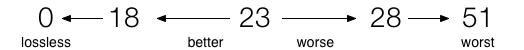

= 视频, 音频 相关技巧
:toc:

---

网上的说明
https://www.jianshu.com/p/fe52089f7651

---

== avi 或 mkv => 转 mp4 -> ffmpeg工具

FFmpeg 可以在dos命令行中, 进行各种媒体格式转换.

[cols="1a,4a"]
|===
|Header 1 |Header 2

|官方下载地址
|点击下面第一个 或第二个链接即可

https://www.gyan.dev/ffmpeg/builds/

下载 https://www.gyan.dev/ffmpeg/builds/ffmpeg-git-full.7z

备用:
http://ffmpeg.org/download.html#build-windows

|win 安装
|- 解压上面下载的7z压缩包, 进入 bin 目录
- 把 bin目录的路径, 拷贝下来. 进入windows 的 控制面板 -> 搜索"系统"关键词 -> 进入"(高级系统设置)系统属性" -> 环境变量 -> 编辑 path -> "新建", 将ffmpeg 的 bin目录的路径拷贝进去.

|如何验证是否安装成功?
|打开dos命令提示符窗口。输入命令 :  ffmpeg –version

|将 avi, 无损转成 mp4
|- 在dos中, 先用cd命令, 进入你的含有avi影片的目录中
- 输入命令: +
ffmpeg -i "filename.avi" -c copy "filename.mp4" +

命令中的文件名, 可以带上路径.

|将 mkv, 转成mp4
|ffmpeg -i 文件名.mkv -codec copy 文件名.mp4

|将 h264 转成 h265
|ffmpeg -i xxx.h264 xxx.hevc +
编码等参数, 查看网络上的说明
|===

---

== 提取音频

[cols="1a,1a" options="autowidth"]
|===
|Header 1 |Header 2

|ffmpeg -i D:\media\test.mp4 -acodec copy -vn D:\media\output.aac
|- 默认mp4的audio codec是aac
|===

---

== 切割视频

[cols="1a,1a" options="autowidth"]
|===
|Header 1 |Header 2

|ffmpeg -ss 00:00:15 -t 00:00:05 -i input.mp4 -vcodec copy -acodec copy output.mp4
|分解
....
ffmpeg
-ss 00:00:15  //-ss 用于指定视频片段的开始时间
-t 00:00:05  //-t 指定视频片段的持续时间，单位都为秒。
-i input.mp4
-vcodec copy
-acodec copy
output.mp4
....

- -ss表示从哪个时间点, 开始切割
- -t表示要切多少秒(指切出的视频的总时长)。本例是切5秒钟出来。

以上命令也适用于音频文件。 如:
....
ffmpeg
-i audio.mp3
-ss 00:01:54
-to 00:06:53
-c copy
output.mp3
....

|===

---

== 指定分辨率

[cols="1a,1a" options="autowidth"]
|===
|Header 1 |Header 2

|ffmpeg -i
|查看视频的原有分辨率，以及视频的长度

|ffmpeg -i input.mkv -c:a copy -s 1280x720 output.mkv
|分解
....
ffmpeg -i input.mkv
-c:a copy
-s 1280x720
output.mkv
....
可以使用 -s 选项, 指定输出文件的分辨率。

|===

---

== 用 CRF 编码来转

[cols="1a,1a" options="autowidth"]
|===
|Header 1 |Header 2

|ffmpeg -i D:\src.mov -c:v libx264 -preset veryslow -crf 18 -c:acopy D:\dest1.mp4

或

ffmpeg -i input.mp4 -c:v libx264 -crf 23 output.mp4

|分解下:
....
ffmpeg
-i D:\src.mov
-c:v libx264
-preset veryslow
-crf 18
-c:acopy
D:\dest1.mp4
....

意思是：将D盘的源文件src.mov，以“非常慢”的速度, 重新编码成H.264格式，保存为D:\dest1.mp4。

- -c:v  后面指定为了 h.264编码
- -preset : 指定的编码速度越慢，获得的压缩效率就越高。 +
-preset取值范围：ultrafast,superfast,veryfast,faster,fast,medium,slow,slower,veryslow,placebo

- -crf参数 : 取值范围为0——51. 其中0为无损模式. 数值越大，画质越差，生成的文件却越小。从主观上讲，18——28是一个合理的范围。18被认为是视觉无损的（从技术角度上看当然还是有损的）

大体来说: +
-> CRF数值 +6,  会使文件大小减半 +
-> CRF数值 -6,  会使大小增一倍。

- -c:a copy 指不重新编码音频, 而将音频数据, 从源文件中以原有编码格式, 直接拷入目标文件.

|===

---

== 将 iphone 拍的 4k 视频, 转成 2k 分辨率(适应 ipad air 3 屏幕分辨率), h.264编码格式, 并且切割出 特定时间段.

....
ffmpeg -i F:\+++" "周喆韬\2022.4.16\2022_04_16_09_26_IMG_0552.MOV  -ss 00:25:33  -t 00:04:13   -s 2048x1152   -c:v libx264  -preset veryfast  -crf 18  -acodec copy  C:\zzt\压缩" "ipad专用\output.mp4  // 如果文件名中有空格, 在cmd中, 需要用" "双引号把空格包起来.
....

....
ffmpeg
-i input.mp4
-ss 00:00:15   //表示从哪个时间点, 开始切割
-t 00:00:05   //表示要切多少秒(指切出的视频的总时长)。本例是切5秒钟出来。
-s 1280x720   //指定输出文件的分辨率
-c:v libx264   //指定用 h.264编码. 其中 -c:v 用于指定视频编码，-c:a 指定音频编码
-preset veryslow  //指定的编码速度越慢，获得的压缩效率就越高。preset取值范围：ultrafast,superfast,veryfast,faster,fast,medium,slow,slower,veryslow,placebo
-crf 18   //取值范围为0——51. 其中0为无损模式. 数值越大，画质越差，生成的文件却越小。从主观上讲，18——28是一个合理的范围。
-acodec copy   //不重新编码音频, 而将音频数据, 从源文件中以原有编码格式, 直接拷入目标文件.
output.mp4
....

