= mac 技巧
:toc:

---

== 硬件问题 / 系统设置

==== 将 pc 键盘替换掉 mac 键盘后, 改换键位问题

把 command 和 control 互换即可. 亲测可行

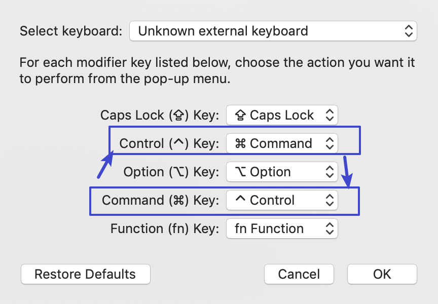

---

==== 将 mac 改成英文版

在系统偏好设置(控制面板)中 -> 语言与地区 -> “首选语言”处, 将英文往上拖到第一位即可.

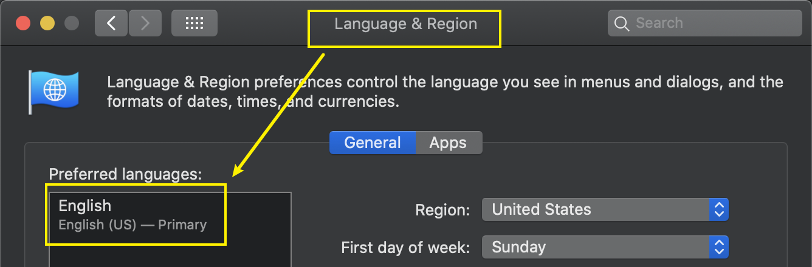

---

==== 提升系统性能, 关闭华而不实的吃资源效果

1.系统偏好设置 -> 辅助功能 -> 勾选“减少透明度”, "减少动画效果"

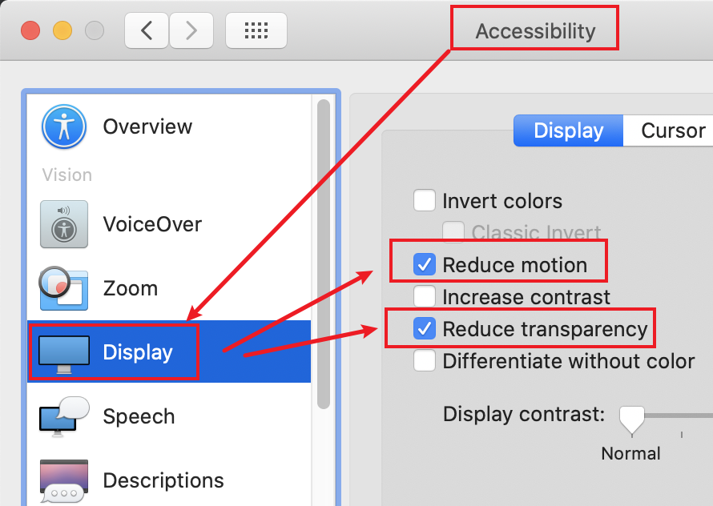

2.系统偏好设置 -> Dock -> 将最小化窗口时的动画, 改成“缩放效果”

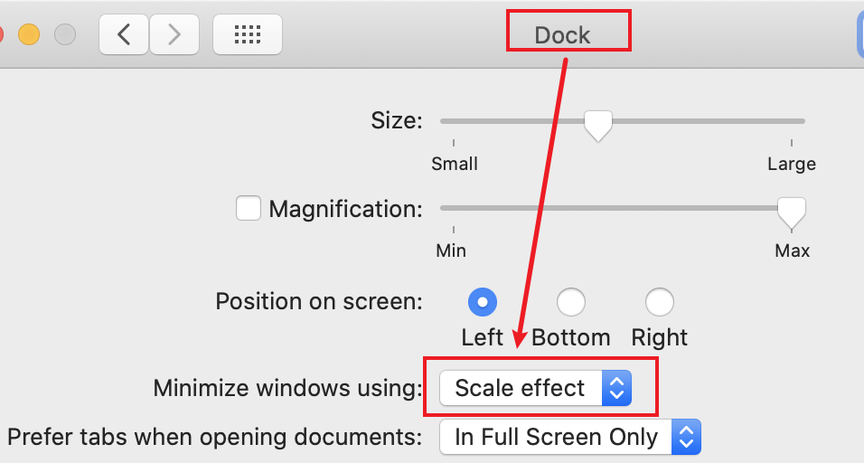

3.禁用通知中心中无用的组件和扩展 +
系统偏好设置 -> extensions -> 将没必要的组件的打勾,去掉

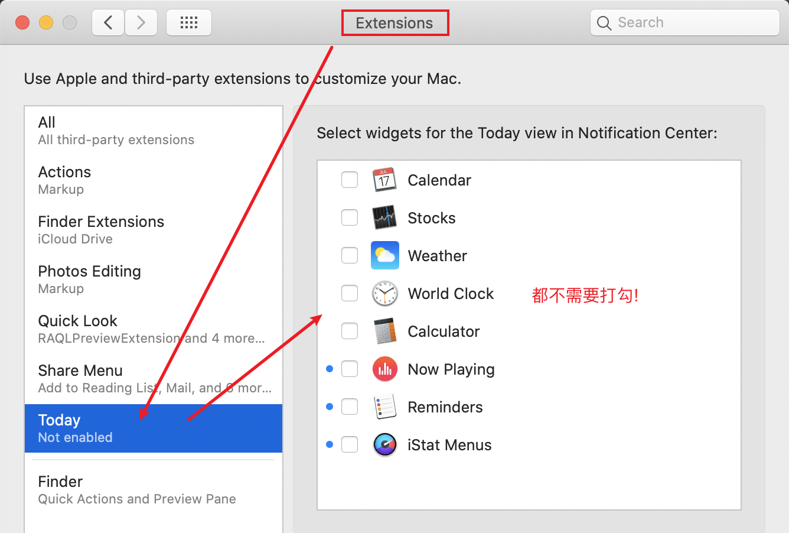

---

== 文件,目录 操作

==== 移动文件

|===
|功能 |快捷键

|剪切文件
|先 Command+C 复制，再 Command + Option + V 移动 // mac 键盘 +

先 ctrl+c, 再 ctrl+alt+v // win 键盘

|复制文件
|先 ctrl+c, 再 ctrl+v 复制 //win 键盘
|===

---

==== 显示出文件扩展名

打开finder, 打开它的设置 -> 高级 -> show all filename extensions

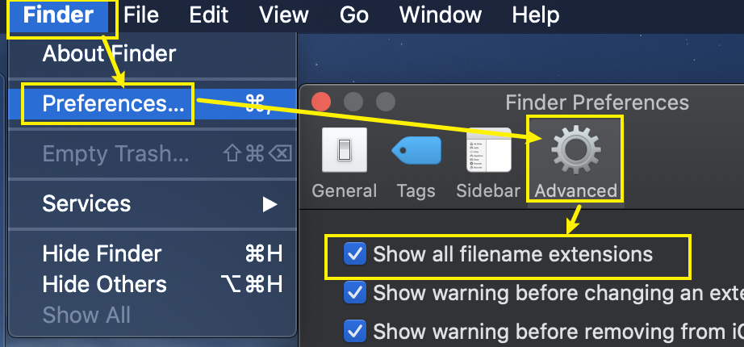

---

==== 在 finder 的侧边栏上, 显示出你想要的目录

打开finder, 打开它的设置 -> 侧边栏 -> 打勾你想要在侧边栏上显示的目录即可

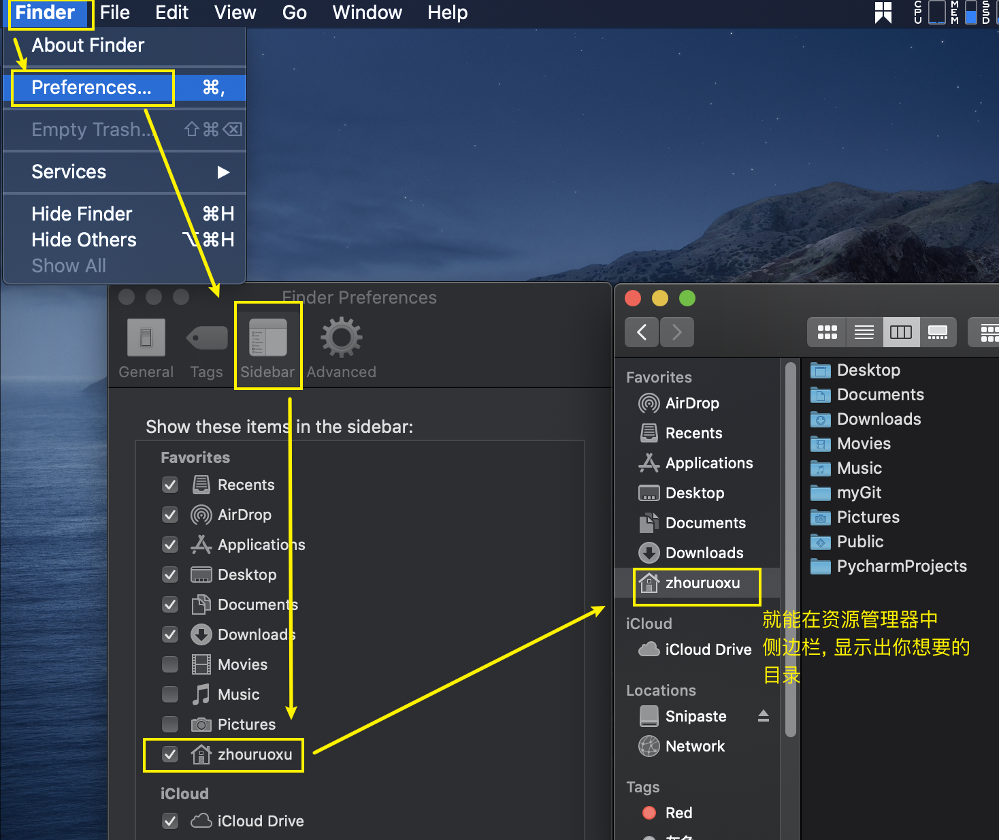

---

==== 给mac 的finder添加地址栏

1.安装 finderpath 软件 +
https://bahoom.com/finderpath/

2.到系统设置里, 启用辅助设备控制，FinderPath才会起作用。

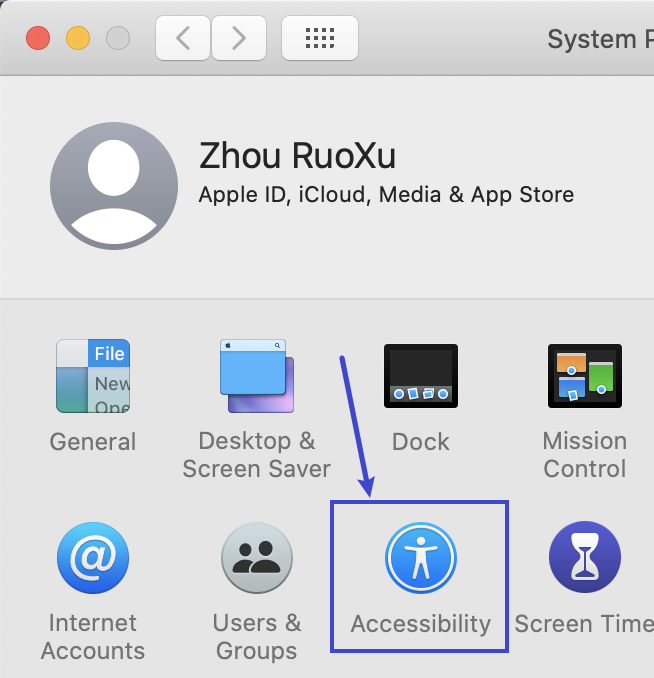
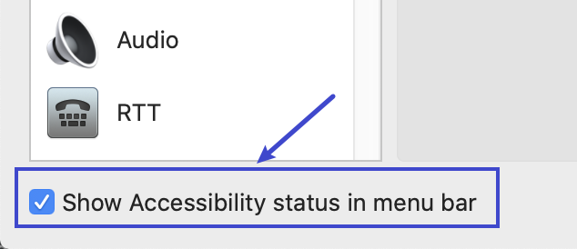

3.选中某个文件或目录, 按 command +g +
或者双击标题栏上面的路径, 就能出现输入框, 显示了完整路径

---

==== 在 Finder 上直接显示完整的路径

1.在终端中, 输入命令:
....
defaults write com.apple.finder _FXShowPosixPathInTitle -bool TRUE;killall Finder
....

就能直接显示出完整路径.

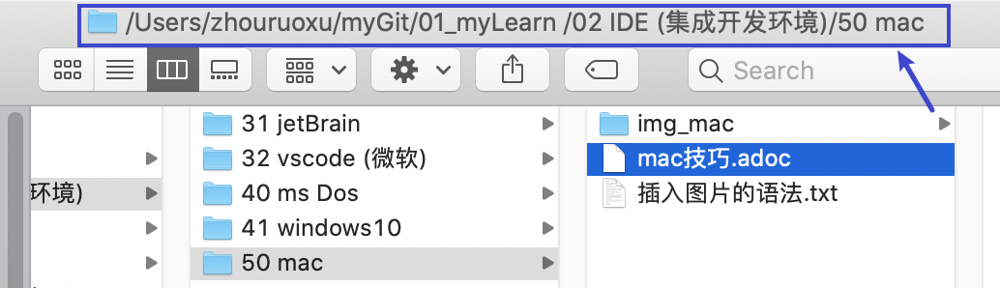

2.要想关闭它, 恢复原来的效果的话, 键输入命令:
....
defaults delete com.apple.finder _FXShowPosixPathInTitle;killall Finder
....

---

==== 复制文件的完整路径

....
option + command + c    //mac 键盘
alt + ctrl + c          //win 键盘
....

还有一种比较麻烦的方法:  +
将文件拖到终端中, 就能显示出完整路径, 拷贝出来即可.

---

==== + 显示隐藏文件 => ctrl + shift + .

|===
|Header 1 |Header 2

|windows 键盘
|ctrl + shift + . +
再按一次这个组合键能隐藏"隐藏文件"

|mac 键盘
|.(点号即?问号左边的>键) + Command⌘ + Shift⇧ //注意!! 先要按点号, 然后再按Command + Shift, 不能倒过来, 否则 finder 会关闭!
|===

---

==== 在 finder 中, 回到上级目录

方法 1: 右键单击 finder 的标题栏上的文件路径, 即可看到各级目录名

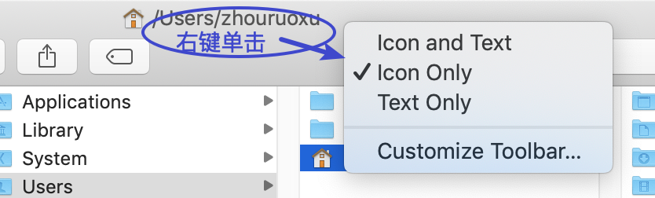

方法 2: command + 上箭头

---

==== + 跳到一行的行尾 => end 键

....
Command + →     //mac 键盘
end 键          //win 键盘
....

---

== 软件&安装问题

==== + 强制关闭"无响应"的软件

打开 utilties 菜单, 找到 Activity monitor 活动监视器工具 (就相当于 win 中的任务管理器)

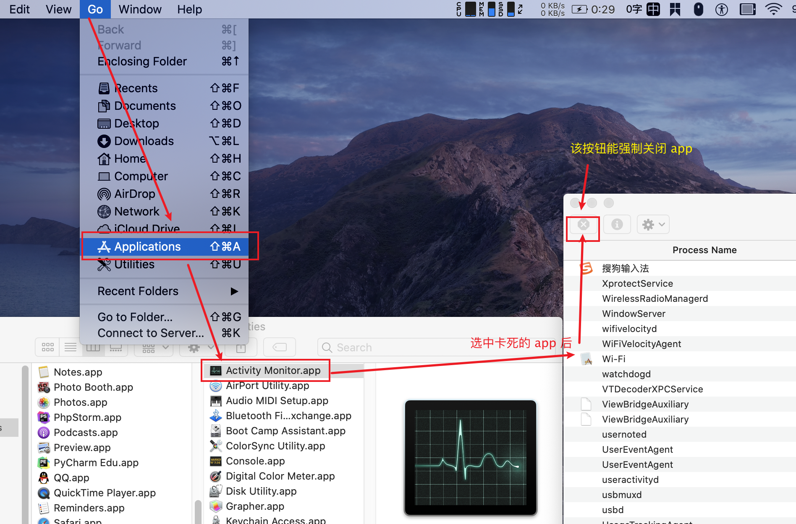

---

==== mac 10.15版本, 软件安装后, 打开提示"已损坏"的解决办法 (亲测可行)

打开终端，输入命令： sudo xattr -r -d com.apple.quarantine , 然后输入个空格，再将应用程序目录中的软件拖拽到命令后面，按回车后, 输入密码执行， +
比如sketch的命令是
....
sudo xattr -r -d com.apple.quarantine /Applications/sketch.app/
....

---

== 必备软件

==== 鼠标流畅滚动 Mos

https://github.com/Caldis/Mos

注意: 不推荐网上的smoothscroll软件! 因为无法破解

---

==== 截图 snipaste

https://www.snipaste.com/

如果想 mac 原生截图操作, 如下, 亲测可行 :

|===
|功能 |快捷键

|截取整个屏幕，并保存在桌面上
|Command + Shift + 3

|截取部分屏幕
|Command + Shift + 4

|截取某一个窗口
|Command + Shift + 4后，再按下空格键
|===

---

