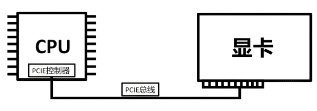

= 频率 原理
:sectnums:
:toc:

---

== CPU主频 =100Mhz基础频率(外频) * 倍频

==== 基础频率 100Mhz (外频)

[cols="1a,4a"]
|===
|Header 1 |Header 2

|主频
|CPU的主频, 分为"倍频"和"外频"两部分. 计算公式:
\begin{align}
\boxed{
CPU主频 =外频 * 倍频
}
\end{align}

假设10个人跳大绳, 当绳子到脚底下的时候 , 必须要10个人一块跳起来, 绳子才能顺利的通过. 如果有任何一个人没跳起来的话, 绳子就会被他拦住. 为了保证大家一块跳起来, 最好的方法就是喊口号, 一二跳，一二跳. 比如1秒喊一次跳, 那频率就是1HZ/秒, 一秒喊两次跳，那频率就是2HZ/秒.

CPU 在算数的时候, 和我们跳大绳一样, 也有一个频率. CPU一秒钟内发生的"同步脉冲数", 就称为CPU频率. CPU频率越高, 它一秒能发生的脉冲就越多, 它算数的速度就会越快.

|基础频率 100Mhz = 外频
|但我们电脑中有很多用于计算与储存数据的芯片, 它们之间都是需要相互通信交互数据的.  为了保证它们都能协调统一工作, 就必须要和跳大绳一样, 让它们一块起跳, 一块落下. 电脑里所有的电气信号, 必须要保证"频率"协调统一. 这个东西就是 Crystal Osciallator, 主板晶振，简称XO. 主板上有很多晶振, 通常在你的主板南桥边上.

100Mhz 就相当于跳大绳当中摇绳子的频率了, 大家都需要和这个频率看齐, *这个 100Mhz 就是我们所说的电脑平台"基础频率", Base Clock*，BCLK. 然后主板上其他元器件和这个频率统一, 协调工作就不会出问题了. 而**其他设备用来和"基础频率"统一的这个频率, 就叫"外频". 既然统一了, "外频"和"基础频率"就肯定是一样的了.**

但 cpu 的频率是远远超过"基础频率"的, 比如 cpu 是 4.2Ghz. 那么它就是 42倍于"基础频率". 这个42倍就是CPU的"倍频" :
\begin{align}
\boxed{
4.2Ghz = 100Mhz 基础频率(外频) * 42倍(倍频).
}
\end{align}

这样, CPU一方面可以保证用"外频100Mhz"和其他设备同步, 另一方面自己工作的时候, 能全速运转(4.2Ghz), 不受到其他设备的影响. 所以你的CPU，人格分裂了, 他在和其他小弟协调工作的时候, 会用100Mhz的外频与他们同步, 然后转过身自己干活的时候, 会发挥全力, 用42倍的基础频率来全力运算.

|===

---

==== 超频, 只动"倍频"

*超频, 是超"倍频"还是"外频"啊? 只动"倍频".* 因为你动"外频(基础频率)"的话, 整个电脑里所有硬件的"外频",都要跟着一起变动. 假设你"外频"调整到了110Mhz, 只要有一个设备不能正常的工作在110Mhz下, 你的电脑轻则蓝屏死机，重则直接烧毁. 而你动"倍频"的话, 只会影响到CPU本身.

---

==== 内存的"外频", 可以工作在 133.33...Mhz 频率下.

除了CPU之外，内存也有相应的"外频"和"倍频", 比如2400的内存. 就是 2.4Ghz = 100Mhz 基础频率(外频) * 24倍(倍频).

那么 2133和2666是怎么来的, 外频不是100Mhz吗, 他是怎么算出来2666的? 工程师研究出一种方法, 可以让内存的"外频", 比CPU"基础频率"高33.3333... 的频率来运行, 也就是**让内存的"外频"工作在 133.33频率下**. 所以:
\begin{align}
\boxed{
2133 = 133.33 * 16 \\
2666 = 133.33 * 20
}
\end{align}

*但为了实现这项功能, 我们就需要让内存的频率(外频), 和"基础频率"异步运行, 这个就是"内存频率转化率 Ratio"*, 这个通常是主板自动识别的. 你插个2133或2666的内存, 主板读取到内存的SPD后, 会自动帮你把 Ratio 切到100:133;  如果你的内存是2400或者3200, 主板就会自动切换到100:100.  +
100:100 就是"同步运行"，100:133 就是"异步运行".

---

==== 显卡及显存的核心频率, 和主板的"基础频率"(100Mhz), 没有任何关系, 不存在换算公式.

显卡核心频率, 和主板的"基础频率"(100Mhz)有关系么? 答案是"没有".

那我们的显卡核心频率和主板基础频率有关系么, 答案是没有，*显卡是利用主板上的 PCIE通道, 与CPU进行数据交互的.* PCIE是接在CPU内部的 "PCIE控制器"上的, 也就是北桥.

早些年的时候, 北桥还未从主板上集成到CPU内, 那时候你可以借助超北桥频率来提高显卡性能. 如今, 北桥已经集成到了CPU内部, 其功能已经被打散到CPU内各个角落了, 因此**"显卡核心频率"和"外频", 现在是没有多少关系的. 有关系的部分是"PCIE通信"那块的.** 所以显卡频率, 你设定任何数值都可以, 不必非要是外频的整数倍.

*"显存频率"同理，它和"外频"也没关系*, 不需要是"基础频率"交互的整数倍.

---

