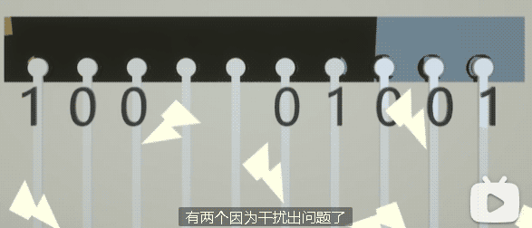
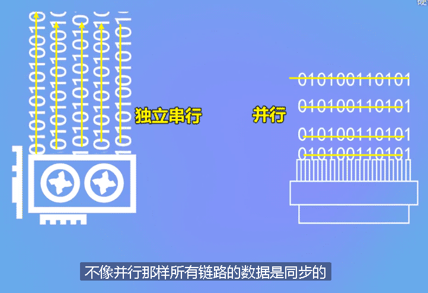
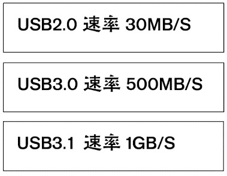
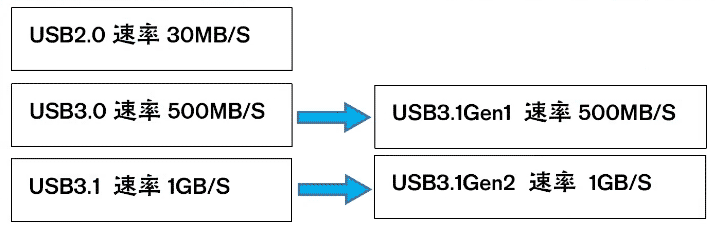

= 串行 & 并行
:toc:
:sectnums:

---

== 总线 & 带宽

[cols="1a,4a"]
|===
|Header 1 |Header 2

|总线
|电脑中不同的设备之间交互数据, 也需要通路. 比如CPU要和内存交互数据, 那CPU就需要搭建一条通往内存的电路; CPU要和显卡交互数据, CPU就要搭建一条通往显卡的电路. *电脑中不同设备交互数据的通路, 就被我们称之为"总线".*

|带宽
|总线和现实生活中的道路一样, 数据传输也是有一定速度限制的, 你在单位时间内只能传输一定数量的数据. *总线的数据传输能力, 称为"带宽".*
|===

---

== 串行 & 并行

"并行"就是很多数据一块传输, 而"串行"就是数据一个接着一个挨着传输, 也就是"多车道"和"单车道"的区别. +
早年的老式设备, 都是采用"并行"传输的. 而现在的设备, 都采用"串行"传输.

"并行"改"串行", 不仅不是退步, 反而是巨大的进步.

[cols="1a,4a"]
|===
|Header 1 |Header 2

|并行
|*缺点1 : 速度高不起来*

"并行"传输总线, 是多个数据同步传输, 需要做到三点:

1. 传输数据出去之前，需要让数据排排站对齐好
2. 然后传输过程中，也需要让数据排排站对齐好
3. 到了目的地后，还需要让数据排排站对齐好

*"并行总线"就好比走方阵一样, 为了保证方阵是整齐的，谁都不能走快了, 大家都要看左右两旁其他人的速度和他们去统一. 所以虽然一次能过去很多人，但是大家都快不起来.*

---

*缺点2:  并行的链路越多, 互相间的干扰就越强*

并行总线, 两根相邻的链路之间, 由于是数据同时传输的, 就会导致严重的干扰. 而且并行的链路越多, 这种干扰就越强. 因此"并行总线"还需要加强抗干扰的能力, 否则传输过程中, 数据可能就会发生损坏. 假设传送了10个数据过去, 有两个因为干扰出问题了, 那你就还需要重新对齐数据再传输.

---

*缺点3: 接口复杂*

"并行总线"是多链路一块传输数据的, 这就导致它需要很多线，接口需要很多的针脚. 你去看老式的并行接口, 就会发现这些线, 都是扁平的, 而且很宽. +
线宽，针脚多，接口大, 这对装机来讲, 就造成了很多不必要的麻烦.

|串行
|**串行总线就相当于只排一列, 然后第一个人跑起来，第二个人跟着他后面跑, 不用看横排面了. **它可以借助速度, 来弥补数量的不足. *虽然每次只能跑过去一个人, 但每个人都是跑着过去的，所以实际上效率并不低.*

电脑当中的总线也是这样的, 并行总线需要照顾数据的"协同传输", 这就导致了"并行总线"的频率不能做的很高, 也就是和方阵一样, 为了跑齐, 一点不能跑快了.  而对于"串行总线"来讲就没有这个问题, 因为只有一条链路, 我就可以把频率做的很高很高.

USB 的全称, 就叫"通用串行总线".

显卡的接口是PCIE X16, PCIE其实也是串行总线, 只不过"串行总线"同样可以做"多链路传输". 不过和"并行"的多链路不一样, *"串行"的多链路, 每根链路是独立的数据, 相互(横向)之间没有关系, 所以不像"并行"那样所有链路的数据是"同步"的.*

|===

---

== USB

[options="autowidth"]
|===
|Header 1 |速率上限

|USB 2.0
|30MB/S 左右

|USB 3.0 后命名改变为 => USB3.1 Gen1
|500MB/S 左右

|USB 3.1 后命名改变为 => USB3.1 Gen2
|1GB/S 左右
|===

