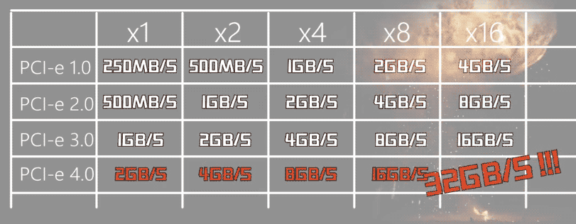
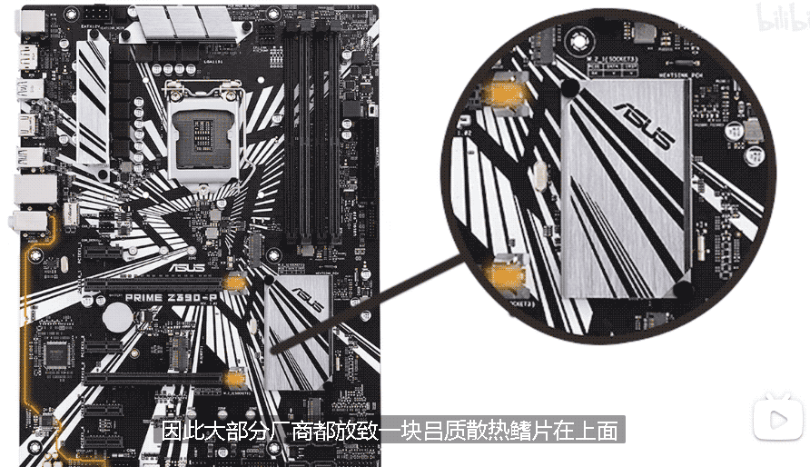
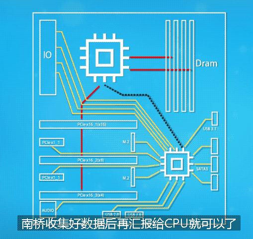
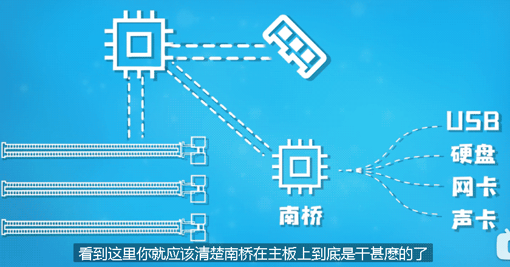
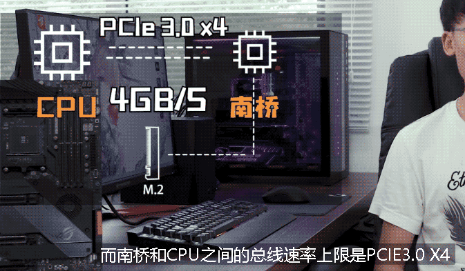
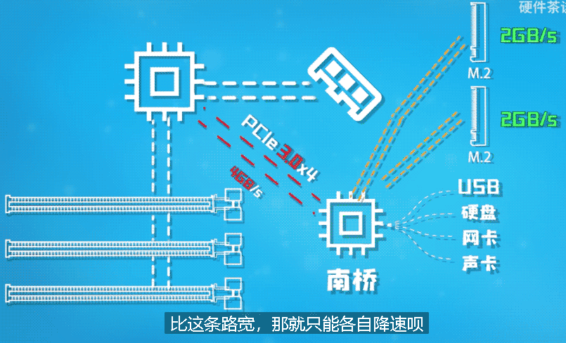
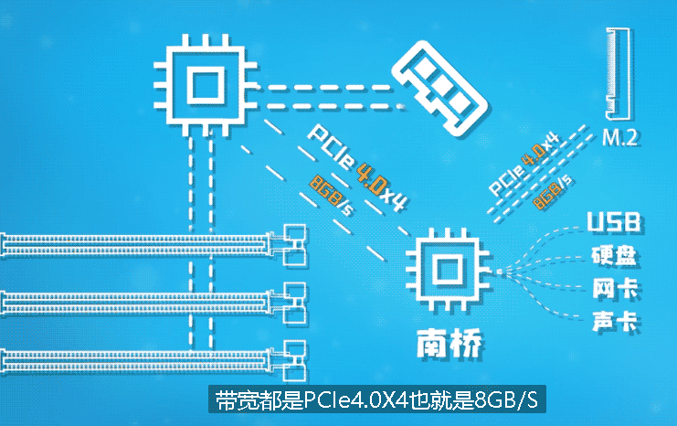

= PCIE 接口 & 南桥芯片
:sectnums:
:toc:

---

== PCIE 接口

总线接口的历史发展:

[cols="1a,4a"]
|===
|Header 1 |Header 2

|ISA总线 (并行传输)
|早年的时候, 电脑当中, 不同的设备所使用的"总线接口"是完全不一样的, 声卡用着声卡的接口, 网卡用着网卡的接口, 显卡用着显卡的接口. 为了解决这个情况呢, 电脑巨头IBM 就联合 intel 为他们的PC/AT 电脑制定了一个接口的标准, 这就是 ISA总线, 它在80年代是最广泛采用的系统总线. 不过它的弱点是, 它采用的是并行总线, 频率无法做到很高. 所以它的带宽只能达到每秒8MB/S的速率.

|PCI总线 (并行传输)
|之后有很多厂商陆续推出了各种总线, 想来统一市场. 最终统一天下的就是 "PCI总线"了. 但它依然采用的是"并行传输".

|PCIe总线 (当前主流)
|为了解决PCI总线的缺陷, 技术再一次进行了革新, 这就是目前我们所用的 "PCIe总线"了.

*PCIe 有两个种在形态, 一种是"接口"(比如 显卡插槽)，一种是"通道".*

- 比如你主板上的 M.2固态硬盘 接口, 它虽然外形是M.2, 但是数据传输, 是依赖于"PCIe通道"的, 所以这时候它的接口形状是M.2, PCIe在这里就承担"数据传输总线"的作用了. 因此你可以简单理解为, M.2接口就是一个换了形状的 PCIe接口.
- 雷电3接口, 也是利用 "PCIe通道" 来传输数据的.

PCIe 还能被转接成其他的接口, 比如 : PCIe转M.2, PCIe转USB, PCIe转Type-c. 所以这个接口的用途是异常的广泛的.

---

PCIe总线的带宽, 是按长度计算的:

- 最短的是 PCIe X1
- 然后是 PCIe X2
- PCIe X4
- PCIe X8,
- 最长的就是 PCIe X16.

*X4 的速度, 是X1的4倍.* 所以, X16的PCIe速度, 就是X8的2倍.

- 任何X16的设备, 都可以插在尾部非闭合的X1槽中运行, 只不过这个设备肯定是没法发挥全部的性能了.
- 你也可以把X1的设备, 插在X16的槽中运行, 只不过这样就会浪费带宽了.
-  残血 M.2, 雷电3, 说的就是 PCIe X2 速率的
- 满血 M.2 和 雷电3, 说的就是 PCIe X4 速率的

PCIe1.0 的时候:

- 单向传输 X1 的速度, 只有250MB/S
- 那X2, 就是 500MB/S
- X4, 也就 1GB/S
- X8的话是 2GB/S
- X16才 4GB/S

第一版PCIe的速度, 很快就不够用了. 由于PCIe目前没有什么明显的使用缺陷, 所以不需要进行大版本的技术革新和换代, 我们只需要让它传输的速度更快就行了, 接口的形状和通讯协议就不需要变动了, 这样的话还可以做到向下兼容, 一些1.0的设备还可以插到2.0上用, 2.0的设备 也可以插在1.0的接口上用, 虽然会降速，但是总比不能用强.

*其实每次PCIe版本更新, 速度就是在上个版本的基础上翻倍了.*

PCIe2.0 的时候, 速度就相对于1.0做到了翻倍:  X1的速度为500MB/S, X2为1GB/S, X4为2GB/S, X8为4GB/S, X16为8GB/S.

为什么目前的M.2固态硬盘, 顺序读写速度, 最高就只有3点多G每秒呢? 因为目前的 "M.2接口" 所使用的"总线版本"均为 PCIe3.0 X4, 速率上限就是4GB/S.  所以你是无论如何也不可能跑到4GB/S以上的, 因为接口的速率上限就这么高.

|===

---

== 南桥芯片

既然PCIE这么快, 那为什么我们不让电脑中所有的设备, 都使用这个接口或者总线呢? 原因有:

- 最大的问题还是受制于成本. 这种高频率的总线, 对线路设计的要求非常高. 比如屏蔽磁干扰这些.
- 并且, PCIE总线对于主板的布线来讲, 是一大考验. 为了安排下这种高速总线, 主板不得不做更多的层数, 来解决高频总线带来的种种需要. 为了满足PCIe4.0的要求, 华硕的板子起步都6层.
- PCIE总线, 直接接通在CPU的 "PCIE控制器" 上. 而"PCIE控制器"本身, 也不可能提供无限数量的PCIE通道.

但电脑里的所有设备, 最终都是要和CPU通信的. 你让所有的设备都去找CPU, 这对主板的布线难度就非常大. 好比马化腾是腾讯的总裁, 如果所有员工大大小小事都需要找马化腾去负责, 那公司肯定没法运营下去了. 所以, *给CPU安排一个下属, 让这个下属去和那些外围设备对接, 然后这个下属把数据汇总以后, 再交给CPU, 这样就解决问题了. 这个下属就是 -- 南桥芯片组 (South Bright).*

AMD的主板上, 有时你会看到主板上有一个小风扇, 这个小风扇就是为了给"南桥芯片组"散热用的. +
而inter的芯片组, 发热比较小, 通常不需要配备散热风扇, 因此大部分厂商就放一块铝质"散热鳍片"在上面. 很多中高端主板，厂家为了好看, 照顾一下主板的外观, 会将这个散热片做成各种炫酷的外形, 有点还会印上自家的LOGO, 甚者在南桥散热片上玩起了RGB.

"南桥芯片"在电脑里的作用, 就是帮助CPU和外围设备交互数据的. +
CPU亲自对接处理的有: 内存 等直连PCIe设备. 而其余的设备，比如声卡，网卡，固态硬盘，机械硬盘, USB这些对实时通讯要求不高的设备, 就全部接入南桥, 南桥收集好数据后, 再汇报给CPU就可以了.

比如, intel Z390主板, 直连CPU的 PCIE 只有16条, 要么单16，要么8+8，要么8+4+4. 而我们的目前的显卡大部分使用的都是PCIeX16, 那如果我插一块显卡，这16条通道就全部被占用了. +
那有人就要问了，我的M.2固态硬盘用的也是PCIE, 而且一下就用掉了PCIEX4, 那我的M.2固态硬盘是不是就会和显卡抢带宽啊? 插上了固态硬盘后, 显卡是不是就变成X12了?

事实上, 在intel平台, M.2固态硬盘使用的PCIE通道, 并不是直接来自CPU的, 而是南桥的.

intel平台上，就没有直连CPU的M.2接口，全部都是绕道走南桥的PCIe. 所以你的主板厂做多少个M.2是主板厂商的事，他想做一个就只有一个，他想做两个就是两个，这个和芯片组没有多大关系，主要看南桥提供的PCIe通道数量够不够。

*intel, "CPU" 和 "主板南桥"之间, 是通过一个叫 DMI3.0 的总线进行连接的, 这个总线就是PCIE3.0X4.  也就是说，CPU和南桥之间的数据带宽, 上限为PCIE3.0X4, 也就是4GB/S.* 所以, 这就解释了为什么目前的 M.2固态硬盘, 其顺序读写速度, 无法突破 4GB/S? **因为 M.2是接在南桥上的, 南桥和CPU之间的总线速率上限是 PCIE3.0 X4, 所以所有接驳到南桥上的设备, 其速率都无法超过 4GB/S. **

PCIe从3.0升级到4.0, 速度翻倍了, 意味着什么? 意味着 CPU和南桥之间的这根线, 同样升级到了**PCIe4.0 X4. CPU和南桥之间的数据带宽就上升到了8GB/S**, 这就意味着所有接驳到南桥上的设备, 其单个接口的带宽上限, 都可以达到8GB/S了. 比如 M.2接口的固态硬盘, 最高就能跑到7点多G每秒的顺序读写速度了.

由于南桥和CPU之间的通路变宽了, 可以缓解南桥上的设备抢带宽的现象.

比如, 微星B360M迫击炮, 如果你在PCIe_4槽里插入了PCIe设备，其第二个M.2接口会被屏蔽. 也就是说，它的 PCIe_4 和 M.2_2, 是共享的一根X4的总线，*它俩是"或"的关系，你只能选择一个. 为什么会这样？就是因为PCIe通道数量不够用导致的。*

---

