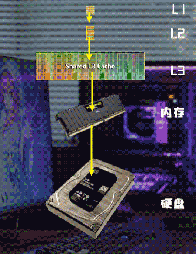
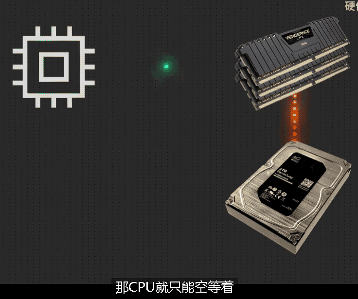

= CPU 原理
:sectnums:
:toc:

---

== 为什么卡顿的电脑换了固态硬盘, 就能起飞? -> 因为 CPU不再需要等待"传入数据"太久了

硬盘太慢了, 跟不上CPU的速度. CPU内部每秒处理的数据都是海量的. 你让CPU直接去对接硬盘, 那效率一定很低. 为了解决这个问题, 目前人们并不让CPU去直接和硬盘交换数据的, 而是通过一个速度更快的中介 -- 内存.

事实上, CPU也并不是直接和内存交换数据的, 在 cpu 和内存之间, 还有 L1, L2, L3 cache, 就是CPU内部的三级缓存.  CPU是先和L1交互数据, 然后是L2, 然后是L3, 最后才到内存, 最后才是硬盘.

目前, 人类无法以低成本制造出媲美CPU速度的存储单元, 我们就只能利用这种无限趋近于CPU速度的多级缓存, 来凑合用. 等将来硬盘速度能够追上内存, 或许那个时候内存就没必要存在了, CPU就可以直接和硬盘交互数据.

为什么换了固态硬盘, 电脑的速度会变快? 因为机械硬盘实在太慢了, **你的CPU和显卡性能再强, 无法及时传递数据去给它们去运算, 它们也发挥不出来呀.  所以, 如果硬盘不能及时把数据传递给CPU, 那CPU就只能空等着.*

你打开某个软件, 鼠标一直转圈圈, 你可能以为是电脑的性能不足, 实际上大概率是硬盘没有及时把数据交给内存导致的.

---
