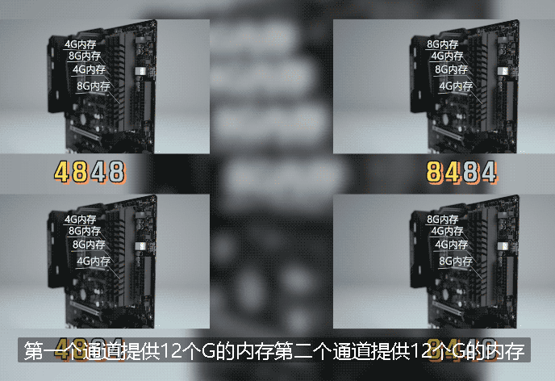

= 内存 原理
:toc:
:sectnums:

---

== 内存的带宽 = 内存核心频率 × 内存总线位宽 × 倍增系数

生活中, 影响马路的通行效率的重要因素, 有两个: 1. 道路的宽度, 2. 限速情况.  +
同样, 电脑中, 任意两个设备传输数据, 也是有一定的通路的 -- 即: 总线.

[options="autowidth"]
|===
|Header 1 | |

|马路
|道路的宽度. +
"车道"数量越多, 道路的通行效率越强.
|限速情况

|总线
|位宽. +

|频率. +
频率越高, "总线"的数据传输速度越快.
|===

衡量"总线"数据传输能力的高低, 就是看它单位时间内, 能传输多少数据.  +
比如 PCIe3.0 × 1, 在一秒钟之内可以传输1GB（985MB）的数据, 那它的带宽就是1GB（985MB）每秒.

内存的带宽计算公式就是:
\begin{align}
\boxed{
内存的带宽 = 内存核心频率 × 内存总线位宽 × 倍增系数
}
\end{align}

[options="autowidth"]
|===
|内存的带宽 =  |内存核心频率 | × 内存总线位宽 |× 倍增系数

|
|3600Mhz 的内存, 速度一定比 3200Mhz 的快.
|内存"双通道"
|
|===

---

==== 内存"双通道" -> 位宽翻倍

如果你只有一根内存, CPU 就只能和这一根内存进行数据交互.  +
*但如果你有两根内存, CPU就可以同时和两根内存交互数据. 这样, 原本CPU通往内存的通路, 就从一根变成了两根. 换言之, CPU 可以同时从两个内存一块读取, 也就是位宽能翻倍.*

*当内存的带宽翻倍以后, CPU和内存 的交互效率就会提高.* 这对于打开大型工程软件, 或者玩三维游戏, 性能会有质的飞跃. +
在游戏<刺客信条奥德赛>中, "双通道"比"单通道" 平均高了足足20帧. 这是啥概念呢? 好比你从2070的显卡, 免费换到了2080.

---

==== Memory Controller I/O -> 你能用到多少通道的内存, 是由 IMC 来决定的

那主板上有四个内存插槽, 插满四根以后, 是不是就可以组"四通道"了呢? 并不是.

*CPU和内存交换数据的部分叫 Memory Controller I/O, 也就是 IMC. 你能用到多少通道的内存, 是由 IMC 来决定的, 和主板上有多少内存槽是没有关系的.* 目前民用平台的 CPU 的 IMC, 最大就只支持到"双通道"内存.

所以纵使你主板上有四个内存插槽, 由于你CPU的IMC只支持"双通道", 因此你插 4 × 4g 和 2 × 8g, 效果是一样的. 同理 4 × 8g和 2× 16g 效果也是一样的.

---

==== "双通道" 的位置划分

[options="autowidth"]
|===
|Header 1 |Header 2

|主板上若只有2根内存插槽
|一根就是一个通道

|主板上有4根内存插槽
|那么, "一二槽"就是第一个通道, "三四槽"就是第二个通道.

如果你有两根内存, 优先插在2, 4槽上.
|===

---

====  "不对称双通道" 的插法

4+8G 这样不对称的容量, 两个内存是否可以组"双通道"呢?  答案是可以, 这个就是"不对称双通道".

[cols="1a,3a"]
|===
|Header 1 |Header 2

|4+8G:

- 4G的全部, 和8G的前半部分, 是"双通道".
- 而8G的后半部分是"单通道".
|

|8+16G 组双通道的话, 那就是:

- 8G的全部, 都是双通道;
- 16G的前半部分8G, 是双通道; 后半部分8G是单通道.
|

|插4根内存: 两个4G, 两个8G
|- 如果是 4488这样插: 则,  +
-> 第一个通道提供8G,  +
-> 第二个通道也提供8G, +
即"双通道"的部分就只有16G. 即: 16G双通, 8G单通.

- 如果你插的是 4848/8484/4884/8448, 这样的话: +
-> 第一个通道, 提供12个G的内存 +
-> 第二个通道, 提供12个G的内存,  +
那你24G内存, 全部都是双通道.

|===

---

==== "不对称双通道"的弊端

"不对称双通道"有一个弊端, 以 4+8G 来举例, *系统并不知道这12G, 哪个部分是双通道, 哪个部分是单通道.* 所以 在Windows中会被一视同仁. 我们的系统并不能智能的帮你把常用和实时使用的软件, 一定去扔到双通道的部分, 以提高速度.

所以, 就有可能会出现这种情况: 你今天打开这个软件, 系统给你扔到了"双通道"的性能很高; 但到第二天, 加入内存用的比较多, "双通道"的部分用完了, 你再次打开这个软件的时候, 系统就给你丢到"单通道"里了, 导致性能出现下降.

所以, 双通道内存, 还是推荐组对称的比较好.

---

== ---------- ----------

---

== 内存频率, 由谁决定其上限?

- 一个2400的内存, 和一个2666的内存插一块, 那最后频率是按2400算, 还是按2666算? +
-> *向下看齐.* 目前主板要求你所有的内存, 都同步频率运行. 所以,  你的主板BIOS, 会自动帮你把 2666的, 降低到2400, 去匹配速度低的那个内存条.

- i3 9100 cpu, 支持的的内存默认频率是2400; B360主板 内存频率上限2666, 那你到底该买多少频率的内存?

==== 体质 -> 决定着内存的频率上限.

*内存自身工作频率的上限, 是由谁决定呢?* 很简单, *只有一个参数 -- 颗粒的体质.*

无论是CPU, 内存颗粒, 还是固态硬盘颗粒, 其本质上都是属于"硅芯片". 即便是同一块晶圆上的相邻两块晶片, 也就是die（芯片）, 它们之间也都会有细微的差异 -- 即"体质"差异.

-> *体质更好的晶片, 可以在更低的电压下, 跑到更高的频率.*   +
-> *而体质差的, 可能在高压下, 也无法跑到目标频率.*

所以芯片生产出来以后, 体质好的芯片, 会直接被挑去拿去做高端产品; 体质差的, 可能就直接被降级为次级型号. +

比如拿CPU举例, 假设一个Die: +
-> 能在1.25V的电压下, 跑到5.0Ghz的频率, 那它就拿去做i7. +
-> 能在1.25伏的电压下, 跑到4.5GHz的主频, 那它就拿去做i5.

即使是同一层级的芯片, 也是有细微的差异的. 有的人的i9 9900K, 只需要1.25V, 就可以全核心5.0Ghz. 而有的人9900K, 上了1.35V, 跑5.0GHz都不稳定, 这就是因为"体质"不一样导致了.

---

==== 决定"内存频率"的因素

包括:

[cols="1a,3a"]
|===
|影响内存频率的因素: |Header 2

|内存条的"标注频率" (体质)
|内存条的标注频率, 就是商品界面标记出来的频率.   +
就是在忽略一切外部因素的情况下, 保证主板/IMC/芯片组等等, 都不出现短板的情况下, 只看内存本身, *它保底可以跑多少频率.* +

比如一个标注频率为3200 的内存,这个3200 是厂家给你测试出来的.

"体质"主要由颗粒的型号去决定的. +
-> 海力士的颗粒, 频率基本上动都不能动. +
-> 三星的 B-Die颗粒, 往上浮动的潜力很高.

|IMC (内存控制器) 性能
|内存是由IMC控制的, 所以IMC的性能, 会直接决定你可以使用多高频率的内存.

英特尔这边, IMC的性能都比较强. 而AMD的 IMC性能 就比较弱鸡.了.

*IMC 除了"性能"这个参数, 也有"体质"一说.* IMC 是 CPU Die中的一小块区域, 所以**它也是硅芯片**, 和CPU生产的时候一块完成的.

|CPU默认支持的内存频率
|i5 i7 i9 都是支持 2666的内存. +
*这个CPU默认支持内存频率, 就是指你主板不支持超频的情况下, 该CPU支持的最大内存频率.*

比如, 你用 i3 9100F 去配 B360, 因为9100F的内存频率上限2400, B360主板不支持内存超频, 所以你的内存频率上限就是2400了.

\begin{align}
\boxed{
即: 主板不支持内存超频的情况下, 内存频率的上限, \\
由 ①内存体质较低的值, 和 ②CPU默认支持的内存频率, 来决定.
}
\end{align}

-> intel 这边, 不支持超频的主板, 是H系列和B系列; 支持超频的主板是Z和X. +
-> AMD : 全系列板子都能给内存超频.

即:
\begin{align}
\boxed{
即: 主板支持内存超频的情况下, 内存频率能达到的值, 将无视CPU的默认支持内存频率值. \\
内存频率的上限, 将由 ① 内存体质，② IMC性能与体质, ③ 主板布线与电气性能，\\
这三者最低的值决定.
}
\end{align}

---

*而如果你的主板允许你超频的话, CPU的默认内存频率, 会直接被无视掉.* 就突破了CPU默认支持内存频率的限制, 此时的内存频率限制因素, 只有三个: 1.内存体质，2.IMC性能/体质，3.主板布线与电气性能.

|主板布线与电气性能
|主板的布线和电气性能, 这个是属于主板的物理性质, 和内存体质一样, 属于玄学的东西. 能跑多高, 全看运气. 但这个东西厂家也会给你一个保底值. 告诉你这块板子, 在"内存本身"和"IMC"不出现短板的情况下, 保底可以跑出多少频率的内存.

如果你想查到这个板子, 最高可以上多少频率的内存, 可以有两种方法:

1. 自己测
2. 去查你主板的内存支持"QVL列表". QVL列表就是厂家帮你测试的, 各种型号，各种内存与这个主板的兼容性.

|CPU的步进 (intel这边)
|
|===

---

== ---------- ----------

---

== 内存条的 SPD 与 XMP

你在购买了中高频内存(3200, 3600这类的)后, 装好机器以后, 如果你不做任何的设置, 你通常都会发现你的内存, 依然工作在2133, 2400 的频率下.

**为了让内存频率正常, 你需要去主板里的BIOS开启 XMP, 才行.
**

*XMP 是 SPD技术的一种延伸.*

---

==== SPD (Serial Presence Detect) 串行存在检测 -> 存储着硬件信息

SPD (Serial Presence Detect)"串行存在检测", 是一种硬件特性.

电脑在开机时, 会进行一次 Power On Self-Test (POST) 自检. 它会对电脑内所有的硬件, 工作状态, 物理信息, 通讯协议, 供电电压, 电流等等, 涉及到影响电脑正常开机 运行相关的项目进行检查.

其中针对内存的检查 , 就会读取内存的容量, 频率, 时序, 电压, 颗粒型号, 颗粒封装方式, 针脚数量, 生产厂商, 制造日期等等. *和内存有关的硬件信息, 就存储在SPD里.*

---

==== EEPROM颗粒(可擦除, 可编程) -> 存储着SPD的信息

*SPD的信息, 存储在内存PCB上的一颗 "EEPROM颗粒"当中.*

EEPROM (Electrically -Erasable Programmable Read-Only Memory) 电子式可擦除可编程只读存储器.

电脑启动时, 开机自检程序就会读取EEPROM芯片里的 内存SPD信息 , 然后主板BIOS, 针对读取到的信息, 给出内存的工作参数, 驱使内存运行起来. *如果没有SPD信息 , 电脑主板无法知道你插入的内存, 到底应该用什么参数去运行*.

一些特定的软件, 可以读取到内存SPD的信息.  例如, CPU-Z, 就可以看到一部分. 更详细的一些信息, 也能够通过台风这个软件去查看.

*存储SPD的EEPORM, 是可擦除可编程的, 台风软件本身也有带修改SPD的功能 , 所以在很多年以前, 就已经有通过修改SPD信息, 造假内存的操作了.* 因此不要完全相信软件读取到的SPD信息.

---

==== XMP (Extreme Memory Profile) -> 是厂家设置好的, 能保证"高频内存"正常运行的一套预设参数.

XMP (Extreme Memory Profile) 是英特尔主导的一项技术, 可以被看作是SPD技术的一种延伸.

在英特尔平台直接就叫做 XMP, AMD平台则是叫做A-XMP, 或者D.O.C.P, 还有E.O.C.P.

*XMP内存储着一套内存预设信息. 这是厂家给你测试出来, 可以保证你的高频内存稳定运行的一套预设.* 这套预设里面, 包含了电压, 频率, 主要时序, 例如tCL, tRCD, tRP, tRAS等等参数. 它和SPD一起存储在内存条的 EEPROM里. 在电脑开机时会被读取到.

但是, BIOS并不会直接应用XMP预设, 大部分情况下, BIOS还是会以一个较低的通用预设去开机, 所以你在电脑内看到的就是2133Mhz.

*所以, 如果你买了高频内存, 就需要手动去BIOS内开启 XMP预设.*

XMP 则可以做到一键开关 , 傻瓜式的让你的内存, 正常地工作在高性能模式下. +
大家在组装完属于自己的新机器以后, 一定记得进BIOS 将 XMP功能打开, 确保自己花在内存上的钱, 不会被白白的浪费.

---

==== ★ 华硕主板, 开启 XMP预设 的方法

官方教程 +
https://www.asus.com.cn/support/FAQ/1042256/

1.计算机开机后，立刻按压键盘上的“delete”键，进入BIOS [EZ Mode]

2.按压键盘F7键，进入[Advance Mode]，如下图所示

3.点选 [Ai Tweaker]页面 ，如下图所示

4.点选[Ai Overclock Tuner]选项并设置为[XMP I]

5.按F10键，点选Ok，保存选项，计算机重启后，XMP选项开启即可完成

image:img/146.gif[]

---

==== XMP1 和 XMP2 的区别

我们在主板BIOS高级设置中, 开启XMP选项时, 有的时候会看见有两组参数, XMP1 和 XMP2 可以选择.

[cols="1a,4a"]
|===
|Header 1 |Header 2

|XMP1
|XMP1 在一般情况下, 会留下几个参数, 交给主板BIOS去自动给出数值优化.

|XMP2
|XMP2 则是把那几个小参数也规定了数值, 不交给主板去AUTO.
|===

之所以不能说 XMP1 和 XMP2 哪个更好, 是因为主板自动给出的数值不一定是最好的 , 但内存厂商给出的参数, 有时未必也能跑到更高的效能.
