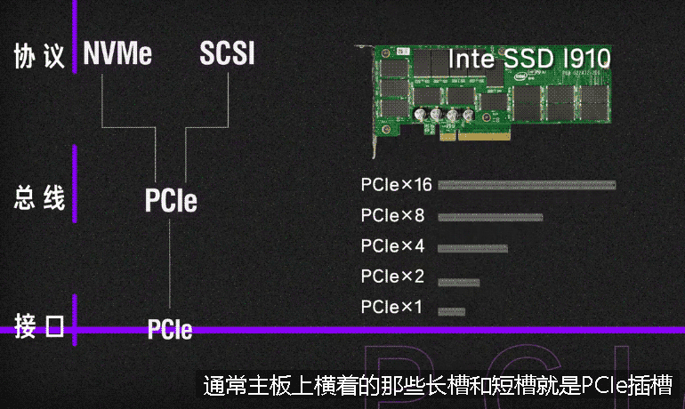

= 硬盘
:toc:
:sectnums:

---

== 硬盘上的数据

磁盘是利用二进制来存储数据的, 但系统并不知道硬盘上, 哪些数据是文件A的, 所以我们用红色的方框把它们框起来, 以标明这个红框内是一个整体的文件. 这个红色的方框, 以前就叫FAT表, 现在则是 "NTFS表"了.

在电脑上删除文件, 清空回收站, 执行的就是删除该文件在FAT表当中的记录, 把红框拿掉. 实际上你的数据在磁盘上并没有消失. 当你写入新的数据的时候, 系统是直接往旧的数据上去覆盖的.

但上述内容只适用于机械硬盘, 固态硬盘是不适用的.  因为**固态硬盘在写入新数据的时候, 必须要保证那一块的区域是空的**, 如果不是空的, 就需要先进行"擦除"操作, 再进行"写入". 所以固态硬盘不能像机械硬盘那样直接往旧的数据上覆盖. 正是因为有这个特性, 所以固态硬盘有一个特殊的功能 -- "*TRIM回收指令*".

你的固态硬盘, 你再进行写入数据的时候, 加入刚好用到之前删除过文件的一块区域, 因为需要先进行擦除, 所以会浪费一定的磁盘性能, 造成写入速度的下降. 所以说, 固态硬盘用久了会发生降速的现象.

**为了避免出现降速的情况, 固态硬盘的厂商就搞了"TIM回收指令", 在你删除数据以后, 如果系统检测到你当前没有进行数据读写, 也硬盘处于空闲的状态, 就会自动帮你擦除你之前删除的数据. 这样当下一次再写入的时候, 就能直接往上写, 而不需要临时进行"先擦除, 再写入"的操作了. **

Windows XP系统, 系统并不支持"TRIM指令". win7 开始, 才加入"TRIM指令". 目前的系统, 都是默认帮你打开 TRIM, 以提升磁盘性能的.  *在 TRIM 擦除数据后, 数据就几乎就不可能再找回来了.* 所以, 你的固态硬盘, 应该在文件被删除后的立刻, 就进行数据恢复, 祈祷系统现在尚没有进行 TIM 回收操作.

---

== PMR 磁盘 (Perpendicular Magnetic Recording，垂直磁性记录)

我们截取磁盘表面一小块的部分，把它近似看做水平的直线. 为了避免相邻磁道的数据发生磁干扰，轨道与轨道之间是存在间隙的，这些间隙就导致了数据密度的降低.

读取的磁头, 和写入的磁头, 是分开的. 在传统没有使用"瓦叠技术"的 PMR 磁盘, 也就是CMR磁盘中, 由于"写磁头"比"读磁头"宽,

这里就有一个问题, 真正有效的数据, 只有"读磁头"扫过去中间的窄窄的一条. 因为"读磁头"只需要这么宽的数据带, 就可以获取数据. 所以不得已浪费了上下磁道的空间.

image:img/056.jpg[]

---

== ---------- ----------

---

== 低性能的代表: SMR瓦楞式堆叠硬盘

"SMR瓦楞式堆叠硬盘" 解决的问题, 就是这些空隙. SMR磁盘采用了特殊的技术，把磁道和叠瓦片一样叠到了一块去，因为很像房顶的瓦片，所以我们称之为"瓦楞式堆叠硬盘"。

---

==== SMR "写入"的操作过程

由于瓦又叠磁盘的磁道, 是堆叠在一起的(每一个轨道, 即和上一个轨道有重叠部分, 又和下一个轨道有重叠部分.)，而"写磁头"比较宽，所以写入第1轨道数据的时候, 会把下面的第2轨道(磁道)也一起写入了.  +
在第2轨道(磁道)写入的时候, 会覆盖了上一个(第1轨道)磁道, 同时, 又把下一个磁道(第3轨道)也写入了。

---

==== SMR "读取"的操作过程

因为"读取磁头"比较窄，像普通磁盘一样正常读取就可以了。

这里就可以发现，"叠瓦磁盘"的数据密度, 为什么比"普通磁盘"要大的多的原理了。

image:img/059.gif[]

---

==== SMR "改写"的操作过程

*SMR "改写"的操作过程, 就是为什么"叠瓦磁盘"比"普通磁盘"性能下降很多的关键！*

*由于叠瓦磁盘, 磁道堆叠的特性，改写某一"磁道"的数据势必会影响下一个"磁道"的数据，所以必须要有一个"缓冲区", 先把下一磁道的数据放入"缓冲区"，改写完目标数据后，再把"缓冲区"中的数据重新填回来。*（这也就解释了为什么SMR磁盘的缓存 从64MB升级到了256MB，因为改写数据时, 需要大量的缓冲区。）

- *本来操作一次就可以完成的任务，放在叠瓦磁盘身上必须操作四次才能实现*，所以我才会说叠瓦磁盘性能很垃圾。

- 磁盘"读写的次数", 与其"寿命"是有关的. *叠瓦盘在改写数据时进行的"读写次数", 远超CMR磁盘，所以它的寿命相比CMR磁盘更短。*

- CMR磁盘普遍是7200转，而到了"叠瓦盘"则变成了5400转，因为"叠瓦盘"数据密度变大，转速务必要降低. 而转速直接影响读写速度，所以即便数据密度变大了, 但由于转速的降低, 使其"读写性能"不增反降。

所以大家买硬盘时, 避免买SMR叠瓦盘。至于怎么分辨SMR也很简单，尽量选择7200转 64MB缓存的，不要选5400转 256缓存的就可以了。 +
一般来说, 1TB内的硬盘, 都是 CMR机械硬盘，只有2TB以上, 才会有 SMR叠瓦盘。

---

== ---------- ----------

---

== SSD (Solid State Disk / Solid State Drive) 固态硬盘

"机械硬盘"的工作原理:: 为了能够精准定位数据所在磁盘面的位置, 磁盘本身又被划分了无数的"扇区"和"磁道". 假设有一个数据, 在第五磁道, 第七扇区上, 那磁头就会优先摆动到"第五磁道"上空, 然后等待着"第七扇区"转过来, 当"第七扇区"转到磁头下面的时候, 就可以读取数据了.

"固态硬盘"的工作原理::
就比较高级了, "固态硬盘"是"量子力学"的实际应用.  +
它存储数据的基本单元, 叫"浮栅晶体管". "浮栅晶体管"的基本结构主要有四个: 1.存储电子的"浮栅级", 2."控制极",  3."P极", 4."原极"与"漏极".

"浮栅"当中存储着一定的电子, 电子数量高于一定的值就是0, 低于一定值就是1. +

==== SSD "读取数据"的操作

[cols="1a,2a"]
|===
|Header 1 |Header 2

|-> 往"控制级"施加电压, "原极"和"漏极"如果导通了, 就说明"浮栅"里存在大量的电子, 判断为 0.
|

|-> 如果没有导通, 说明"浮栅"里没有或者有少量电子, 判断为 1.
|
|===

这样就可以做到读取数据了.

---

==== SSD "写入数据"的操作

而"写入"或者"改写"数据的时候:

[cols="1a,2a"]
|===
|Header 1 |Header 2

|-> 往"P级"施加电压, 就可以从"浮栅中"析出电子.
|

|-> 往"控制极"施加电压, 就可以吸回电子.
|
|===

这样就可以进行"写入"和"改写"操作了, 这便是固态硬盘的工作原理.

---

==== NAND 颗粒 <- 用于存储数据

而无数的"浮栅"堆叠在一块, 就可以存储大量大量的零和一的数据, 这个东西就是NAND颗粒. 也就是固态硬盘表面那一个一个的黑块. 它就和图书馆当中的书架一样, 存储着无限的 0101... 的数据.

---

==== 主控

固态硬盘的主要结构, 除了"颗粒"以外, 还有另外一个非常重要的部件 -- 主控.

我们假设 "NAND颗粒" 是水库，数据是水, 那么"主控" 就类似水坝这样的角色. 它控制着固态硬盘的数据流入与流出, 并针对"NAND颗粒"里的数据, 进行管理与分配.

---

==== "SSD 固态硬盘" 和 "机械硬盘" 的速度对比

"机械硬盘"实际上是存在很多的弊端的:

- 它的延迟很高, 你在读取数据之前, 需要先摆动"磁头臂"到对应的"磁道"上, 还需要等待"扇区"转过来. 七千二百转看上去很快, 但是这两个操作依然会导致大约十几毫秒的延迟. 这对于动辄几千兆赫兹的内存, 和几G赫兹的CPU来讲, 已经很高了.  +
而"固态硬盘", 全程都是电子交互, 电气信号的速度, 要远超"磁头臂"和"磁盘"这种机械结构的.

- 如果你的数据, 是随机分散在磁盘的各个角落, 那"机械硬盘"就需要经过多次的寻道和寻址, 多次等待扇区转动到磁头底下. 所以"机械硬盘"在读取分散性文件的时候, 性能异常的弱鸡, 这个就是我们所说的"随机读写性能"低下.

我们来看一组数据, 使用的测试软件为ASSSD. +
最左侧是一块机械硬盘, 中间为三星860EVO SATA3固态硬盘, 最右侧为三星970EVO PLUS M.2接口的NVME固态硬盘.

[cols="1a,4a"]
|===
|Header 1 |Header 2

|第一行为"连续读写".
|

这个参数主要影响的, 就是**单个或者几个数量比较少的"独立大文件", 比如说一个几G的电影, 一个几G的压缩包. 这种"数量不是很多, 但是单个体积比较大"的连续性文件*, 在读写这部分数据的时候, 就会涉及到"连续读写". 大部分情况主要就是拷贝电影, 复制压缩包或者很多的大图片之类的.

- 如果数据是连续分布在"机械硬盘"的扇区上, 那只需要进行一次寻道, 就可以读取了, 所以即便是机械硬盘"连续读写速度"也不会很慢, 大部分机械硬盘都可以做到一百到两百兆每秒.

- 而SATA3固态, 则受制于接口的速度限制, 最多只能跑到500MB/S.
- M.2 NVME固态, 则可以轻松达到3GB/S.

|第二行为"单线程4K随机读写"
|

*这个主要就是"体积不大, 但是数量众多"的分散性文件.** 比如说我们的游戏, Windows操作系统, 它们都是由无数个几十K, 几百K, 或者几兆的零散性文件组成.  +
这种读写操作, 由于单个文件不大, 很快就可以完成. 但是是要做到读取完一个数据以后, 迅速找到下一个数据再进行读取, 然后再迅速找到下一个数据. 所以"4K随机读写", 实际上考验的就是硬盘的寻道和寻址能力.

- 而机械硬盘, 如果数据随机分散在磁盘表面的各个部分, 那它就需要经过多次的寻找和寻址, 而"机械硬盘"的寻道和寻址性能实在是弱鸡, 导致性能大幅度的下降. 所以这里可以看到, "单线程四K读写"的速度, 机械硬盘连1MB/S都没有达到, 而这行跑分恰恰是最影响我们日常使用体验的.

- SATA3固态, 基本可以做到40MB/S左右
- M.2 NVME, 则可以轻松达到60MB/S.

|第三行为"64线程随机读写"
|

第三行为64线程随机读写, *这个就是"并发"一次来做好多"单线程的4K读写".  因为软件在请求数据的时候, 不太可能就只是要一串数据, 大部分的时候它们会同时需要很多的数据, 这时就需要同时进行好几个线程的"4K随机读写".* 这个就是多线程4K随机读写.

不过, 一次并发请求"64线程"的随机读写, 还是比较难碰到的, 我们大部分的操作都是基于"单线程"和"64线程"之间.

- 这里, 机械硬盘的速度依旧还是只有个位数, 只有2MB/s.
- SATA3固态, 和NVME固态的速度, 则是机械硬盘的几百倍, 甚至上千倍.

|第四行"访问延迟"
|机械硬盘达到了十几毫秒, 而固态硬盘只有零点零几毫秒.
|===

所以大家看到这里就能体会到, "机械硬盘"在"固态"面前到底有多慢了吧.

---

==== 缓存

那是不是AS SSD的跑分越高, 固态硬盘的速度越快呢? 也不完全是.

其实有很多的固态硬盘跑分, 并不能做到全盘的速度都那么快. *大部分硬盘为了提高性能, "主控"并不是直接访问"NAND颗粒"本身, 厂家会在"颗粒"与"主控板"之间, 设置一个缓存, 让"主控"交互数据的时候, 优先和"缓存"进行交互, 然后"缓存"在在空闲的时候, 再把数据写入"颗粒". 所以, 如果你跑分跑1G的数据, 有时就是跑"缓存"的性能.*

*实际上, 有很多的固态硬盘"缓存"跑完以后, "主控"就只能直接和"颗粒"进行交互, 这个时候就会出现阶梯式的性能下降.* 这里说的就是以台电, 铭瑄, 七彩虹为主的一些黑白片固态. 跑分看着很高, 但是实际用起来, "缓存"一爆, 立马原形毕露.

因此, AS SSD 只做一个参考.

---

== ---------- ----------

---

== 硬盘的 总线 bus, 协议 protocol, 接口 interface

---

==== 总线 bus

计算机内部有很多的电子元器件, 它们之间会有数据沟通和传输的需求, 如果A元器件, 想给B元器件传输数据, 那它就需要建立通路. 比如说CPU想和显卡交互数据, 那CPU就需要拉一条通往显卡的电路, CPU要想和硬盘交互数据, 那CPU就需要拉一条通往硬盘的电路. 在电脑里, *像这种不同设备之间交互数据的通路, 就被我们称之为"总线".*

总线也是有一定的承载能力的, 总线在单位时间内能传输多少数据量, 就被我们称之为总线的"带宽".

---

==== 协议 protocol -> 规定了两个设备之间, 用什么方法来进行通讯

*"协议"简单来讲, 就是电脑内部的一种规矩, 它规定了两个设备通讯时, 如何识别对方, 如何建立链接*, 使用的讯号类型, 数据的编码和解码方式, 数据传输的类型, 数据传输的方式, 以及物理层面上的电压电流的保持和截止时间等等规定.

*两个设备只有在"协议"完全一样, 或者相容的前提下, 它们之间才能够进行通讯.*

假设A, B元器件之间有一根电路, 可以通电和断电. 如果我规定, 一秒为10个周期, 通电为1, 断电为0. 那A只需要通过大量的通电和断电, 就可以把想发送的信息, 以1秒10Bit的速度, 传输给B. 而这个一秒为10个周期, 通电代表1,断电代表0, 这个规定, 就是AB之间通讯的"协议".

*如果A不按照这个"协议"去发送数据, 或者B不按照这个"协议"去接受数据, 那AB之间就无法达成沟通.*

所以简单理解就是, "协议"就是一种双方提前约定好, 采用某种形式, 以某种规格, 利用某种物体, 把数据传输出去. 而另一方再以同样的规则和流程, 去接收数据.

*一个更高效率的"沟通协议", 可以非常显著的提高两者的沟通效率.* 但是反过来, 高效率的协议, 同样也需要硬件作为后背的支撑才能得以实现.

---

==== 目前硬盘的数据协议 : NVMe (民用), SCSI(服务器用)

*协议, 总线, 接口, 都能限制一块硬盘的性能发挥*:

- 你有一个超级强大的"协议", 但是"总线"或者"接口"无法承载起来, 你也跑不动.
- 你有一个超级强大的"总线"和"接口", 但是没有足够好的"协议", 数据也无法完成高速的传输.

但通常来讲, 厂商都会保证这三者处于一个匹配的状态, 比如说一块性能很强大的固态, 厂商一定会设计出性能足够强大的"协议"与"总线", 还有与之匹配的"接口", 才会推出这款产品. +
所以大部分时候, 我们往往不需要考虑"协议层面"与"接口层面", 只是要看"传输总线"的承载能力即可.

---

==== 民用硬盘接口: SATA, MSATA, SATA Express, PCIe, M.2

[options="autowidth"]
|===
|Header 1 |版本| 理论带宽 |编码 |实际传输速度

|SATA (民用接口)
|SATA 3.0
|6Gbps
|8:10
|600MB/S

SATA接口, 使用的是SATA传输总线, 协议是AHCI. +
目前几乎所有的民用3.5寸, 和2.5寸机械硬盘, 2.5寸固态硬盘, 使用的都是这个接口.

*由于"SATA3总线"速率上限, 就是600MB/S*, 再加上各种损耗和干扰, 实际上这个接口的速度, 最多就只能跑到五百多兆每秒. 所以凡是使用"SATA3总线"作为传输载体的硬盘, 无论是固态硬盘, 还是机械硬盘, 其速率都不可能突破五百多兆每秒.

SATA接口分为两部分, 一个是长一点的"供电", 另一个短一点的则是"数据".  供电接驳在电脑电源上; 数据则是用SATA数据线, 接驳到主板上.

除了用线缆连接一些服务器, 或者硬盘架, 也提供有"供电数据一体式"的母口, 直接和抽屉一样把硬盘插在上面就可以, 供电和数据就自动对齐接上了.

|PCIe (民用接口)
|PCIe3.0
|
|128：130
| +
PCIe的带宽和长度有关系, 也就是后面那个乘几: +
-> 乘4的速率, 就是乘1的四倍, +
-> 乘16的速度, 就是乘4的四倍.

*PCIe既可以作为"总线" 承担"传输通道"作用, 也可以直接以"接口"的形式存在.* 如果在PCIe插槽安装固态硬盘, 使用的就是PCIe总线 /NVMe协议.

通常主板上横着的那些长槽和短槽, 就是PCIe插槽. 上面可以插显卡, 无线网卡, 有线网卡, 声卡, 采集卡,转接卡等.

|
|PCIe4.0
|
|128：130
|

|M.2 (民用接口)
|M.2 又分为两种 : B-Key 和 M-Key.
|
|
|NGFF 是M.2接口行业规范的别名.

->  *M.2接口可以走 SATA总线/AHCI协议, 此时它和普通的SATA硬盘没有区别, 速率同样会被限制在500MB/S左右*, 就是体积小一点. +

-> M.2接口也可以走 PCIe总线/AHCI协议, 速率上限由PCIe版本和长度决定. +

-> *M.2还可以走 PCIe总线/NVMe协议, 速率上限同样由PCIe版本和长度决定, 这个也是目前用途最广泛的组合*. PCIe3.0*4 的固态, 就是4GB/S以内了. PCIe4.0*4 的固态, 速度上限就是8GB/S以内了. +
image:img/161.gif[]

M.2接口, 又分为B-key, 和M-Key两种:  +
->  B-key的豁口在左边. B-key被称为Socket2, 支持SATA总线, 和 PCIe*2. +
-> M-key的豁口则是在右边. M-key被称为Socke3, 支持SATA总线, 和PCIe*4

注意: 不能通过外形去判断 M.2 支持什么总线和协议, 有的主板的B-key 可能只能走SATA, 不能走PCIe总线. 而有的M-key 可能只能走PCIe, 不能走SATA. 具体你这个接口能走什么总线, 要看你主板的接口说明书.

|U.2 (企业级接口)
|
|
|
|U.2接口, 是在SAS接口上继续改款而来的. +
这个接口, 也是在服务器, 和高端HEDT平台上使用的比较多. 很多的企业级固态, 使用的都是这种接口.

U.2在主板上的接口非常类似, 两个USB接口摞起来的形状, 比较有辨识度的. +

|SAS (企业级接口)
|SAS 3.0
|12Gbps
|8:10
|1.2GB/S

AS接口, 使用的是 SAS总线/SCSI协议.

这种接口服务器上用的非常多, 可以把它理解为是一种强化版SATA接口, 在SATA上增加了更多的功能, 并且支持更高速率的SAS总线.
|===

*PCIe总线的硬盘, 他们之间的接口, 大部分都是可以互相转换的*, 比如:

- PCIe <- 可以互转 -> U.2
- PCIe <- 可以互转 -> M.2
- U.2 <- 可以互转 -> M.2

**所以你可以发现, "接口"其实并不是完全限制速度发挥的因素. **真正要判断一个硬盘所使用的接口 其速率上限, 以及**你主板上的接口会不会限制你的硬盘性能发挥, 最好去查看一下它们所使用的"总线"比较好.**

---

