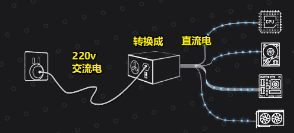
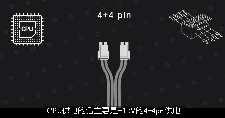
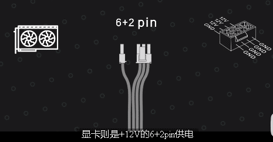
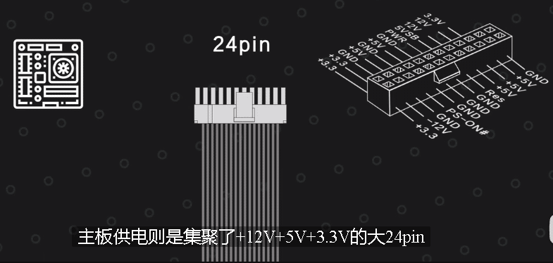
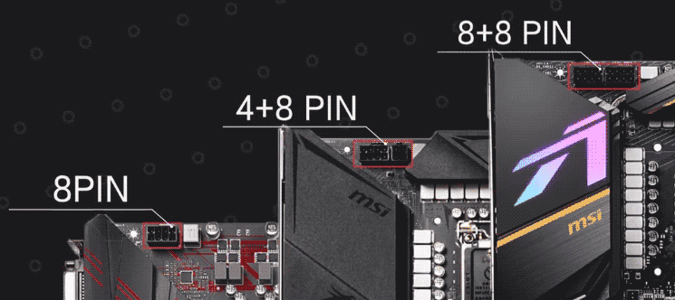
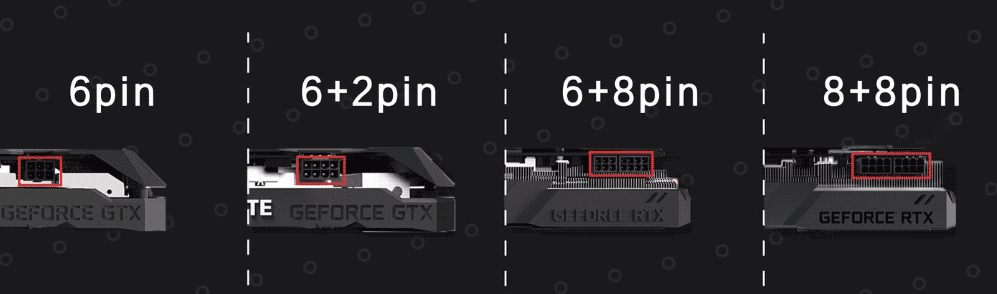

= 电源 原理
:sectnums:
:toc:

---

==  电源 原理

电源在电脑里到底是干什么的?  +
我们家里插座提供的市电, 都是220V, 50Hz的"交流电", 而CPU显卡硬盘等等各种芯片, 使用的都是使用的+12V+5V+3.3V的"直流电". 所以**我们就需要一个东西, 去把高压的"交流电", 转换成"直流电", 这个就是电脑里电源的作用了.** 电脑电源在电脑里只有一个任务, 就是将输入的交流电变成直流电以后, 再输出给各个配件.

所以普通的电脑电源, 一般情况下是一定有两个端口的:

- 一个端口通过一根很粗的线缆, 接到你家的插座上, 接入220V的交流电.
- 220V的交流电进入电源以后, 就会经过各种转换, 最后变成电脑所需的+12V+5V+3.3V的直流电, 再从另一边各种各样不同的接口, 输送给电脑里的各个配件.

目前电脑里需要独立供电的设备, 主要是:

[cols="1a,3a"]
|===
|Header 1 |Header 2

|CPU -> 4+4pin, +12V
|

对CPU供电, 主要是+12V的 4+4pin 供电, 4+4合并后就是8pin.

|显卡 -> 6+2pin, +12V
|

显卡是 +12V 的6+2pin供电, 6+2合并以后也是8pin, 只不过线序和CPU的4+4是完全颠倒的, 它们不能混插.

|硬盘
|- M.2固态, 和PCIe固态, 都是直接从主板取电的.
- SATA接口的硬盘, 会使用扁L口 SATA供电, 从电源获取+12V+5V+3.3V 的供电.

|主板 -> 24pin, +12V, +5V, +3.3V
|

主板供电是集聚了 +12V, +5V, +3.3V 的 大24pin
|===

但不同的主板是不一样的:

- 大部分主板的CPU供电是 "单8pin",
- 有的主板却是 8+4pin,
- 或者 8+8pin.

对不同显卡的供电, 也都是不一样的:

- 有的显卡只要 "单6pin" 供电
- 有的要 6+2pin 供电
- 还有的要 8+6
- 高端卡基本上 8+8 都是标配
- 夸张一点的还有 8+8+8.

每个人连入的硬件数量, 和硬件供电需求, 都是不同的. 所以, 电源厂商通常都会给出很多富裕的接口.

[cols="1a,3a"]
|===
|Header 1 |Header 2

|非模组电源
|所有接口, 都直接从直流输出端拉出来, 无法自行去除的电源, 就是"非模组电源".

|半模组电源
|即: CPU供电, 和主板供电, 这两根线是直接从电源的"直流输出端" 拉出来. 而其余的线缆, 则是以接口的形式存在, 你需要这根线就接上, 不需要的话就不用接.

|全模组电源
|就是整个电源的所有线缆, 包括24pin, 和CPU的 8pin供电, 所有的"直流输出端线缆", 都会以接口的形式存在, 你需要什么线就接什么线.

|定制线
|由于"全模组电源"线缆的两头都是接口, 这就意味着, 在保证线序相同的情况下, 你可以用自己的线缆, 替换掉原厂的线缆.
但是:

- 原厂线缆的质量一定是达标的, 而"定置线"的话, 无论是端子, 接口, 还是线缆本身, 质量全看卖家良心.
- 并且所有的全模组电源, 因使用"定制线"而导致的机器损坏故障, 或者电源故障, 厂家都是不给你保修的.

为了安全与保险起见, 一些生产力主机, 或者服务器之类的, 都是直接用原厂线缆的, 而不搞那么多花里胡哨"定制线"的.

|===

电源的"模组化"与否, 和电源本身的品质, 没有任何关系. 一个炸弹级别的电源, 它也可以做成全模组; 一个顶好的电源也可以做成非模组的.  +
模组化与否, 只是方便你接线, 和更换定制线, 和电源的品质本身没有任何的关系.

---

