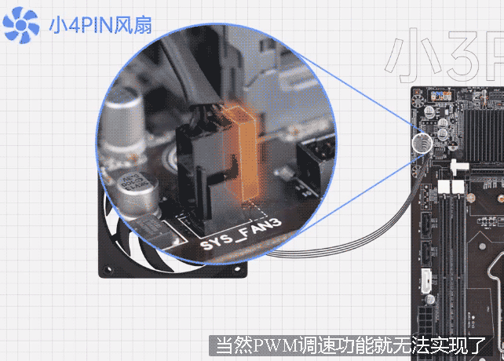
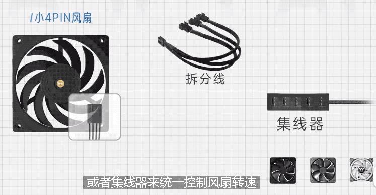
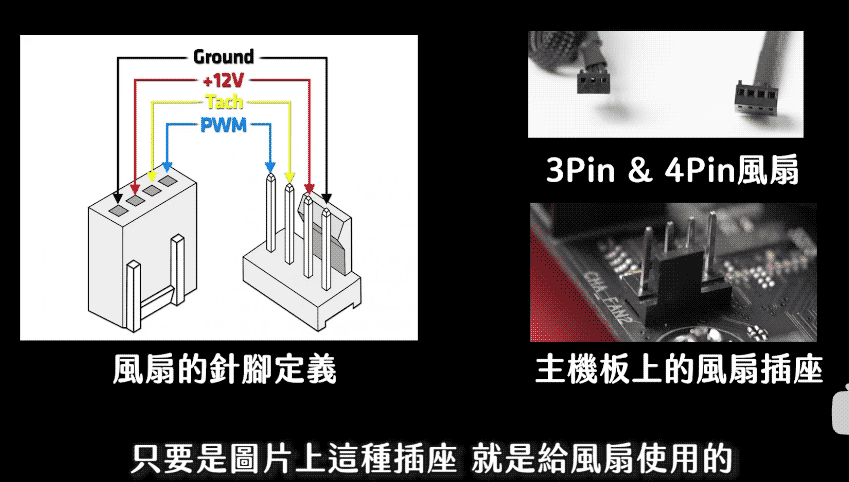

= 风扇 原理
:toc:
:sectnums:

---

机箱风扇, 主要作用就是加强机箱内空气的流通, 吸入冷风 排出热风.

---

== 风扇转速 的控制策略

目前"风扇转速"的控制策略, 主要就是 DC 和 PWM

[cols="1a,3a"]
|===
|Header 1 |Header 2

|DC
|image:img/009.gif[]

DC调速很简单, 通过控制供给风扇的电压, 来调整转速 :  电压高, 转速就高; 电压低,转速就低.

|PWM
|

PWM, 采取的是调整"占空比" 来控制转速, 就是一开一关, 一开一关. 当开关的频率高了以后, 看上去风扇就平稳转动的了.  +
想要控制转速, 只需要调整"开关的时间比值" 即可.  +

例如, 假设一个风扇的转速控制芯片, 一秒可以开关10次, 那它的频率就是10Hz, 一个周期的时间也就是0.1秒.

- 如果每个周期0.06秒开，0.04秒关, 那这个风扇就是最大转速的60%.
- 如果一个周期内, 20%的时间开, 80%的时间关, 也就是0.02秒开，0.08秒关, 那这个风扇就是最大转速的20%.
|===

---

== 定速扇 (已过时)

**定速扇, 这类风扇采用的是 "大4PIN" 供电, 直接接到电源上取电.** 开机的时候, 随着电源的开启就通电转起, 关机的时候就断电停转. 你无法控制他的转速, 买来是800转 那就永远是800转.

"定速扇"最大的好处, 就是兼容性好, 因为只要是个电源, 就一定有"大4PIN" 接口.  因此这种风扇哪怕是放到七八年前的古董机上, 都能顺利的转起. +
除非是给老机器加装, 否则不推荐大家去买大4PIN风扇. 一定要买的话, 也不推荐买转速超过1000的, 会有比较明显的噪音.

---

== 小3Pin 风扇 (已过时) -> 只能使用"DC调整电压" 来调整转速, 转速跨度小.

小3Pin风扇, 其针脚定义如图:

- +12v提供供电,
- GND作为负极回路,
- 另外一根是测速线, 可以监控风扇的转速

小3PIN 接口, 在老旧主板上非常常见, 风扇的接口上有一个滑槽, 主板上的接口有一个竖起的塑料片, 对齐滑槽和塑料片以后垂直插入即可.

小3PIN由于只有"供电"和"转速监控"线, 所以它无法采用数字信号, 也就是 "PWM控制转速", *只能使用"DC调整电压" 来动态的调整转速.*

DC调速的话, 有一个比较大的缺陷就是, 风扇的转子马达是有一个"起转截止电压" 的, 电压低于一定程度以后, 就无法驱使风扇转起了.  因此"DC调速" 能调整的区间比较有限, 转速的调整, 不能做到比较大的跨度.

---

==  小4PIN 风扇 -> 使用 "PWM" 调整转速, 跨度可以很大

小4PIN风扇, 其针脚定义如图. 相对于小3PIN来讲, 就多了一根PWM调速线, 滑槽的部分和小3PIN也是一样的, 所以**小4PIN风扇也可以接到小3PIN接口上用, 当然 "PWM调速功能"就无法实现了.**

反过来, 小3PIN的风扇, 也可以接到小4PIN接口上用, 当然还是只能用 DC .

这种 小4PIN接口, 也出现在主板上和集线器上.

*采用小4PIN的风扇, 都可以使用PWM调整转速, PWM 可以调整的区间, 相对于DC来讲非常广.*  +
比如, 利民的B12, 其在华硕主板的小4PIN接口上, 可以在400-2150转之间调整转速, 跨度达到1700多转.

---

== 私有接口风扇

私有接口风扇, 主要是部分水冷厂商, 或者品牌方自己做的风扇.

比如说TT家的扇子, 他们采用的接口, 是自己设计的私有接口, 供电调速RGB走的都是一根线, 你只能接到他们自己的集线器上用.  转速调整, 和RGB调整, 通常都是通过走集线器, 通过USB2.0跳线, 在系统内用软件控制.

但是本质上无非也就是PWM, 所以这类接口你可以理解为, 形状不一样的 PWM "小4PIN接口".

---

== 总论: 推荐选择 "小4PIN接口" 的风扇

[cols="1a,3a"]
|===
|Header 1 |Header 2

|不推荐 "大4PIN" 或者 "小3PIN"的风扇
|一般新装机的时候, 不推荐大家去买大4PIN 或者小3PIN的风扇, 虽然他们便宜而且兼容性好, 但是使用体验还是比较差的:

- 大4PIN 完全不能调速
- 小3PIN 则是能调整的转速区间非常窄

|推荐 "小4PIN"风扇
|小4PIN风扇 是我(硬件茶谈)个人最推荐的选择, 虽然会贵一点, 但你可以非常简单的通过几根"拆分线", 或者"集线器", 来统一控制风扇转速, 做到需要高转的时候, 再转; 不需要的时候, 就低转保持静音.

|私有接口风扇 -> 泛用性不太好, 只能用厂家的控制盒
|而私有接口风扇, 多线合一的设计可以方便走线, 也显得比较整洁. 但是泛用性不太好, 只能用厂家的控制盒, 价格也偏高.
|===

---

== rgb 与 argb 灯光控制

==== 接口

[cols="1a,4a"]
|===
|Header 1 |Header 2

|rgb
|传统的 rgb, 采用 12v 电压, 4pin 供电.

|argb
|argb 采用 5v 电压, 3pin 供电.

|===

---

== rgb 风扇的两根线

一般, rgb风扇都是有两条信号线:

- 一条控制风扇转速,
- 另一条控制 rgb灯光效果.

[cols="1a,3a"]
|===
|Header 1 |Header 2

|控制"风扇转速" 的线
|

插上之后, 风扇就能直接转了.

|控制 "rgb灯光" 的线
|

|===

一般, 市面上的风扇, 控制转速的接口, 主要有:

一般来说, 只要前两只脚有接通, 风扇就会转. +
第三只脚的功能, 是让主板可以侦测风扇的转速.

3Pin 和 4pin 风扇的前三只脚, 构造是完全相同的. 它们的差异在于第4只脚 -- 支持进行PWM模式控制.

image:img/035.gif[]

用 pwm 技术来控制风扇转速的, 该风扇就叫做"pwm风扇", 它是 4pin 的.

3pin 的风扇就是 "dc风扇".

3pin风扇 可以插在 4pin 的插座上, 但无法通过 pwm模式来进行转速控制, 只能使用 dc 模式来调整.

3pin的 dc风扇, 主要通过电压的高低, 来控制风扇的转速. 电压越高, 风扇转速越高. 但 dc风扇的缺点就是, 无法精确控制转速.

pwm模式的风扇, 电压会被固定在12v, 风扇转速是通过最后一支 pwm针脚 来控制的.

---

