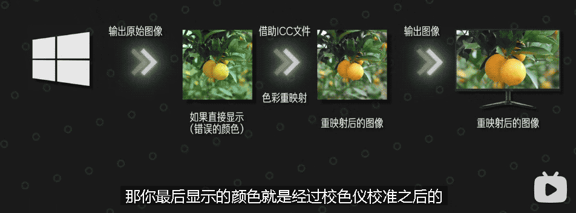

= 显示器 原理
:sectnums:
:toc:

---

== 色域 -> 代表了人眼睛可以识别的全部颜色

我们把人眼可见的所有光的"颜色信息"和"明度信息", 通过一定的数学变换, 映射到一个平面上, 就得到了这样一个**"色域马蹄图". 它就代表了人眼睛可以识别的全部颜色.** 这个颜色范围空间, 被我们称之为"CIE色彩空间".

一个理想状态的显示器, 应该是可以还原出"CIE空间"当中的全部颜色.

*显示器所能表现出来的全部颜色, 就是显示器的"色域".* 也就是说, "色域"指的是显示器所能显示颜色的丰富度. *色域越窄的显示器, 所能显示的颜色越匮乏.*

---

== 色彩空间 -> 是在CIE颜色覆盖范围内, 圈出来的一定区域. -> 100sRGB 只能覆盖到79.6%的DCI-P3色域

由于每个人的显示器, 所能覆盖的颜色范围是不一样的; *我们的摄影设备, 能存储的色彩信息也是不一样的.* 所以为了方便统一, 各行各业就制定了不同的颜色标准, **在CIE颜色覆盖范围内, 圈出来一定的区域, 作为标尺. 存储颜色信息的时候, 按照这个标尺去存储. 显示颜色的时候, 也按照这个标尺去显示. 这个就是"色彩空间"的概念. **

常见的色彩空间有:

- sRGB
- NTSC
- Adobe RGB
- DCI-P3

知道这些后, 我们再去看显示器的商品界面就很好理解了.

-  99%sRGB: 就代表它能显示出sRGB空间当中, 99%的色彩.
- 95%DCI-P3: 就意味着它能显示出DCI-P3空间当中, 95%的色彩.

如果要让你去对比 "100%sRGB" 的显示器, 和 "95%DCI-P3色域" 的显示器, 只看前面的数字, 好像是前者色彩覆盖广一些, 但实际上, *100sRGB 只能覆盖到79.6%的DCI-P3色域*, 95%DCI-P3要远远比100%sRGB色彩广.

显示器, 既然只能显示一定色彩空间内的颜色, 那"色域马蹄图"上三角形的色彩空间之外的颜色, 为什么能在你屏幕上看见呢? 原因也很简单, *显示器显示不出来的颜色, 就会按照一定的映射, 去强行让它显示出来. 也就是说, 你在屏幕上看到的色域马蹄图, 已经不是它真实原本应该存在的颜色了.*

---

== 色彩管理

目前我们的windows10操作系统, 就是以"100%sRGB色彩空间"作为标尺, 去存储色彩信息的. 目前你在互联网上看到的绝大多数内容, 它们都是按照"100%sRGB色彩空间"去存储和显示的.

win 10 读取你的显示器信息, 包括多少分辨率, 刷新率, 型号, 是通过显卡, 去读取显示器驱动板的 "EDID信息"来获取的. *而EDID信息里, 并没有存储显示器的"色域覆盖"的相关信息. 也就是说, 操作系统并不知道你的显示器是多少色域的面板. 所以, 目前Windows10系统只能默认, 你的显示器就是100%sRGB的.*

那这就会导致一个问题:  *如果你的显示器"色域"覆盖, 超过了100%sRGB,* 比如95%DCI-P3, *那这时候win系统还按照100%sRGB的色彩空间, 去发送颜色信息给显示器, 那你最后在屏幕上看到的色彩, 就是过饱和的.*

比如, 你有一个95%DCI-P3色域的显示器, 对应sRGB大概是135%sRGB. 你要显示纯蓝色: +
win10默认你是100%sRGB的显示器, 然后告诉显示器, 请显示100%的蓝. 但是显示器确是95%DCI-P3色域的. 100%的蓝在这个色域上, 就变成了135%sRGB的最蓝. 结果就是, 画面过饱和了.

如果你已经买了一个超过100%sRGB的显示器, 你希望它在Windows系统下能正常的显示颜色, 那该如何操作呢? 一般来讲有两个方案:

[cols="1a,4a"]
|===
|Header 1 |Header 2

|方法1
|在显示器的设置菜单当中, 把显示器切换为"sRGB模式". 时, 驱动板就会借助一些算法, 用你这块超过100%sRGB的屏幕, 模拟100%sRGB的色彩空间.

但是大部分中低端显示器, 在sRGB模式下, 是不允许你调整屏幕亮度的, 因为亮度的变化会导致色彩出现偏离. 这就给你的使用造成了很多不便.

|方法2
|使用"较色仪", 去对你的屏幕进行"色彩空间"的矫正管理. +
但是, ICC校色文件, 并不是所有的时候都能生效的. 比如全屏游戏就无法调用ICC文件, 还有很多软件也不支持调用ICC校色文件.
|===

所以这就是为什么我说, 在当下能给你最好体验的显示器"色域"覆盖范围, 最好就直接是100%sRGB.

[options="autowidth"]
|===
|Header 1 |显示器的色域 |不做校色(不做色彩管理), 显示的效果 |做了色彩管理

|sRGB 图片
|-> P3色域 显示器
|过饱和
|sRGB空间内的颜色, 正常显示; 超出sRGB的颜色, 无法显示

|sRGB 图片
|-> sRGB色域 显示器
|正常显示
|正常显示. +
因为图片文件的存储"色彩空间", 和显示器的"色域"是匹配的, 你做不做色彩管理, 它都能正常显示.

|P3色域图片
|-> sRGB 显示器
|欠饱和
|在sRGB空间内的显示正常, 超出SRGB的色彩无法显示. +
操作系统输出的是P3色彩, 但是由于你有ICC文件, ICC文件就会把这个P3色域, 映射到sRGB空间里去, "广色域"往"低色域"映射, 肯定都能全部映射下去. 但是你的显示器只有SRGB的色彩空间, 那你就只能是显示sRGB的颜色, 超出sRGB的部分显示不出来

|P3色域图片
|-> P3色域 显示器
|正常显示
|正常显示

|===

---

== 色准 -> 显示颜色的准确度. △E值越小, "色准"越高.

色准: 指的就是, 在显示器在色域覆盖范围内, 显示颜色的准确度.

衡量"色准"的参数叫"△E值". *△E值越小, 代表色彩偏离越小, "色准"越高*.

一个色准比较差的显示器, 可以通过使用"校色仪", 对显示器进行色彩校准的操作.

只需要把"校色仪"贴在屏幕上, 然后运行校色仪配套软件, 校色软件就会让你的屏幕去显示一些颜色, 并用校色仪捕获下来, 计算出你显示器的颜色偏离数值, 然后通过一些公式和算法, *生成一份"ICC校色文件"*.

你只需要把这份ICC文件导入到系统当中, 那你最后显示的颜色, 就是经过"校色仪"校准之后的.

但是校准毕竟只是基于软件层面的色彩映射, 无法改变显示器硬件本身的色准差硬伤.

一般来讲:

[cols="1a,4a"]

|===
|△E值|Header 2

|≤1.5
|可以说是色准极好, 定位S级. 物理意义上讲几乎不存在色偏的可能性.

|1.5-3
|属于非常优秀的级别, 定位A级. 大部分高端绘图显示器基本上有出厂校色都可以做到. 这种色准, 即便是专业人士, 用肉眼也很难看出色偏的情况.

|3-5
|属于优秀的级别, 定位B级. 大部分中高端显示器, 包括高价位的高刷电竞屏, 都可以达到这个水平. +
这种级别的色准, 日常使用几乎不会有任何的影响. 简单的修修图调色, 都没什么非常大的问题.

|5-8
|属于普通, 定位C级. 大部分平价显示器, 中端的144Hz电竞屏之类的都在这个区间. +
这种色准不建议拿来作图调色, 普通人一般无法区分偏色, 但是经常专业做修图等, 对色彩敏感的人, 应该可以看出来屏幕颜色偏的现象.

|>8
|色准属于很差的水平, 定位D级.  +
大部分对真实色彩有一定概念的人, 一看都会觉得这个屏幕色彩存在偏色的问题. 八百元以下很多廉价的入门显示器, 都是这个范畴的.

|===

---

== 色深 -> 是衡量显示器色彩过渡平滑度的一种概念

像素点混合颜色, 是依赖于调整红绿蓝三个子像素的亮度来完成的. 由于我们的视频传输带宽, 和芯片处理能力有限, 亮度的数值, 不能做到非常细致地无极过渡, 只能在一定的阶梯上去调整亮度.

[options="autowidth"]
|===
|Header 1 |Header 2

|如果它的像素点亮度, 只有"2的1次方"的阶梯, +
也就是两种状态: 0代表全白, 1代表全黑. +
最后显示颜色就是这种效果:
|

|如果它的像素点亮度, 有"2的2次方"的阶梯,  +
也就是现在有4种状态了:  00纯白, 01浅灰, 10深灰, 11纯黑, +
最后显示画面就是这种效果:
|

|如果它的像素点亮度, 有"2的3次方"的阶梯, +
也是8种状态: 000 001 010 011 100 101 110 111, +
最后显示画面就是这种效果:
|

|如果我们在加大到"2的4次方", 也就是16种状态, +
那最后显示画面就是这个样子:
|

|===

现在, 你就可以明白显示器的"色深"是什么东西了.

[cols="1a,1a"]
|===
|Header 1 |Header 2

|- *2的1次方, 也就是1bit. 它有2个色阶*, 在色彩过渡的时候可以有2个阶梯.
|

|- *2的2次方, 也就是2bit. 它有4个色阶*, 在色彩过渡的时候有4个阶梯.
|

|- 而 *8bit : 指的就是2的8次方, 有256个色阶*, 在色彩过渡的时候, 有256个阶梯.
|现在, 你就可以理解厂商宣传的1680万色是怎么来的. 屏幕的像素点, 由红绿蓝三个像素点构成, 红色有256个阶梯, 绿色有256个阶梯, 蓝色也有256个阶梯, 所以它们最终可以混合出256X256X256, 也就是1680万种颜色

|- *10bit : 指的就是2的10次方, 有着1024个色阶*. 在色彩过渡的时候, 有1024个阶梯.
|*10bit的屏幕, 就是红绿蓝各自有1024个阶梯, 1024X1024X1024, 最后也就是10.7亿色.*

|===

你可以发现, *颜色过渡的阶梯分的越多, 屏幕在显示色彩过渡的时候, 就能呈现的越平滑, 色彩越不容易出现"断层"的现象.*

注意: *"色深"仅仅只是衡量显示器色彩过渡平滑度的一种概念, 它对显示器的"色域"是没有影响的.* 不同"色深"的显示器, "色域"可以完全一样, 它们仅仅只是在色彩过渡时, 平滑度不一样.

---

==== FRC像素抖动技术

假设一个屏幕只能显示深灰和浅灰, 我们要显示出它中间那部分的中度灰, 我们就可以频繁的在浅灰和深灰之间来回切换, 只要切换的速度足够快, 借助人眼的视觉暂留效应, 最后你在视觉感官上, 就似乎能看到一个中度灰了.  +
这点类似PWM调光一样, 只不过"FRC抖动"只是在颜色之间切换, 背光本身并不会关闭, 所以不会产生频闪伤眼的现象.

但是, 这种抖动会产生很多的"静态噪点", 所以并不能做到和"原生色深"相匹配, 只能在一定程度上缓解"色彩断层"的现象.

*而6抖8的屏幕, 可以宣传成 8bit; 8抖10的屏幕, 也可以宣传成 10bit.* +
很多的低端显示器, 虽然标着自己是 8bit, 但是很多都是靠着 6bit 的面板抖动上去的.

如果你需要一个真正色深比较好的显示器, 那最好还是去 *DisplaySpecifications 这个网站上, 查询下你要买的显示器, 到底是原生的色深, 还是靠着"FRC抖动"上去的色深.*

[options="autowidth"]
|===
|Header 1 |Header 2

|6bit 的屏幕
|在民用层面, 不推荐大家去买 6bit 的屏幕. 因为这种屏幕在显示一些平滑的色彩过渡的时候, 势必会出现一些色彩断层.

|6抖8的屏幕
|如果你仔细看的话, 是能看到一些静态噪点的, 这种显示器能凑合用.

|原生的8bit
|最佳的民用选择, 还是原生的8bit, 够用而且不贵.

|8抖10
|如果你是一些专业的设计人士, 那最好还是选择"8抖10"比较好, 8抖10的屏幕, "静态噪点"就要比6抖8的好很多了.

|原生是10bit
|最好
|===

如果你买了高色深的显示器, 千万别忘记, 要去显卡驱动里, 把你的显卡"输出色深", 改成屏幕的对应值. 否则的话, 你就浪费掉显示器的色深了.

---

