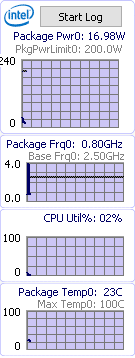

= 硬件温度监测软件
:toc:
:sectnums:

---

== cpu 温度监测软件

[options="autowidth" cols="1a,1a"]
|===
|Header 1 |Header 2

|intel cpu 温度, 官方检测软件
|Intel Power Gadget

https://www.intel.com/content/www/us/en/developer/articles/tool/power-gadget.html

- Power : 当前 CPU 的功率
- Frequency : 当前 CPU 的频率
- Utilization : 当前 CPU 的占用率
- Temperature : 当前 CPU 的温度，此温度是内核温度

| AMD 官方监测软件
|AMD Ryzen Master
|===
