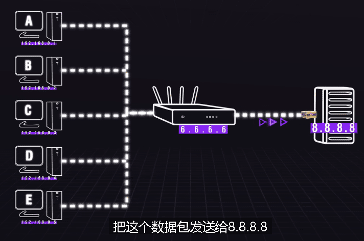

= 网络地址 原理
:sectnums:
:toc:

---

== IP 地址

==== 交换机

你有n台需要联网交互数据的电脑, **可以在所有的电脑中间放置一台"交换机", **电脑和电脑就不需要点对点的连接了, 而是全部都接入交换机上, 由"交换机"去分发来自不同设备的数据.

这个交换机, 可以是一个有很多接口的常规"网络交换机", 可以是一台"服务器", 也可以是你家的"路由器".

我们给所有的电脑, 都设置一个数字的虚拟地址, 比如 A电脑的地址是192.168.0.1, B电脑的地址是192.168.0.2, C电脑的地址是192.168.0.3. 这些就是 IP地址.  +
在发送数据的时候, 带上这个数字的虚拟地址,这样, 数据到达的交换机以后, 就知道接下去确切要发给哪台电脑了.

IP地址就和我们寄快递需要填写的地址一样, 只不过它是用来在互联网上传输数据包所使用的.

当电脑有了各自的IP以后, 这一堆电脑, 加上这台交换机, 就组成了一个局域网.

如果我们又创建一个新的局域网, 想让它和老的局域网互通, 只需要把这两个局域网的"交换机"连接起来.

---

==== IPV4 地址

IPV4地址, 由32位二进制数构成, 理论上可以提供 2^32 约42.28亿个地址. +
由于一些地址有特殊的用途, 所以被保留下来, 不允许被大众使用, 所以最后真正可用的IP地址, 只有36.47亿个.

为了方便记忆和输入, 将每8个二进制数, 分为一组, 转换为十进制, 变成常用的4个0-255数字的样子.

---

==== IPV6

IPV6 由8组 四位十六进制数, 组合而成, 理论上可以提供约 3.4×10^38 个IP地址.

但 IPV6 和 IPV4 是完全不同的两个协议, 这就意味着它们之间不能够进行直接互通, 必须要借助其他的设备, 去做转换和映射.

---

==== NAT 网络地址转换

现有的 IPV4 已经完全不够用了. 因此我们引入了一项新的技术, "NAT 网络地址转换".

假设5台电脑 ABCDE (IP分别为 192.168.0.1 到 192.168.0.5), 接入了一个路由器(网关). 该"路由器"接入广域网的IP为 6.6.6.6.

假设电脑A (192.168.0.1) 要访问广域网上 一个IP地址为 8.8.8.8 的设备. 电脑A的数据包 到达网关(6.6.6.6)后, *网关会把电脑A (192.168.0.1) 发送过来的数据的IP, 映射成网管自己的 ip (6.6.6.6)*, 并记录好映射表. 以自己的地址名义 (6.6.6.6), 把这个数据包发送给 8.8.8.8. +
**这就实现五台设备, 共用一个IP的效果. 网管就像五台电脑的父母一样, 成了它们的代理人. **

同理, 8.8.8.8 那边如果作为网关, 下面同样可以挂载很多台电脑. 共用8.8.8.8这一个IP.

但还有一个问题要解决: 这五台电脑的数据都是走着一个IP出入的, 数据发送出去以后, 接收方并不知道这是哪台电脑发送过来的, 接收方下面如果有很多的其他附属设备的话, 它也不知道这个数据包要发送给自己下面的谁.

所以这里我们就引入了一个新的概念 -- **"端口映射". 我们在IP地址后面, 增加一串端口号, 网关会**以不同的端口去和外网交互, 然后**把这些端口映射给局域网内的各个设备.** 传输数据的时候, 除了"IP地址的映射"之外, 再额外加上"端口号的映射", 这样就可以实现共同一个IP还能精准传送数据了.

---

==== 私有ip & 公网ip

[options="autowidth"]
|===
|Header 1 |Header 2

|公网 IP
|能直接在广域网上交互数据的"网管"的 ip, 就是"公网IP".

|私有 IP
|寄宿在6.6.6.6的网关下面的 那5台 192.168.0.1 到192.168.0.5 的 IP, 就是"私有IP".
|===

---

== DNS解析

Hosts文件, 它通常在你的 C:\Windows, System32\drivers\etc 目录之下. 当你输入www.baidu.com的时候, *由于互联网不能直接通过域名访问, 系统就会去Hosts文件里, 查询 www.google.com 这个域名对应的IP地址是什么, 然后电脑会去帮你访问这个IP.*

但是 Hosts 文件的容量是有限的, 你可以保存一些常用的域名对应的 IP, 但你不可能保存 全世界所有的域名对应的IP.

于是, *我们单独独立出来一个服务器, 让这台服务器去专门存储这个世界上绝大多数域名和IP的映射表. 当你是要访问某个网站的时候, 先让电脑去这个服务器上查下你需要访问的域名, 其背后对应的IP是什么*, 然后再帮你访问到这个IP上. *这个服务器, 就是我们所说的"DNS服务器".*

那我们如何在 win10上, 来自己设置 DNS服务器的地址呢?

在控制面板中, 搜索"网络和共享中心".

"更改适配器设置", 然后找到你连着网的网卡右键属性, 如果你使用的是 IPV4, 那就双击 IPV4协议; 如果你使用的是IPV6, 那就双击IPV6协议. 在里面, 我们就可以手动设置 "DNS服务器"的地址了.

为什么有时能上QQ, 但无法正常访问网页? 因为 QQ客户端内部已经帮你配置好所有的IP了, 这里不涉及到"域名解析"的操作, 所以你可以正常的登录. 但是如果你的 DNS配置错误, 你的电脑就无法访问到"DNS服务器"去帮你做 ip解析.

---

==== DNS劫持或污染

假设某个网站的域名是www.abc.com, 假设这个网站的IP是 202.206.64.41, 那你输入 www.abc.com 以后, 一个正常的DNS服务器就应该返还给你 202.206.64.41.  +
但是如果在这个过程中, 发生了一些不为人知的操作, 最后给你返还一个202.206.64.42, 那你就访问到了别的网站上去了.

这种情况下, 轻则它可以给你返还一些广告, 重则它可以直接把某个网站完整的复制下来, 然后做出一个克隆网站, 来完成对你的盗号, 获取个人信息等操作.

---
