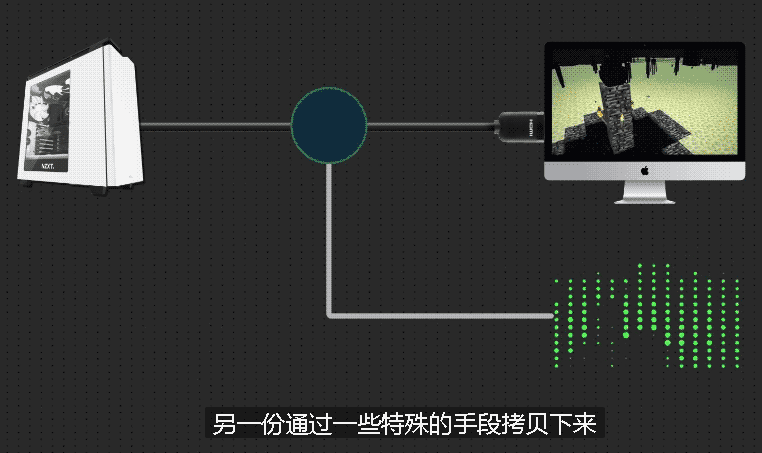
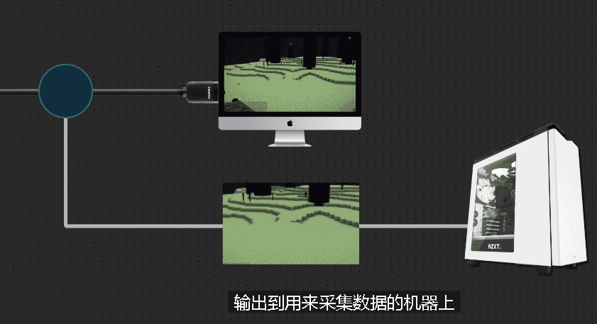
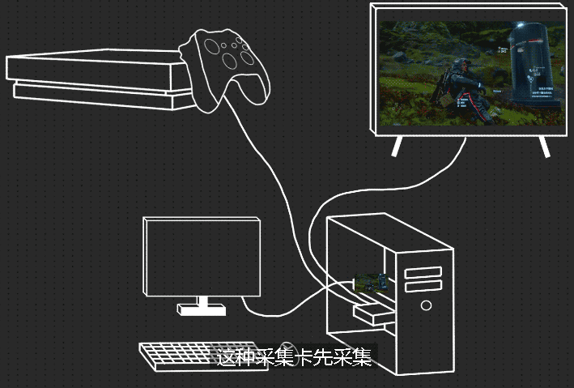
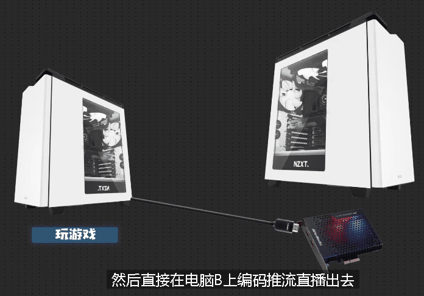
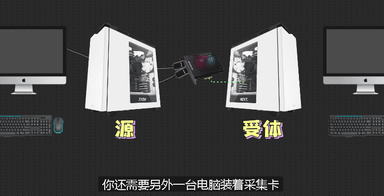

= 视频采集卡 原理
:toc:
:sectnums:

---

视频采集卡有什么用呢?

比如你在装机, 在BIOS内, 此时系统还不存在, 你无法用软件来录屏. 只能用相机去拍屏幕.

但电脑，游戏主机，相机, 它们都是有视频输出信号的. 电脑需要接显示器; 相机可以外接监视器. 那我们**把原本输出到显示器的信号, 从中间截断, 在中间复制一份. 其中一份照常输出给原来的"显示设备A"上, 另一份拷贝下来, 输出到用来采集数据的"机器B"上. 就能在"机器B"上来录屏了.** -- 这就是"视频采集卡"的功能了.

视频采集卡:: 是直接采集"硬件视频输出接口"的信号, 从硬件的层面, 去获取视频信号.

比如:

[options="autowidth"]
|===
|Header 1 |Header 2

|原本
| Xbox -> (HDMI视频线) -> 直连到电视上

|为了录制Xbox游戏的画面
|Xbox -> (HDMI视频线) -> 采集卡 -> (HDMI视频线) -> 显示器

这样, 游戏A的画面, 就会从Xbox的输出以后, -> 先进入"采集卡"内, 采集卡拷贝一份视频信号, 转录成视频文件, 输出给电脑, -> 再把视频信号发送给显示器, 来正常显示.

*这种采集卡"先采集, 再输出视频信号", 就被我们称之为"环出".*

这样就可以做到不用"录屏软件"的情况下, 来捕获游戏主机的画面. (走的是"硬件层面"的视频信号采集)

|===

你能发现, 用采集卡的时候, 必须要有两个设备:

1. 一个被拍摄的对象, 也就是“源”. (美女)
2. 另外一个是用来装"采集卡", 接收采集卡捕获视频信号的电脑, 也就是"受体".(摄影师)

所以, 为了拍一个对象, 我们还要单独多购买一套电脑, 成本很高.

---

