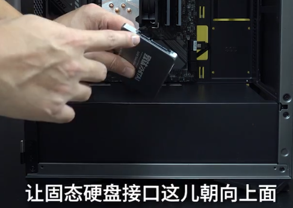
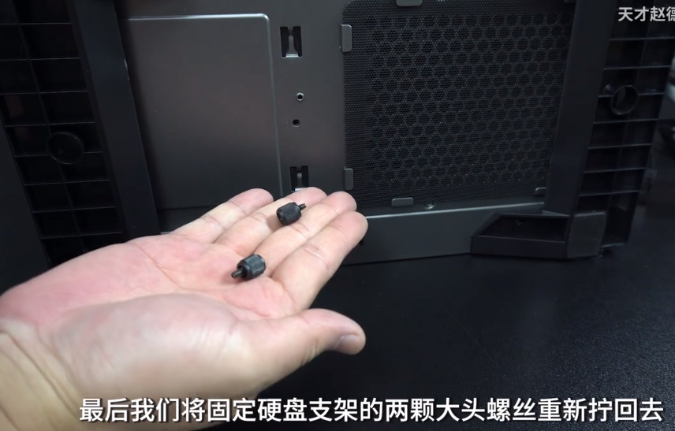

= 电脑装机: M.2 固态硬盘, SSD硬盘
:toc:
:sectnums:

---

== M.2 固态硬盘

==== 接口类型

---

==== M.2 固态硬盘 安装方法

无论你的主板上有几个 M.2 插槽, 都优先选择插在离CPU最近的那个 M.2接口上. 因为这个插槽是和cpu直连的.

---

==== 第一种情况: 主板不带固态硬盘的散热片

我们先在主板的包装盒里, 找到固定 M.2固态硬盘的 "增高柱" 和"固定螺丝"

有时, 有些主板的 "增高柱" 和 "固定螺丝", 在出厂的时候就已经拧在主板上了. 或只其中一个被拧上了.

可以给你的 M.2固态硬盘, 买一个散热片. +

---

==== 第二种情况: 有时候, 主板会自带一个标准长度的固态硬盘散热片.

那么你就要先把它拆下来, 再来装固态.

装上固态硬盘后, 要把散热片背后的保护膜撕下来 +

---

==== 第三种情况: 主板自带超长固态散热片

根据你的M.2固态硬盘的长度, 来确定一下"增高柱"放在哪个位置 +

同样, 先把散热器背面的保护膜, 撕下来 +

---

== ---------- ----------

---

== 2.5寸 SSD 固态硬盘

==== 安装

每个机箱的 2.5寸固态硬盘位, 都不相同.

2.5寸固态硬盘的 固定螺丝, 和主板的固定螺丝, 用的是同一个.

然后, 我们需要从机箱的后面, 去拧螺丝.

---

==== 连线

---

== ---------- ----------

---

== 3.5寸 机械硬盘

==== 安装 3.5寸硬盘

每一个机箱的 3.5寸硬盘位, 都不相同.

比如本例中的案例:

把机箱放倒后来操作 +

然后, 把硬盘支架拆下来

将3.5寸机械硬盘, 装到硬盘架上

然后, 将硬盘支架, 重新安装回去

---

==== 给机械硬盘, 连接电源线

---

==== 给机械硬盘, 连接 SATA数据线

再从主板盒子里, 找到 SATA数据线

image:img_PC/091.png[]

由于M.2的优先级, 是高于SATA 的. 换言之, 这些主板, 你插了 M.2固态, 则部分SATA接口, 就直接失效了, 会被禁用.

例如: +

---
