= 电脑装机: 主板
:toc:
:sectnums:

---

== 主板

==== 在机箱上, 安装固定主板所需要的 "增高螺柱"

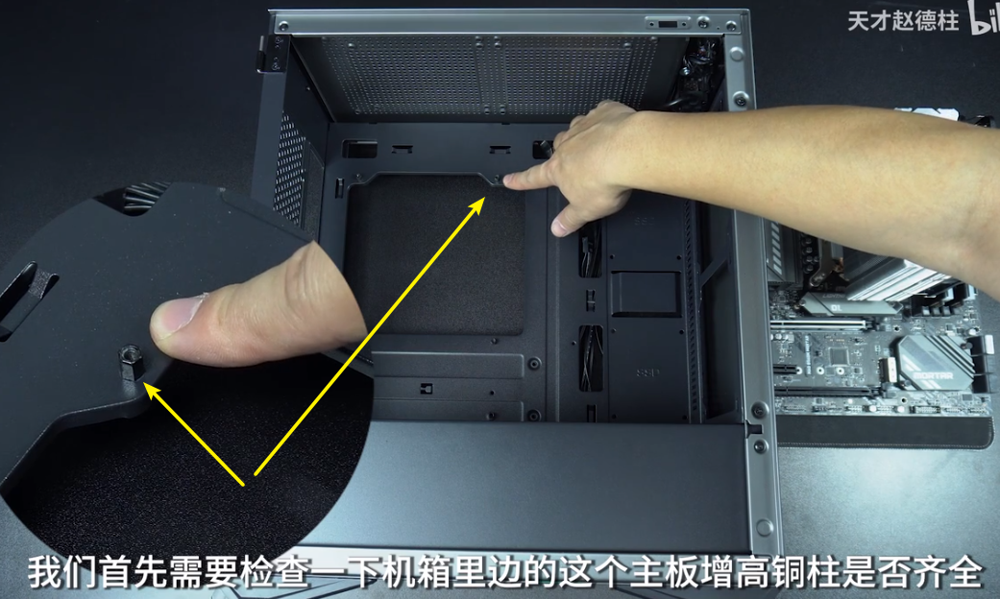

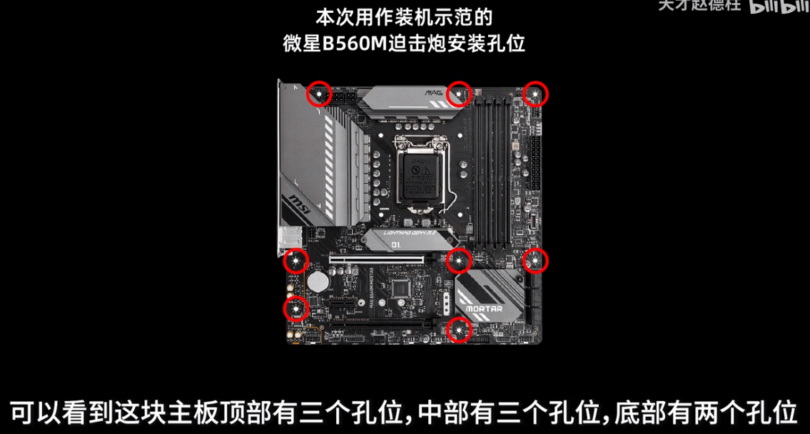

机箱上, 默认可能没有帮我们拧上"增高螺柱", 就需要我们自己拧上"增高螺柱".  +
你的主板上有几个安装孔位, 对应到机箱上, 就要拧上几个"增高螺柱". 位置要和主板上的孔位位置一致.

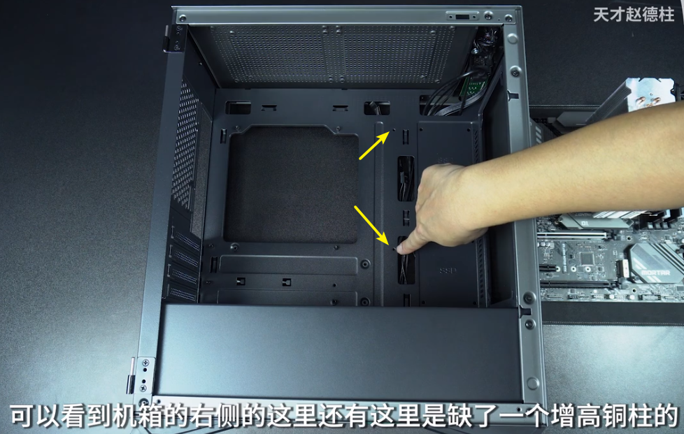

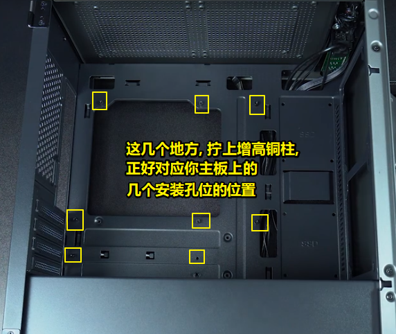

---

==== 拆卸机箱背后的 PCIE 挡板

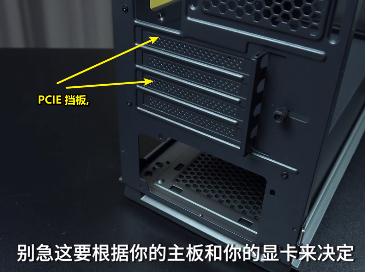

|===
|Header 1 |Header 2

|对于PCIE挡板和机箱是连在一起的情况下
|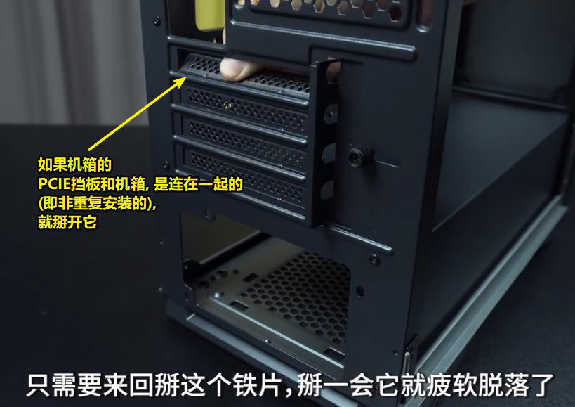

|对于可重复组装的PCIE挡板
|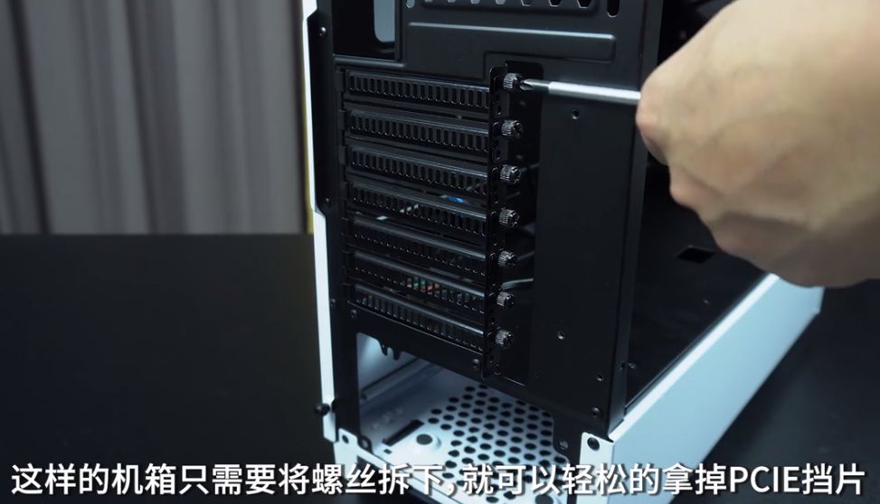
|===

---

==== 安装主板到机箱里

[cols="1a,3a"]
|===
|Header 1 |Header 2

|第一种情况: "IO挡板" 和 "主板" 是分离式的
|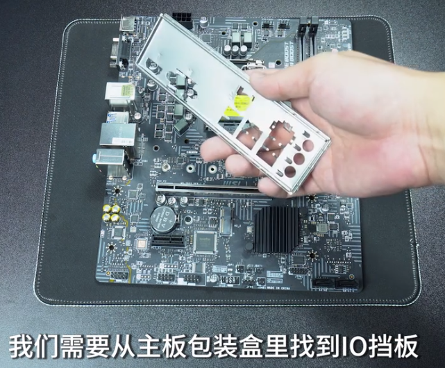

把io挡板放在主板上, 确认一下其上下位置 +
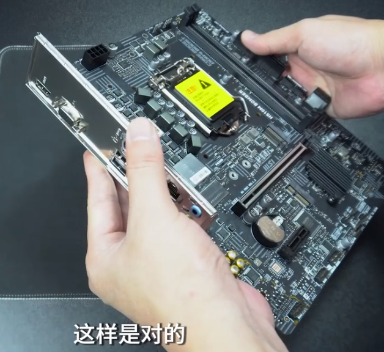

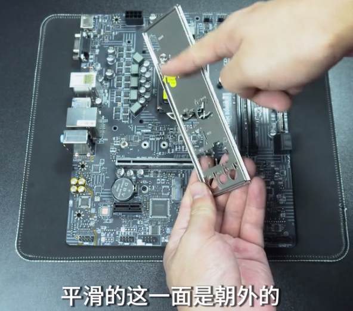

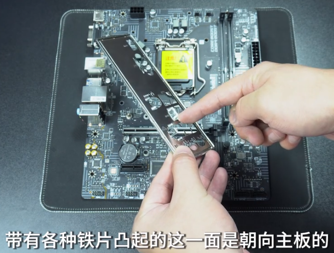

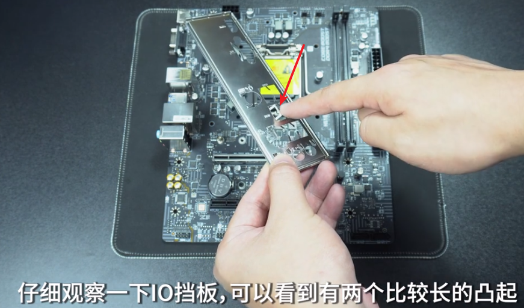

把这两个凸起, 掰起来 +
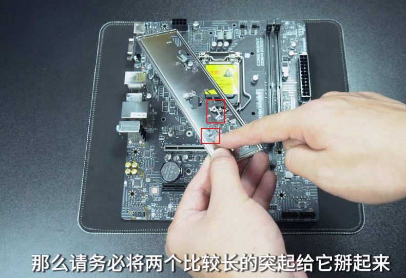

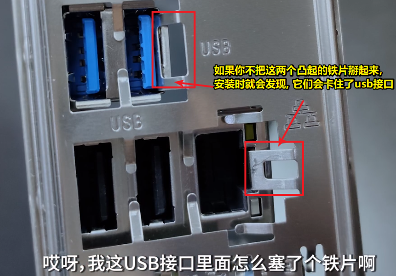

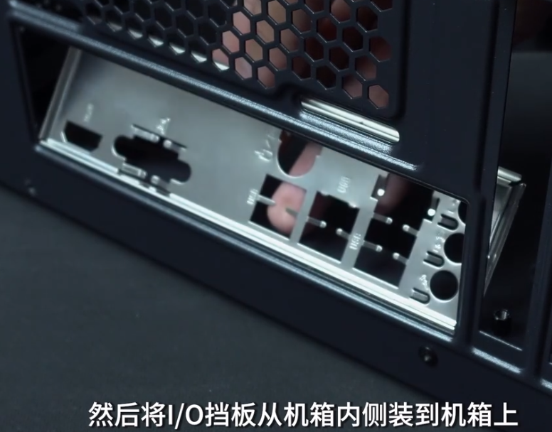

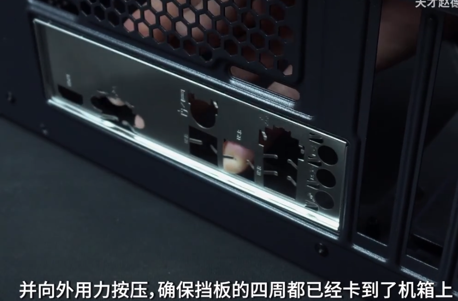

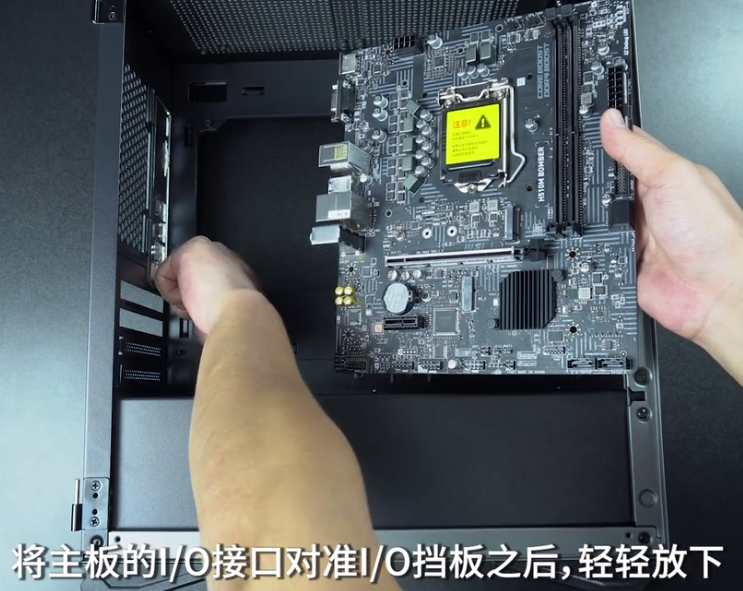

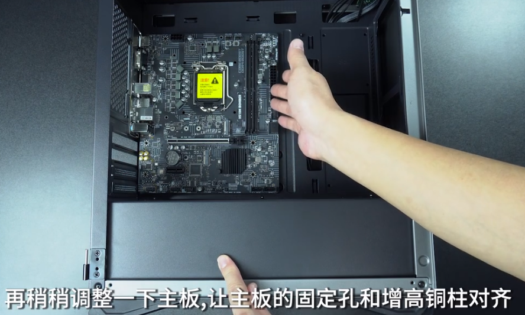

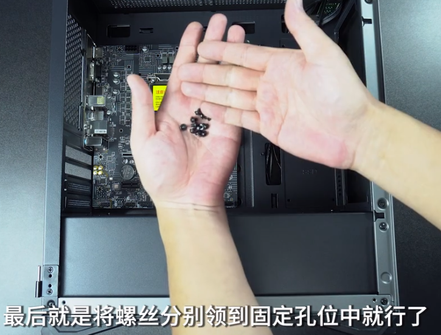

|第二种情况: 主板和 IO挡板, 是一体式的
|这个比较简单

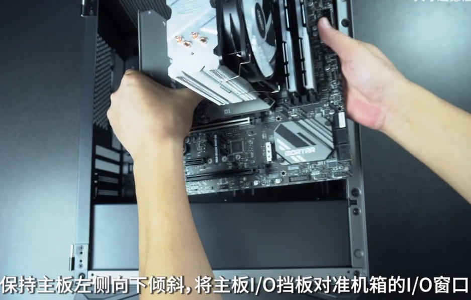

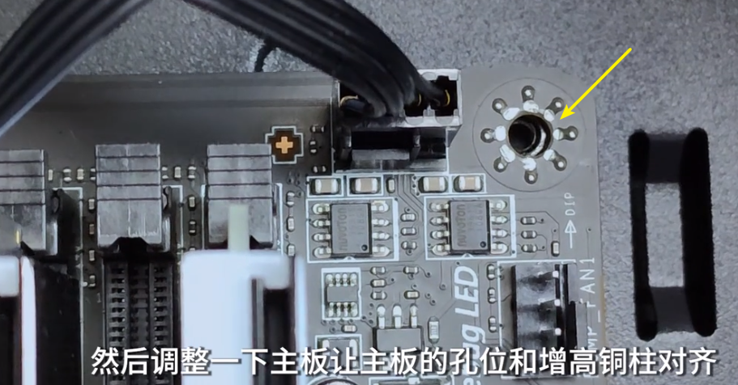

再将螺丝, 拧到"固定孔位"中就行了.

|===

---
