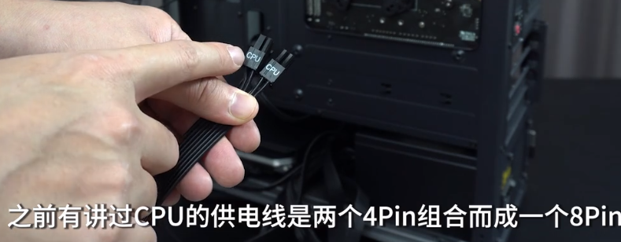
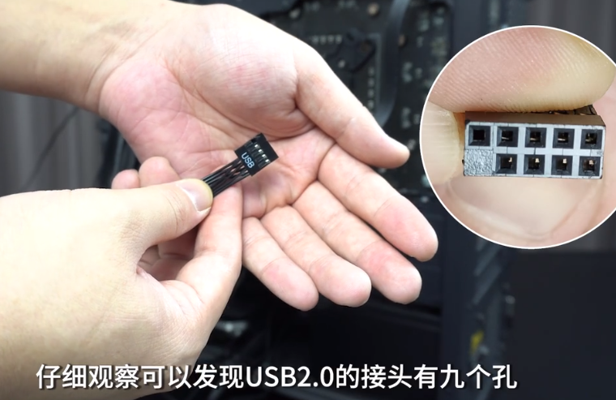
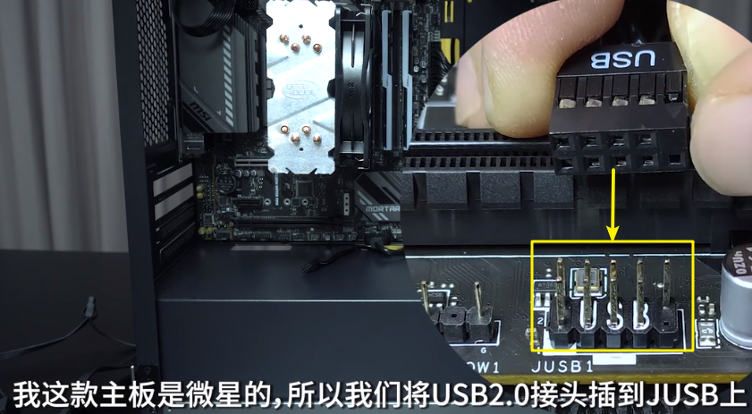

= 装机教程 : 接线(供电线) & 跳线
:toc:
:sectnums:

---

接线分两类: 供电线, 和机箱前面板线

---

== 供电线

==== 供电线 -> CPU 供电线

---

==== 供电线 -> 给主板供电

接下来, 找到主板 24Pin 供电线

---

==== 机箱前面板线

包括:

- 机箱开关键
- 重启键
- 电源指示灯
- 硬盘指示灯
- USB 3.0接口
- USB 2.0接口
- 音频接口 (话筒, 耳机接口)

---

==== 机箱前面板线 ->  USB 3.0 -> 19个孔

注意: 一定要垂直的, 缓缓插入. 因为稍有倾斜, 或针和孔没对好, 就会造成"断针"的结果.

---

==== 机箱前面板线 ->  USB 2.0 -> 有9个孔

USB 2.0 第二排少一个孔, 该处是防呆设计, 防止你插反.

然后来到机箱正面, 在主板上找到 USB 2.0 的接口. 同样特征很明显, 是9根针, 右下角缺失.

---

==== 机箱前面板线 ->  音频线 -> 有9个孔

音频线接口, 第二排第4个孔位是缺失的, 用于防呆设计.

同样把该线, 从机箱背面的理线孔, 穿到前面去. 在主板上, 找到 AUDIO 的接口. 特征很明显, 同样是9根针, 第一排第4根缺失.

image:img_PC/125.png[]

---

== 跳线

==== 跳线 -> 开关键, 重启键, 电源指示灯, 硬盘指示灯

跳线, 用于连接 开关键, 重启键, 电源指示灯, 硬盘指示灯.

同样把这些线, 从机箱背面的理线孔, 穿到前面去. 来到机箱正面, 找到主板上的跳线接针. 特点是一个有 9 个针, 第一排的第5根针是缺失的.

==== 跳线 -> 电源指示灯 POWER LED +-

==== 跳线 -> 开机键 POWER SW

==== 跳线 -> 硬盘指示灯 H.D.D L

==== 跳线 -> 重启键 RESET SW

RESET SW 也不分正负极

---
