= 电脑装机: 显卡
:toc:
:sectnums:

---

== 显卡的安装

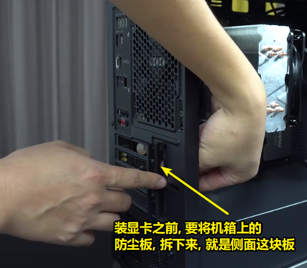

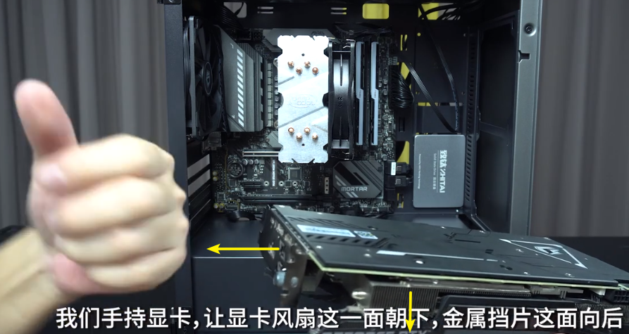

将显卡, 插到离 cpu最近的一个 PCIE*16 插槽上. 因为这个最近的插槽, 才是满速的. 其他的 PCIE*16 插槽都可能会造成显卡性能降低.

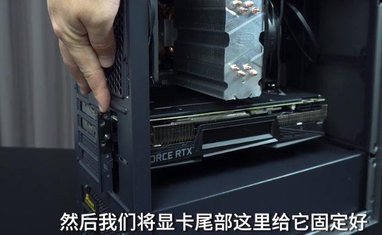

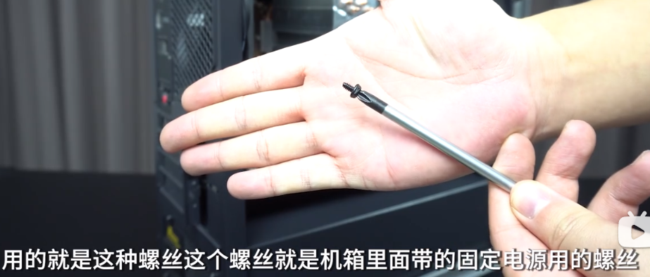

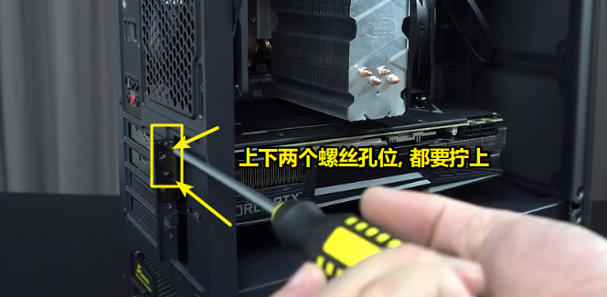

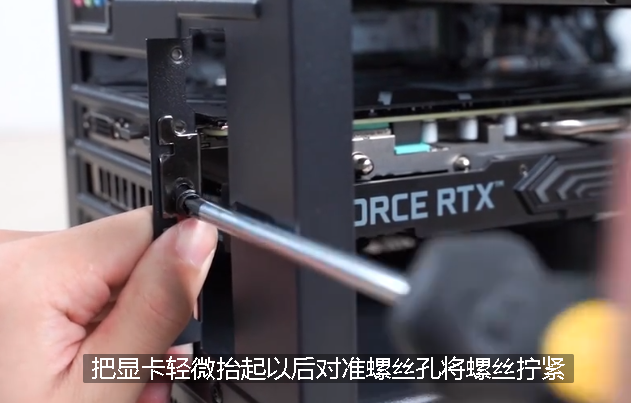

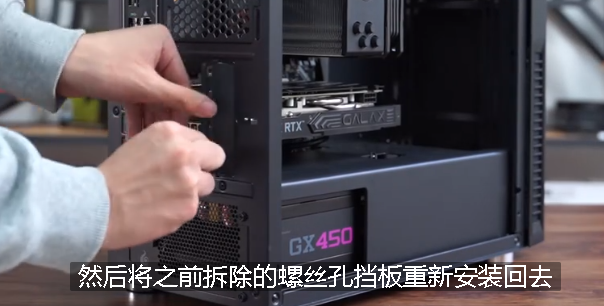

---

== 给显卡连上供电线

你的显卡有多少个供电接口(多少组 4+4 Pin), 就全部插满它!

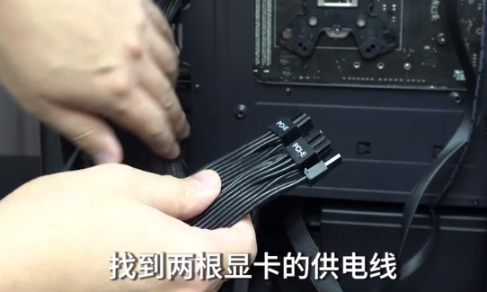

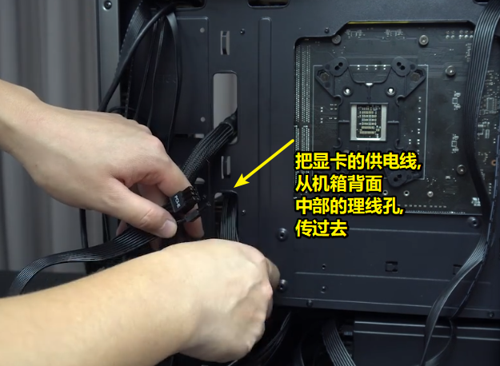

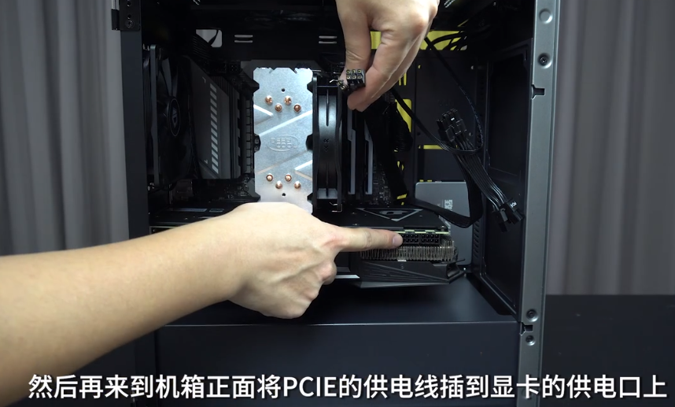

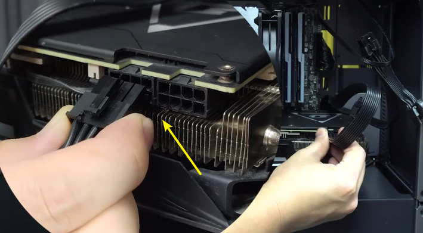

image:img_PC/180.png[]

---
