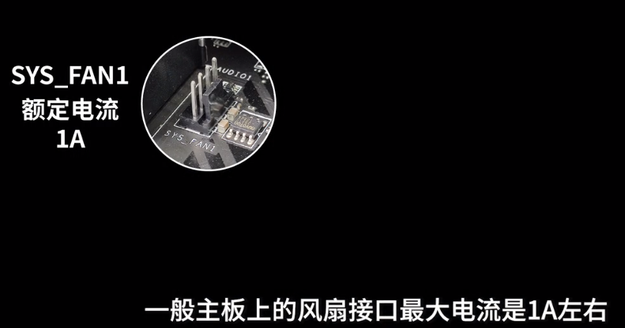

= 电脑装机: 机箱 & 机箱风扇 & 机箱理线 & 机箱外部接线
:toc:
:sectnums:

---

== 机箱

==== 机箱里的配件

配件可能包括:

螺丝有:

[options="autowidth"]
|===
|Header 1 |形状特点

|主板和2.5寸硬盘的 固定螺丝.
|就是像草帽一样, 圆圆的螺丝头四周有一圈延伸

|3.5寸硬盘专用的固定螺丝
|纯圆头

|电源专用固定螺丝
|螺丝头最大, 而且呈六角形
|===

---

== ---------- ----------

---

== 机箱风扇

==== 判定风扇的风向位置

有三种判别方法: 第三种方法是终极判定方法, 没有例外.

[cols="1a,2a"]
|===
|Header 1 |Header 2

|方法1: 风扇上会有"风向"的标记
|

|方法2 : 95%的情况下, 没有骨架的一面, 是进风口, 即"吸气";  +
有骨架的一面, 是出风口, 即"吐气"
|

另外5%的情况, 就是有些品牌的风扇, 骨架是反的, 或者, 扇叶是反的. 那么风向的位置也就相反了.

|方法3 : 看扇叶, 来确定风向
|扇叶上, 鼓的一面, 是吸风; 凹的一面, 是吐气.

|===

---

==== 风扇连到主板上的接口的位置

4针的风扇接口, 既可以接 "小3Pin" 的风扇, 也可以接 "小4pin" 的风扇.

---

==== 安装风扇

可以分为三种情况:

[cols="1a,3a"]
|===
|Header 1 |Header 2

|情况1: 机箱上已经给你自带了 "大4d接口" 的风扇
|

|情况2 : 机箱上已经给你自带了 "小3pin"的风扇
|我们就将风扇的 小3pin 接头, 插到主板的 SYS_FAN1 上即可.

|情况3 : 你不想用机箱自带的, 而想安装自己买的 小4pin 风扇
|详见下
|===

---

==== 机箱背部 的风扇安装

在风扇的正面和反面, 四个角上, 都要先安装上"减震垫" +

---

==== 机箱顶部 的风扇安装

---

==== 将风扇的连线, 接到主板上

假设你装了两个风扇, 那么可以把它们的连线, 一个装在主板的 pump_fan1 接口上, 另一个装在 sys_fan2 接口上

这里可以看出, 一个风扇, 就要占据掉主板上的一个风扇接口. 但如果你有多个风扇, 而主板上没有那么多风扇接口, 该怎么办? 可以使用 "风扇分线器".

但是, 注意: 主板上的风扇接口, 能提供的电流是有限的, 可能带不动你同时的多个风扇.

所以, 到底一个口能带几个风扇, 就要看你风扇的额定电流数值了.

如果你的一个风扇, 额定电流是 0.25A, 内么主板上的一个风扇接口, 最多也就只能带动 4个该风扇.

---

== ---------- ----------

---

== 机箱理线

你需要自己些买绑线, 机箱自带的太少了.

---

== ---------- ----------

---

== 机箱外部接线

[cols="1a,3a"]
|===
|Header 1 |Header 2

|电源线
|

|网线
|

|显示器线
|只要你有独立显卡, 就要将显示器线, 插在独立显卡上. +

或者 +

|===

---

