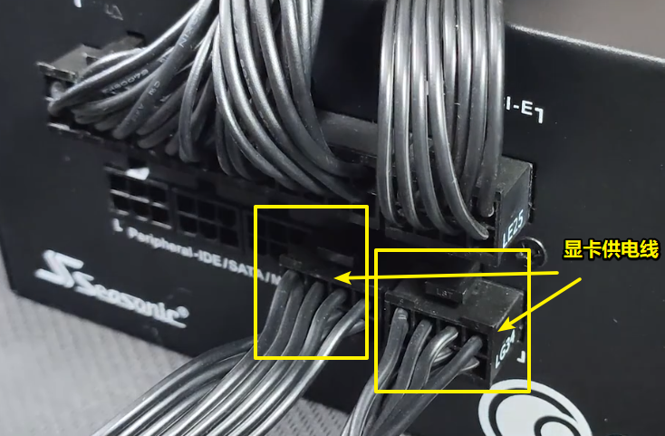

= 电脑装机: 电源
:toc:
:sectnums:

---

== 电源(全模组) 上的 供电线

==== 主板 供电线 -> 24 pin

接下来, 我们要分辨出, 哪一头是插电源的, 哪一头是插在主板上的.

[cols="1a,3a"]
|===
|Header 1 |Header 2

|插主板的这头
|

|插电源的这头
|有不同规格. 比如,  +

但是, 绝对不会有 20+4 pin.

那本例中, 我们就将 18+10 pin 的这一头, 插到电源的 M/B接口.

|===

---

==== cpu 供电线 -> 4+4 pin / 8+4 pin / 8+8 pin

4+4 pin这一头, 是用来插到主板上的. +
所以另一个头, 就是插到电源的 CPU/PCIE接口上就行了.

image:img_PC/060.png[]

注意:

[cols="1a,3a"]
|===
|CPU接口 |Header 2

|单8pin
|很多中低端主板, 设计都是一个 单8pin 的CPU接口.

|8+4 pin
|质量好的中端主板, 会设计成 8+4 pin. 其中 8Pin 是"主供电"; 4pin 是"辅助供电".

这种情况下, 如果你的电源, 只提供了一根cpu供电线, 那么只需要将这一根cpu供电线, 插在主板上的 8pin 供电接口上, 就行了. *每一个 8pin 最大可以提供 336W左右的功率.* 4pin 是可以空着的.

除非你用的是顶级CPU, 这就需要换个接口齐全的电源了. 但很少有人用中端主板搭配顶级CPU的.

|8+8 pin
|高端主板, 会设计成 8+8 pin 的 cpu供电设计. 这就需要高端电源来满足了.

image:img_PC/062.png[]
|===

---

==== 显卡 供电线 -> 6+2 pin

显卡, 从低端到高端, 供电线的接口, 可以分成: +

这里面的 6pin, 我们可以看做是 8pin.

显卡的供电线  +

[options="autowidth"]
|===
|显卡 供电线 |Header 2

|6+2 pin 这一头
| -> 是插到显卡上

|另一头
| -> 插到电源的 CPU/PCIE 接口上.

注意: 你的显卡上有几个8pin接口, 就必须要插几根8pin线. 必须要插满!

|===

---

==== sata硬盘 供电线

[options="autowidth"]
|===
|sata硬盘 供电线 |Header 2

|扁头这一头
|-> 接 SATA硬盘

|另一头
|-> 插到电源的SATA插口上

|===

---

==== 大4D风扇 供电线

这个就是给低端的 大4D风扇, 供电用的.

---

== 电源的安装

下置电源, 要让电源的风扇面, 朝下.

几乎所有的下置电源机箱, 都会在底部, 给电源留"入风口".

还有些机箱, 电源需要从机箱的尾部塞进去.

---
