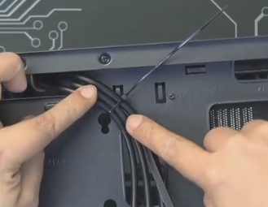

= 装机教程 v2 : 对v1版本的补充
:toc:
:sectnums:

---

== 机箱

==== 机箱配套的螺丝

---

==== io 挡板

---

==== 机箱上的 主板增高螺柱 (支撑柱)

要根据你主板上的孔位数量和位置, 来对应安装上机箱上的"主板支撑柱".

大部分中塔式机箱, 出厂一般都是预装主流的m-atx主板的支撑柱. 如果你是atx主板（大板）, 或者itx主板（小板）, 装主板前需要观察一下机箱里的支撑柱数量, 是不是和主板上的螺丝孔位数量一致. 如果多余, 就需要拧下多余的支撑柱; 如果少, 就需要加装支撑柱。

image:img/img 005.png[]

---

==== 理线

==== 机箱前置线材 的接口

[cols="1a,3a"]
|===
|Header 1 |Header 2

|前置音频接口 HD AUDIO
|

HD AUDIO 是前置音频接口,  一般插在主板最左侧字母为JAUD1 样式的接口上（也就是机箱前面的耳机麦克风接口，不过一般是不会使用的，便宜的机箱音频接口是不如主板自带的音频口的）

|usb2.0接口
|

USB接口, 是机箱前面的usb2.0接口, 一般插在主板最下侧字母为 JUSB1 或 JUSB2上. 1和2是接口的数量，随便差哪一个都一样的。

|USB3.0（蓝色接口）
|

前置USB3.0接口, 一般插在主板最下侧, 或者右边标识为 JUSB3 接口上（如果有JUSB4的话, 是一样可以插3.0接口的）. 主板上标识字母为 jusb 的接口, 一般都是接usb接口的，只要针脚数量一致就不会有问题。

|跳线
|

*这些线材, 一般都是插在主板最右侧标识字母为 JFP1 的接口 (或者叫FPANEL )上.* +

大部分品牌的主板接口方式基本一致:

- 上面一排最右边是少一根针脚的, 为第一排. 从左到右依次接线顺序为：powerled＋、powerled-、powersw（总计3根线）
- 下面第二排, 从左到右依次接线顺序为：hddled＋、hddled-、reset-＋（总计3根线）

注意 : 6根线标着字母的一面的方向, 统一朝下，也就是字母那面朝机箱底部，这样就不会接错正负极了。

|===

---

== 电源

电源上延伸出的接头有:

[cols="1a,3a"]
|===
|Header 1 |Header 2

|大4pin (也叫 "大4d") 接头
|属于比较老的接头了. 一般用来接(给予供电):

- 低端风扇
- 风扇控制器
- 灯光控制器
- 或 PCIE插槽的辅助供电

"大4pin" 供电, 它的形状和英文字母d一样, 又被我们称之为 "大4d". +
几乎所有的外围设备, 比如说灯条RGB灯板, 风扇等等, 都可以从这里取电. +
这个供电, 也可以转换成其他类型的供电, 所以又被我们称之为万能供电.

|sata 线
|

用来接

- 2.5寸的固态硬盘
- 3.5寸的机械硬盘
- 水冷散热器

|4+4 pin
|用来给 cpu供电

事实上, *主板上需要连接电源的供电线, 只有两根: 一根是位于主板左上角的CPU供电, 一根是位于主板右侧的主板供电.* (而对显卡等的供电, 是"电源线"直接插到"显卡"上面的, 而不是由"主板上的接口"来给显卡供电.)

我们从电源内部, 找到CPU的 4+4pin 供电, 从机箱的右上角穿过去, 然后把它接驳到主板左上角的CPU供电的位置.

---

部分高端主板, 会配有 "8+4pin" 或者 "双8pin" 供电, 你只需要接驳序列号为 1 的主CPU供电, 就可以开机使用.

目前, *"单8pin"* 在线缆质量合格, 温度正常的情况下, *可以提供 250瓦到300瓦 的供电*, 足够i9-9900k轻度超频使用.

辅助供电, 可以接, 可以不接, 当然接了是更好的.  就算你不超频双线缆供电, 甚至三线缆供电, 对于线缆本身的供电压力会小一点, 线缆的温度会低一点.

但是大部分情况下, 650瓦以下的电源, 就只会给你一根 4+4pin 供电.

|6+2 pin
|用来给 显卡供电.  +
越是高端的显卡, 需要供的电越多, 所以高端显卡上可能有多个(偶数个) 6+2pin 供电接口.

显卡装好后, io面板处, 有的要把侧板装上后, 才能拧固定螺丝.

| 20+4 pin
| 用来给 主板供电

从电源内找到最宽, 最大的 24pin "主板主供电", 将其从机箱理线孔穿到机箱正面, 对准主板上的"主板24pin供电插槽", 插入.

|===

---

== 接线盒

---

== 机箱背面的外接连线

