= windows 10
:toc:

---

== 查看硬件信息

==== 查看bios的品牌

在"运行"中, 输入 msinfo32

---

== 官方win10 ios 下载

https://msdn.itellyou.cn/

官方 安装win10的u盘的制作工具, 下载

https://www.microsoft.com/zh-cn/software-download/windows10

---

==== 用官方u盘安装win10时, 提示"只能安装到GPT磁盘上"的问题

报错提示: Windows无法安装到这个磁盘。选中的磁盘具有MBR分区表，在EFI系统上，Windows只能安装到GPT磁盘.

解决办法: 我们必须先把硬盘这个分区的MBR格式, 转成GPT格式. 按以下步骤操作:

|===
|命令步骤 |功能说明

|1. 按 Shift+F10
|调出 CMD 命令行工具

|2. 输入 diskpart 命令
|进入分区工具

|3. 输入 list disk 命令
|查看电脑当前可用硬盘，编号为0、1（一般最后一个是U盘), 一般, 编号为0的是你的c盘, 可以通过看其容量来判断.

|4. 输入 select disk x（x为上述硬盘编号）
|选择你要进行分区操作的硬盘，如果只有一块硬盘，输入select disk 0后按回车键。
CMD提示“磁盘0是现在所选磁盘”

|5. 执行 clean 命令
|清除该硬盘上的所有分区的数据

|6. 输入 convert gpt
|将该硬盘转换成GPT格式。
|===

现在, 你就能继续用u盘 来安装 win10了.

---

== 激活

KMSpico 软件

---

==== 查看你的win是否激活 -> slmgr.vbs -xpr

在"运行"(win+r)中, 输入
....
slmgr.vbs -xpr
....
即可查看

---

== win 显示效果

==== 设置"桌面上图标"的显示

在运行里, 搜索"主题" -> 桌面图标设置

---

==== 设置"开始菜单 侧边栏"的图标显示

在运行里, 搜索"主题" -> 开始 -> 选择哪些文件夹在屏幕上

image:./img_win10/img_win10_04.png[]

---

==== 设置"任务栏"上显示的图标

在运行里, 搜索"主题" -> 任务栏 -> 选择哪些图标显示在任务栏上

---

== 卸载软件

====  卸载自带软件

点击任务栏最右边的"操作中心"图标, 或也可以在搜索中, 搜"操作中心"这个词.

然后, "所有设置" -> "应用" -> "应用和功能", 就能看到所有的软件, 点击它们, 就会看到"卸载"按钮.

---

== 网络

==== 显示流量 -> TrafficMonitor 软件

https://github.com/zhongyang219/TrafficMonitor

---

==== 你共享的目录, 网上邻居的其他电脑, 访问你时, 提示"没有权限访问"的问题

[cols="1a,4a"]
|===
|步骤 |Header 2

|1.
| 在控制面板中, 搜索"共享" +
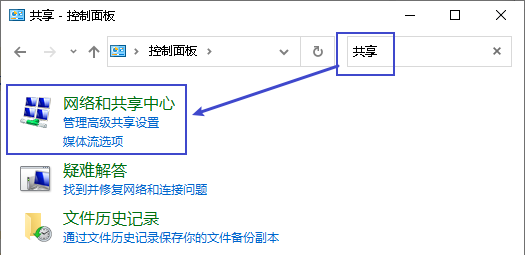

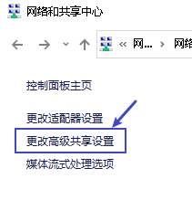

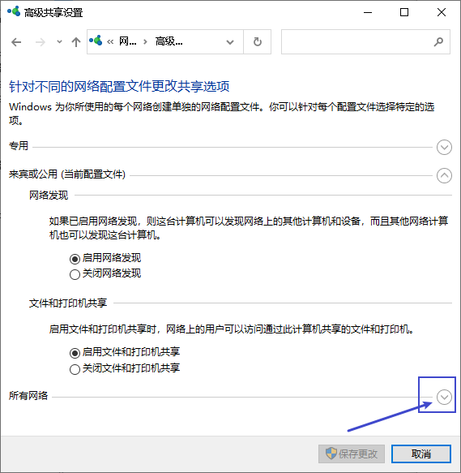

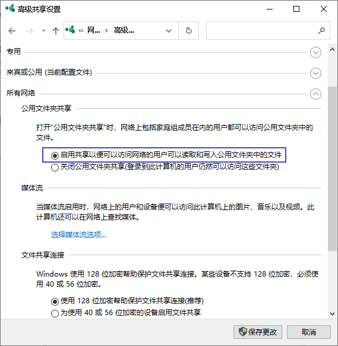

|2.
|鼠标右击点击电脑，选择管理 +
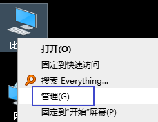

右侧可以看到全部用户，一般都有Guest账户，如果没有请添加一个. +
我们右击Guest点击属性，然后把“账户已禁用”去掉勾选，点击确定。同时您可以设置登陆密码。

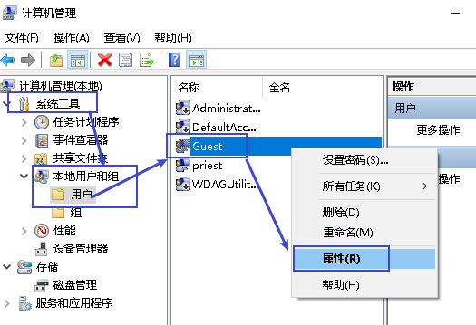

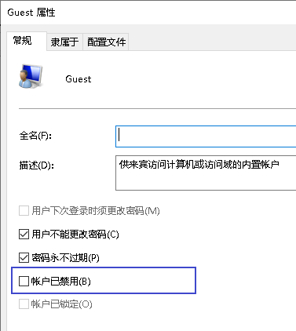

|3.
|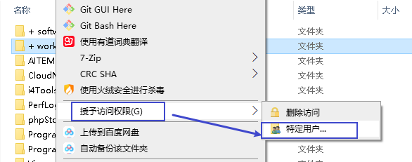

出现搜索框点击下拉图标，选择Everyone，然后点击添加 +
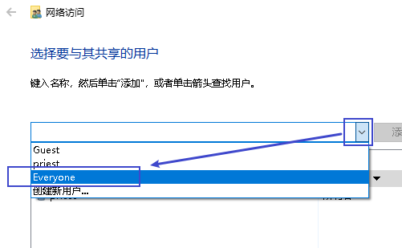

根据权限, 设置"读取"还是"写"入，然后点击"共享"就完成了。 +
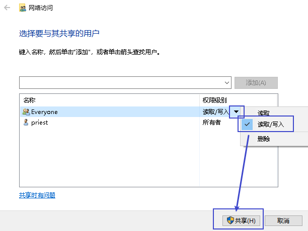

| 下面有两种教程, 教程(1):  +
4.
|win + r, 打开"运行",，输入命令 gpedit.msc

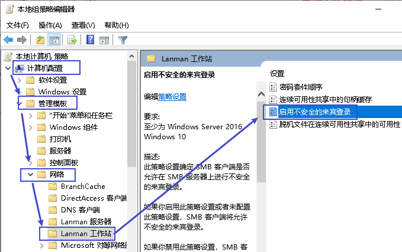

在右侧的窗口中找到“启用不安全的来宾登录”设置项, 双击该设置项，在打开的编辑窗口中选择“已启用”一项，最后点击确定按钮。这样就可以通过网上邻居访问共享文件夹了。

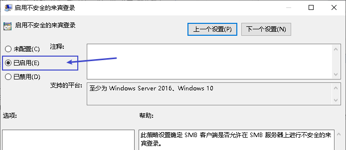

|教程 (2)
|找到你要共享的文件夹，右键，选中"属性"，选择安全选项卡.

点击安全选项卡下面的编辑，弹出编辑选项卡，

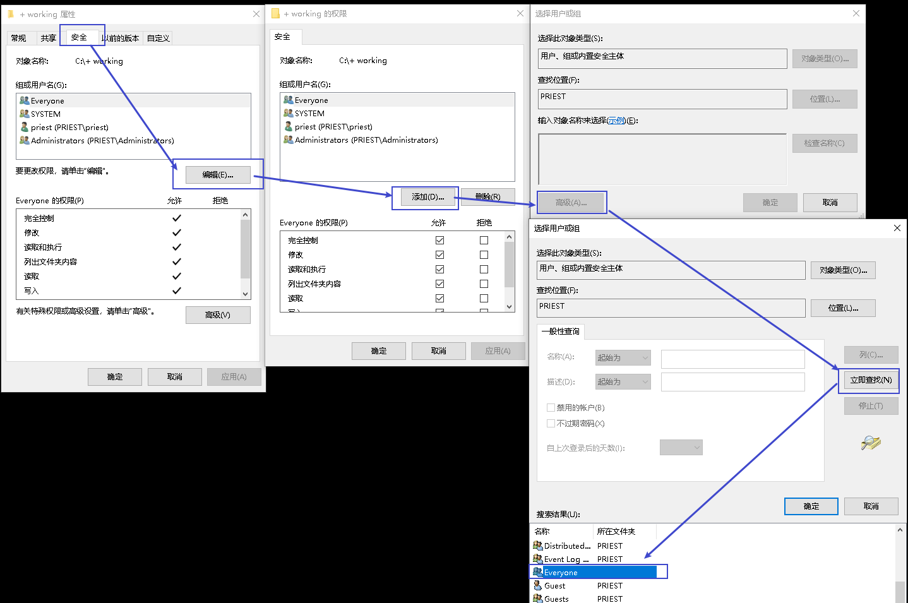

点击确定，在组合用户名下面, 就会出现了everyone. +
在everyone的权限中, 选择你允许的权限，如读取，改写，读取和写入等，一般可以选择完全控制。 +
然后点击"确定"。

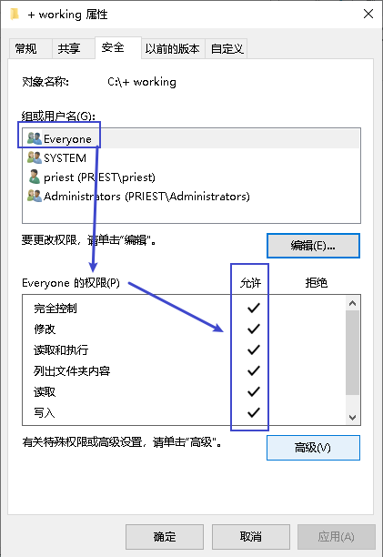

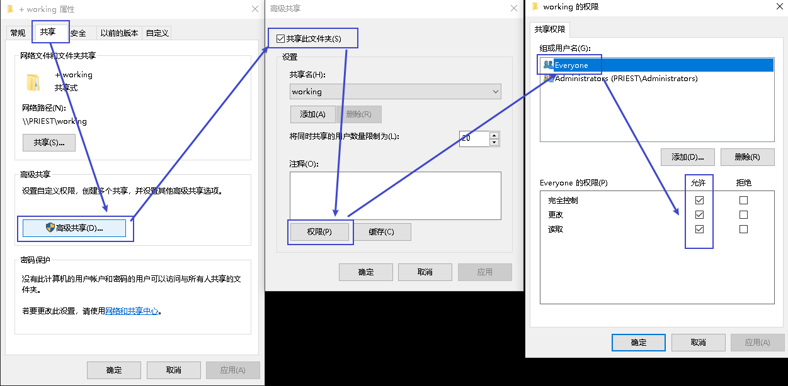

|===

---

== 文件操作

====  资源管理器, 根据鼠标选中的文件, 自动展开到那一层目录

---

==== 同时搜索多个扩展名文件

....
*.txt OR *.doc
....

---

