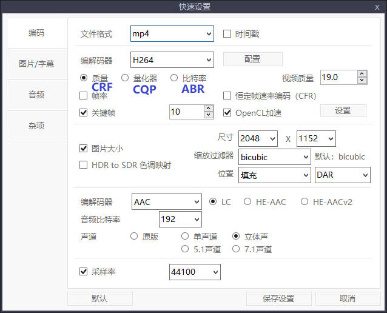
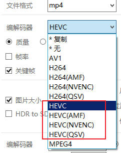

= ShanaEncoder h265 压缩
:sectnums: 3
:toc:

---

== 编码器 CRF, CQP, ABR

[options="autowidth" cols="1a,1a,1a,1a"]
|===
|Header 1 |说明|优点 |缺点

|CRF （Constant Rate Factor)
|- 质量优先. 瞬时码率会随场景复杂度波动.
- 独有的质量模式（CRF），比量化器（CQP）稍微好一点.

- CRF是x264和x265的默认码率控制方式
- #CRF值越大, 视频压缩率越高，但视频质量越低. (即, 取值范围 0-51. 其中0为无损模式，23为缺省，51质量最差。)#  +
-> 更改±6 : 会导致码率大小的一半/两倍左右的变化.
(#RF值加6，输出码率大概减少一半；减6，输出码率翻倍。#) +
-> ±1 : 会导致码率10%左右的变化。

CRF, 推荐值在17~29之间，#17往往被认为从视觉上看是无损的。#

!===
!codec !取值范围 !默认值 !	建议值

!x264
![0, 51]
!23
![18, 28]

!x265
![0, 51]
!28
!

!VP9
![0, 63]
!
![15, 35]

!===

|- 可以理解为量化器（CQP）的升级版
- 动态编码
|视频容量大小, 无法预测.

|CQP (Constant Quality Factor)
|设置一个期望的画质水平值，值越低，画质越高，体积越大。 +
取值范围, 和 CRF 相同.

|- 动态编码
|无法预测视频文件的体积，不适合作为有最高码率限制的网络视频。

|ABR (Average Bitrate)
|该方法直接将码率限制在某个区间之内.

参考值:

- 480*272 : 1000左右
- 1280*720 : 5000左右
- 1920*1080 : 10000左右

|能预测出压制后视频的体积. 比如, 某些网站对上传视频有容量大小限制, 就可以用 ABR 方法来压缩.
|视频质量差. 如非必要, 不推荐使用这种模式.
|===

---

== HEVC 后面带参数的区别

[options="autowidth" cols="1a,1a,1a"]
|===
|Header 1 |优点 |缺点

|无后缀 (建议使用)
|- 理论上兼容性最好，压出来的视频质量不错.
- H264 可以使用显卡OpenCL加速.
- H265/HEVC 没有OpenCL加速，只能靠CPU硬撑.
|

|NVENC
|N卡专用方案
|

|AMF
|A卡专用方案
|

|QSV
|Intel核显专用方案
|

|===

---

