= yt-dlp
:toc:
:toclevels: 3
:sectnums:

---

== 下载 ffmpeg

[options="autowidth"]
|===
|Header 1 |Header 2

|进入FFmpeg官网
|https://ffmpeg.org/download.html

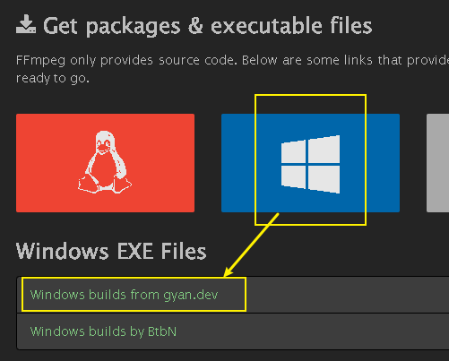

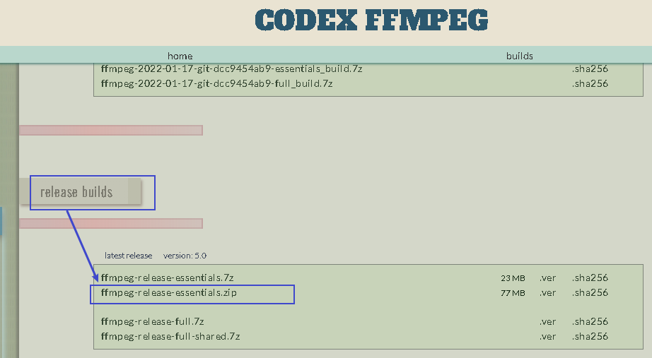

|解压缩, 进入 bin目录, 可以看到3个 exe文件
|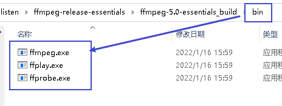

|===

---

== 不推荐 × :  使用 youtube-dl (被youtube限速了, 只有 40k/s)

[options="autowidth"]
|===
|Header 1 |Header 2

|官网地址
|https://github.com/ytdl-org/youtube-dl

下载  https://yt-dl.org/latest/youtube-dl.exe
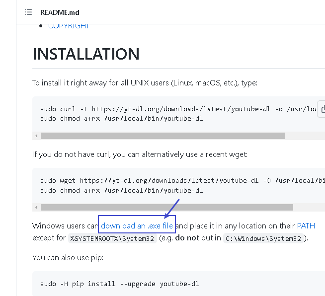

|下完后
|下完后, 不要把它放在c盘根目录, +
并把刚刚 FFmpeg 的bin目录中的 那3个 exe文件, 拷贝到你存放 youtube-dl.exe 的目录中.

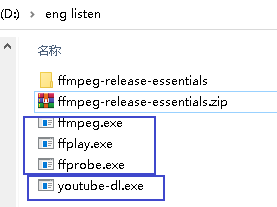

|注意: 下载前, 翻墙软件先要打开"全局模式"
|

|查看youtube上你目标视频的分辨率
|命令: #youtube-dl -F  视频url#

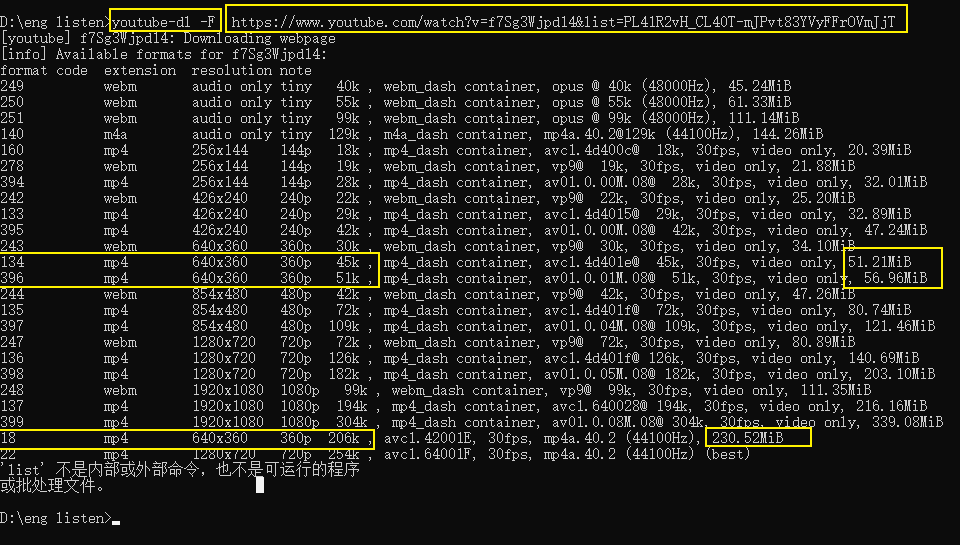

|下载某个分辨率的视频
|根据分辨率下载，比如下载 640*360 分辨率的mp4,前面的数字是18, 则下载命令就是:

#youtube-dl -f 18 视频url#

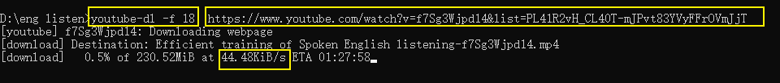

|===

---

== 推荐 √ : 使用 yt-dlp

[options="autowidth"]
|===
|Header 1 |Header 2

|下载 yt-dlp
|https://github.com/yt-dlp/yt-dlp#installation

下载 yt-dlp.exe

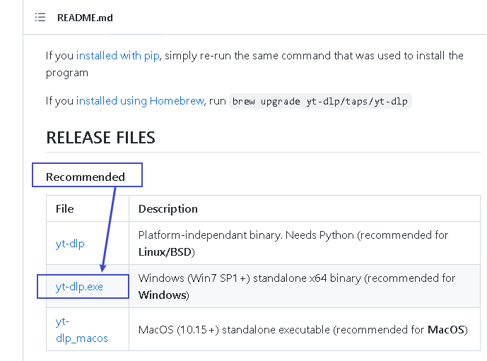

|下完后
|下完后, 把  yt-dlp.exe 放到一个文件夹中, 并把刚刚 FFmpeg 的bin目录中的 那3个 exe文件, 拷贝到你存放 yt-dlp.exe 的目录中.

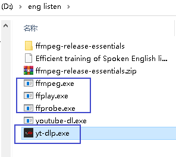

|打开翻墙软件的"全局模式"
|如果你不打开"全局模式", 就要在 命令中, 加上参数: +
--proxy [系统代理] #填写你的系统代理设置，如果使用全局模式可不使用此语句。

|查看youtube上你目标视频的分辨率
|命令: #yt-dlp -F  视频url#

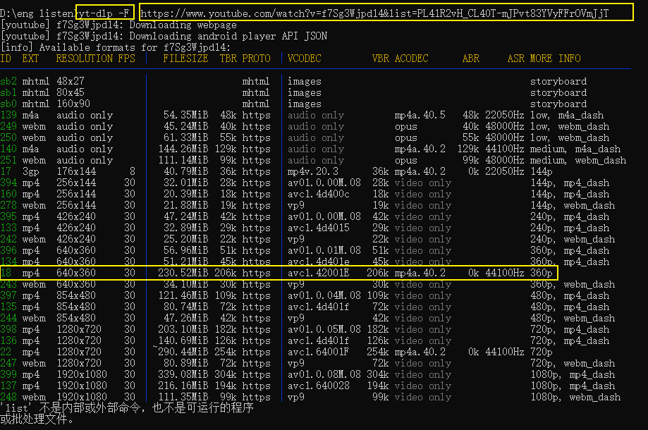

|下载某个分辨率的视频
|根据上面各分辨率前列出的数字, 你就可以指定:
 #yt-dlp -f 分辨率前的数字 视频url# +
注意: 参数 -f 必须是小写!

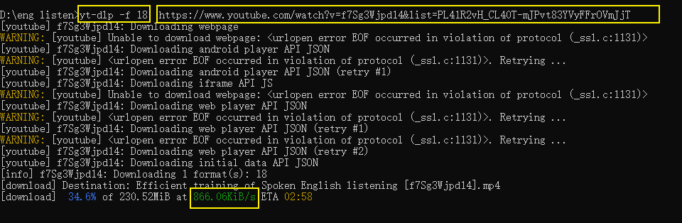

视频文件会下载到你 yt-dlp 所在目录

|===

