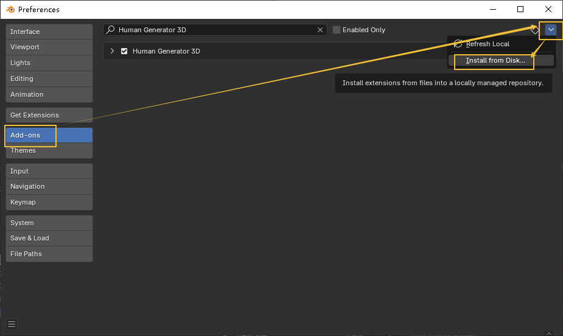

= blender 插件安装
:toc: left
:toclevels: 3
:sectnums:
:stylesheet: myAdocCss.css

'''

== 安装插件

比如安装 HumGen3D_v4_0_21 插件

在顶部菜单编辑(Edit)-偏好设置(Preference)-插件(Add-ons)-安装(Install),弹窗里选择对应ZIP安装

在Human Generator插件设置里，点击Select folder，弹窗里选择Human Generator 3D v4 Assets即可