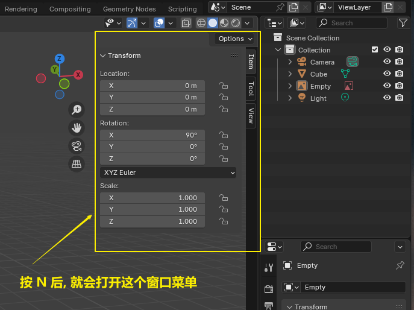
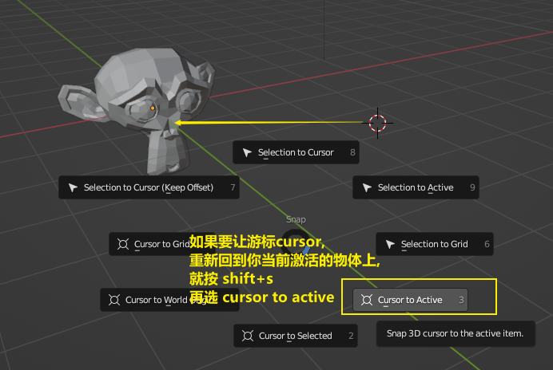
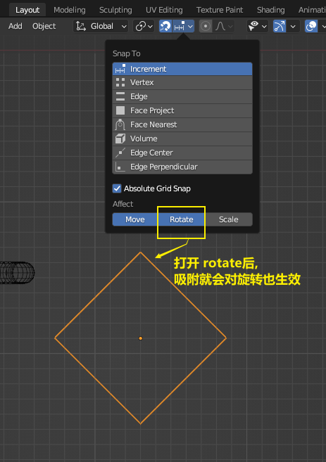
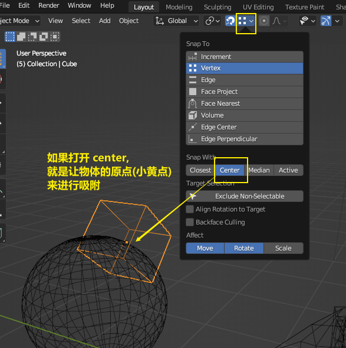
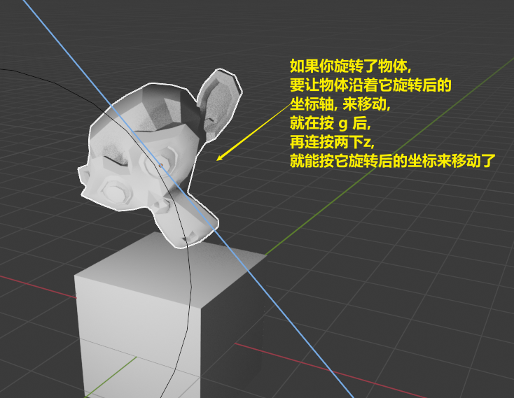
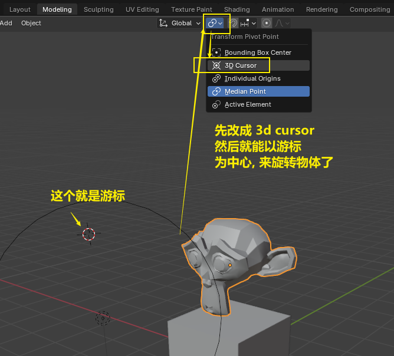
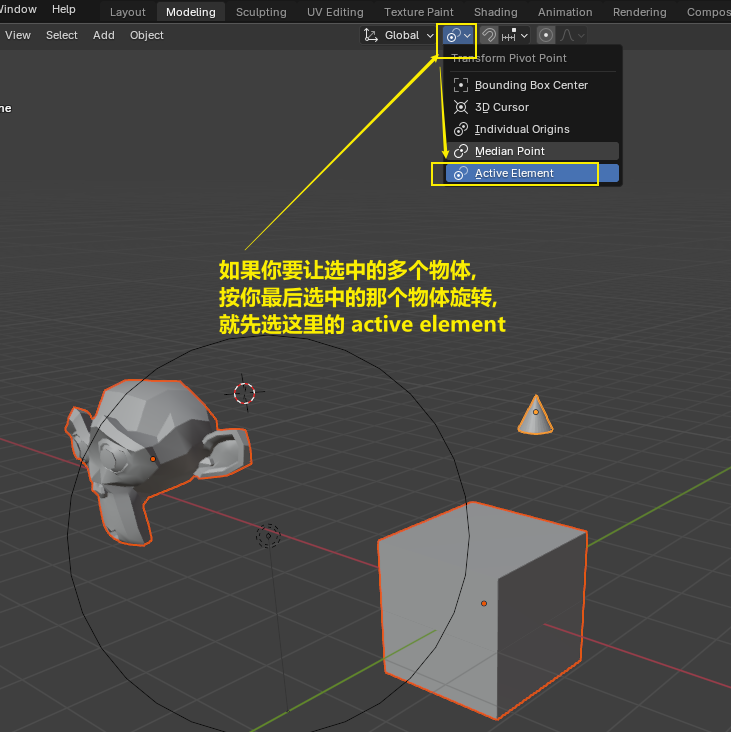

= 00 blender 最常用快捷键
:toc: left
:toclevels: 3
:sectnums:
:stylesheet: myAdocCss.css

'''
== 快捷键, 网上资料

https://blender.bgteach.com/Shortcut.html

== 软件 UI 界面

[.small]
[options="autowidth" cols="1a,1a"]
|===
|Header 1 |Header 2

|
|image:img/0273.png[,70%]

|调出右侧边栏选项（变换/视图/工具），调整摄像机锁定
|按N +
image:img/0262.png[,70%]

|===

'''

== 图层

[.small]
[options="autowidth" cols="1a,1a"]
|===
|Header 1 |Header 2

|锁定图层, 让其不能被选中
|image:img/0266.png[,70%]
image:img/0267.png[,70%]
image:img/0268.png[,70%]
|===

'''

== #游标#
[.small]
[options="autowidth" cols="1a,1a"]
|===
|Header 1 |Header 2

|将游标, 重新回到选中(激活)的某物体坐标处
|
image:img/0010.png[,70%]

|将游标, 回到整个世界轴的中心处
|shift + c +
image:img/0012.png[,70%]
|===

'''

== 每个物体自身的 #原点(小黄点)# (代表物体的真正坐标位置)

[.small]
[options="autowidth" cols="1a,1a"]
|===
|Header 1 |Header 2

|移动物体的小黄点位置
|image:img/0015.png[,70%]
image:img/0261.png[,70%]

|★ 将小黄点(原点)回到物体中心
|image:img/0276.png[,70%]
image:img/0277.png[,70%]
|===

'''

== 新建物体, 删除

[.small]
[options="autowidth" cols="1a,1a"]
|===
|Header 1 |Header 2

|新建任何物体
|shift+A

|删除
|按 x

|===

'''

== 视图

[.small]
[options="autowidth" cols="1a,1a"]
|===
|Header 1 |Header 2

|正视图 |数字键盘 1
|右视图 |数字键盘 3
|左视图 |Ctrl+3
|顶视图 |数字键盘 7
|底视图 |ctrl+7

|===

== 显示模式

[.small]
[options="autowidth" cols="1a,1a"]
|===
|Header 1 |Header 2

|边框线模式
|shift +z +

|透视模式
|alt + z
|===

'''

== #定位#

[.small]
[options="autowidth" cols="1a,1a"]
|===
|Header 1 |Header 2

|将选中的物体快速定位, 单独放大到视图中间显示
|按数字键上的小数点"."键
|===

'''

== 移动物体, 更改坐标位置, #吸附#

[.small]
[options="autowidth" cols="1a,1a"]
|===
|Header 1 |Header 2

|移动物体:
|按 G (go)
-> 再按住x, 就能让物体只沿着x轴移动, +
-> 在移动物体的同时, 按住y, 就能让物体只沿着y轴移动, +
-> 在移动物体的同时, 按住z, 就能让物体只沿着z轴移动, +
-> 用 g 移动时, 再按住ctrl, 就能让物体吸附网格进行一个个的移动.

|移动时自动吸附其它物体
|按g 移动物体的同时, 按ctrl不放 +
image:img/0269.png[,70%]
image:img/0270.png[,70%]

|移动时, 自动吸附其它物体的顶点上
|image:img/0271.png[,70%]
image:img/0272.png[,70%]

|对旋转后的物体, 如何按旋转后的它自身的坐标轴, 来移动?
|在世界坐标, 和局部坐标之间切换的快捷键: 按g移动物体的同时, 可以按两下z, 来切换坐标系. 事实上, 可以连按两下x, 或连按两下y, 都可以. +

|将选中的物体, 移动到"游标"的坐标处
|就选中物体，再按 shift+s,选 selection to cursor

|要撤销移动(即回到最最初始婴儿诞生新建的位置, 而不是上一步的位置)
|按 alt+g
|===

'''

== 旋转

[.small]
[options="autowidth" cols="1a,1a"]
|===
|Header 1 |Header 2

|旋转
|按 r (rotate)

|按5度旋转
|ctrl + r

|旋转特定角度
|R+X/Y/Z 后, 然后按数字键上的45 <- 意思就是旋转45度.  G/S也可以这样使用 +
image:img/0264.png[,70%]

|要撤销旋转到刚婴儿诞生的状态(而非上一步)
|按 alt+r

|以游标(如同太阳)为中心(圆形), 旋转物体 (如同地球)
|
image:img/0256.png[,70%]

| 多个物体, 以你最后选中的那个物体为旋转中心, 来旋转
|
image:img/0258.png[,70%]

|多个物体, 每个都以自己的黄色小圆点为中心, 来旋转 +
|image:img/0259.png[,70%]
image:img/0260.png[,70%]

|===

'''

== 缩放

[.small]
[options="autowidth" cols="1a,1a"]
|===
|Header 1 |Header 2

|缩放物体
|按 S (scale)
|===

'''

== #镜像反转#

==== 方法1: 复制并镜像

==== 方法2: #让选中的物体直接原地镜像# -> ctrl+m 再按 x/y/z

'''

== 摄像机

[.small]
[options="autowidth" cols="1a,1a"]
|===
|Header 1 |Header 2

|切换到摄像机视图
|按小键盘数字键 0

|切换到正交视图 (即无透视视图)
|按数字键5

|===

'''

== 渲染

[.small]
[options="autowidth" cols="1a,1a"]
|===
|Header 1 |Header 2

|渲染| F12

|===

'''

== #显示或隐藏#

[.small]
[options="autowidth" cols="1a,1a"]
|===
|Header 1 |Header 2

|隐藏选中的物体
|按 H (hide)

|重新显示(所有被隐藏的)物体
|按 alt+H

|只显示选中的物体, 将其它所有物体暂时隐藏
| 按斜杠 / , 或shift + H
 +
可以多选多个物体, 按 斜杠/, 就能只显示这些物体了.
|===

'''

== 复制物体

[.small]
[options="autowidth" cols="1a,1a"]
|===
|Header 1 |Header 2

|复制物体
|shift + D +
注意: 复制出的物体, 会放在原物体处, 即两个物体现在处于坐标"重叠"状态. 你要用 g 快捷键来移动复制出的物体.
|===

'''

== #贴图#

'''

