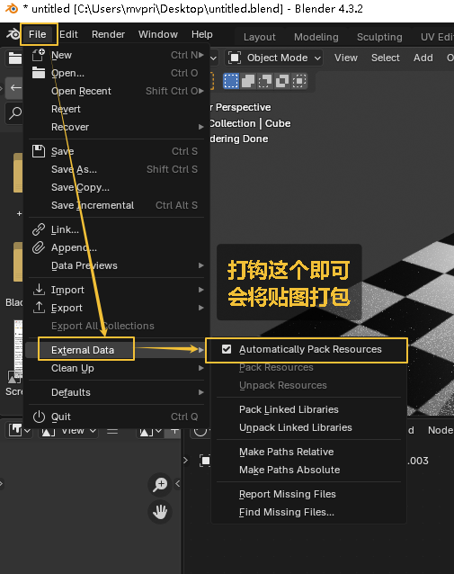
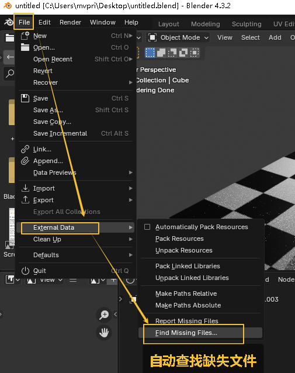

= 存储 打包贴图
:toc: left
:toclevels: 3
:sectnums:
:stylesheet: myAdocCss.css

'''

默认状态, blender 不会打包你的贴图, 而是用链接到外部资源文件的方式, 来存储.
这样会导致你换台电脑后, 链接文件全部丢失.

== 方法1 : 不推荐
为了解决这个问题, 第一种方式, 你可以打包贴图, 但不推荐.  因为文件存储后会很大.

'''

== 方法2 : 推荐

第二种方式: 把贴图资源, 单独存在你新建的文件夹中. 当贴图丢失, 就可以自动查找缺失的文件.

然后找到你的素材文件夹, 就可以自动找回所有缺失素材.

