= blender 物体基本操作
:toc: left
:sectnums: 3

'''

== 窗口操作

==== 拉出新窗口

image:img/0007.png[,]

== #视图# 操作

[.small]
[options="autowidth" cols="1a,1a"]
|===
|Header 1 |Header 2

|旋转视图
|鼠标中键

为了以你选中的物体为中心, 来旋转视图, 你要先这样设置:

image:img/0018.png[,]

image:img/0020.png[,]

|平移视图
|shift + 鼠标中键

|缩放视图
|鼠标滚轮 +
为了以你鼠标的当前位置, 为缩放的中心, 能更方便你来操作视图. 你要这样设置:

image:img/0018.png[,]

|===

==== 正视图, 侧视图, 顶视图 的切换 : 按 数字键盘上的 1-9

image:img/0005.png[,]

image:img/0006.png[,]

- 也可以按你键盘右边的"数字小键盘"上的 1-9, 来切换视图. 1,3,7,9 是90度旋转视图. 2,4,6,8 是 每次按15度旋转视图.

- 也可以按alt + 鼠标中间, 来转

==== 切换到摄像机视图 : 按数字键 0

==== 切换到正交视图 (即无透视视图) : 按数字键5

==== 在一堆物体中, 将选中的物体快速定位, 单独放大到视图中间显示 : 按数字键上的小数点"."键

'''

== #灯光#

image:img/0047.png[,]

'''

== 材质

image:img/0048.png[,]

'''

== #相机#

==== 调整相机取景

要看摄像机取到什么景, 就按键盘右侧数字键的 0

image:img/0038.png[,]

下面似乎是老版本的操作

image:img/0039.png[,]

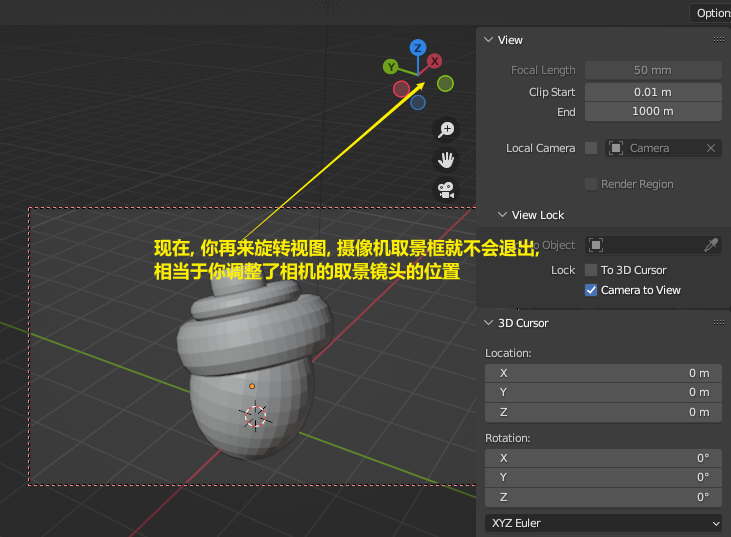

image:img/0041.png[,]

image:img/0043.png[,]

新版本的操作, 如下

image:img/0251.png[,]

image:img/0252.png[,]

image:img/0253.png[,]

== #渲染# -> 按 F12

==== 渲染尺寸设置

image:img/0042.png[,]

== 改成 用显卡 gpu 渲染

==== 自带渲染器

[.small]
[options="autowidth" cols="1a,1a"]
|===
|两个渲染器 |Header 2

|eevee
|- 没有光线追踪. 所以快.

|cycles
|- 基于物理渲染, 所以逼真, 但渲染速度很慢.
|===

image:img/0051.png[,]

image:img/0046.png[,]

==== 进行渲染 : 按 f12

== #物体# 坐标

==== 在特定坐标位置, 新建物体

image:img/0008.png[,]

也可以用 "shift + 鼠标右键", 来快速更改该"虚线圆圈curse"的位置.

==== 将选中的物体, 移动到"游标"的坐标处

== #物体# 操作

==== 选中物体

image:img/0004.png[,]

==== 新建物体 : shift + A

==== 让物体更光滑 : 右键, 平滑着色

image:img/0049.png[,]

==== 移动 ->  移动物体: 按 G (go)

image:img/0002.png[,]

按住x, 就能让物体只沿着x轴移动, +
在移动物体的同时, 按住y, 就能让物体只沿着y轴移动, +
在移动物体的同时, 按住z, 就能让物体只沿着z轴移动, +

*用 g 移动时, 再按住ctrl, 就能让物体吸附网格进行一个个的移动.*

要撤销移动(即回到初始新建的位置), 就按 alt+g

==== 移动 -> 以物体自身的"局部坐标"为标准, 来移动

image:img/0024.png[,45%]
image:img/0025.png[,45%]

image:img/0254.png[,45%]

*在世界坐标, 和局部坐标之间切换的快捷键: 按g移动物体的同时, 可以按两下z, 来切换坐标系. 事实上, 可以连按两下x, 或连按两下y, 都可以.*

==== 缩放物体 : 按 S

在缩放的同时, 按 x或y或z, 就可以指定只沿着某个轴来缩放.

要撤销缩放, 就按 alt+s

==== 旋转 -> 旋转物体 : 按 R

要撤销旋转到刚婴儿诞生的状态(而非上一步), 就按 alt+r

image:img/0013.png[,]

image:img/0014.png[,]

==== ★ 旋转 -> 多个物体, 以你最后选中的那个物体为旋转中心, 来旋转

==== ★ 旋转 -> 多个物体, 每个都以自己的黄色小圆点为中心, 来旋转

image:img/0023.png[,]

==== 隐藏选中的物体 : 按 H ;  重新显示(所有被隐藏的)物体 : 按 alt+H

image:img/0003.png[,]

==== 将没有选中的全部物体, 一次性直接隐藏 : 按 shift + H

==== 复制物体 : shift + D

注意: 如果你在选中物体后, 按了 shift+D 后, 再点右键, 它就会在该物体的当前位置上, 复制出一个新物体,  新旧两个物体是重叠在一起的. 所以不要将右键误认为是你取消了复制. 复制并没有取消!

'''

==== #★ 复制后, 随机变换位置, 旋转角度, 与缩放大小#

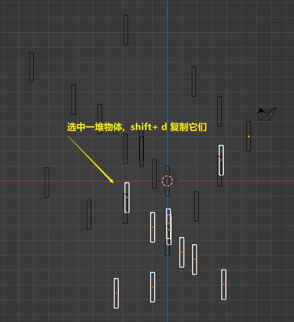

image:img/0249.png[,]

image:img/0250.png[,]

image:img/0251.png[,]

image:img/0252.png[,]

image:img/0253.png[,]

image:img/0254.png[,]

image:img/0255.png[,]

image:img/0256.png[,]

image:img/0257.png[,]

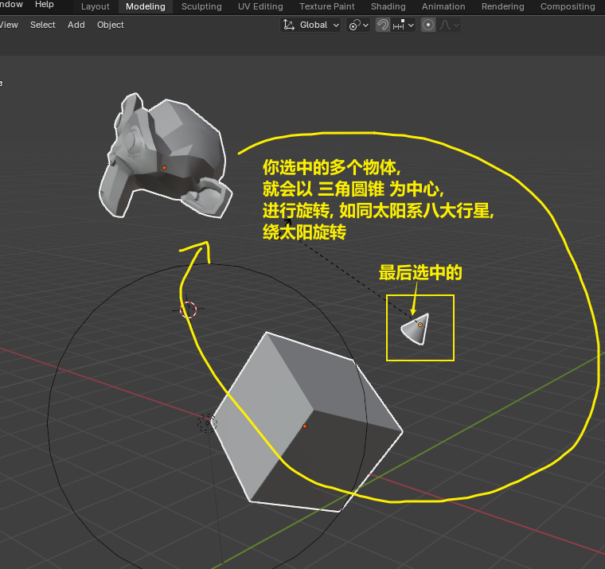

image:img/0259.png[,]

image:img/0260.png[,]

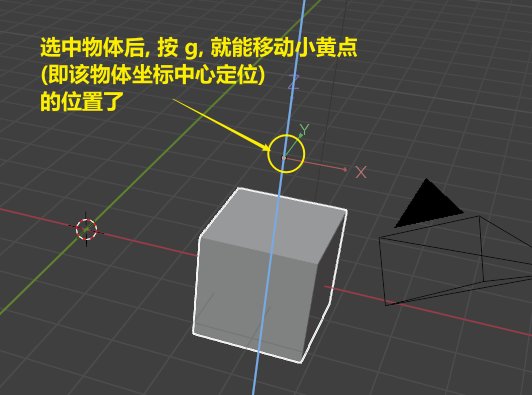

image:img/0262.png[,]

image:img/0263.png[,]

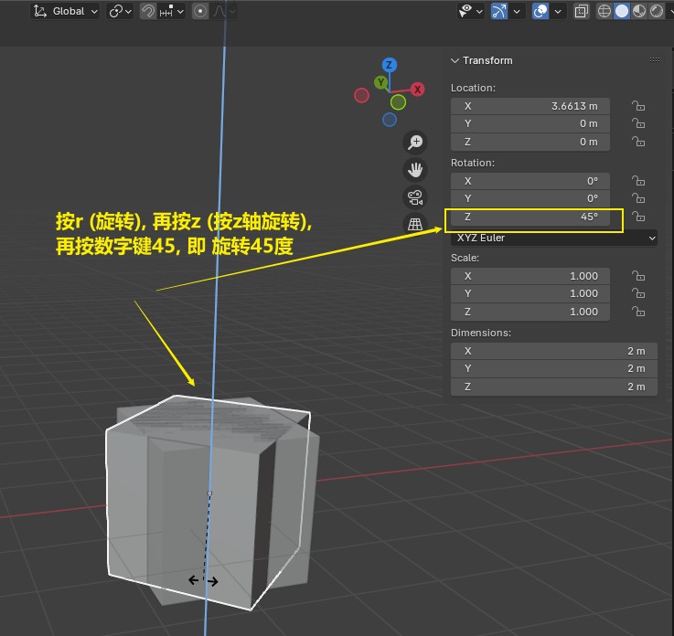

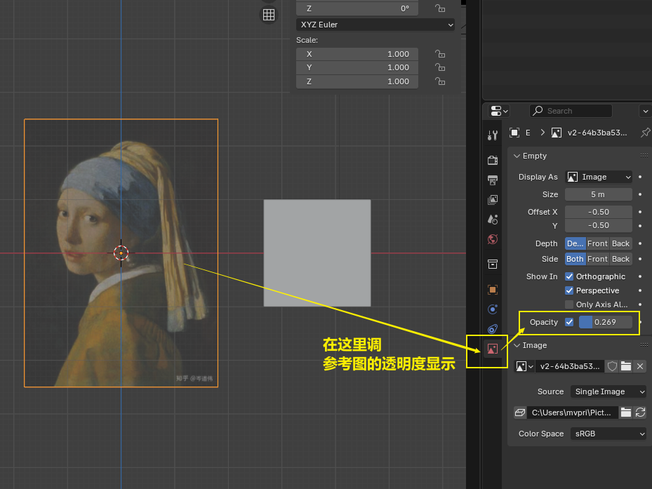

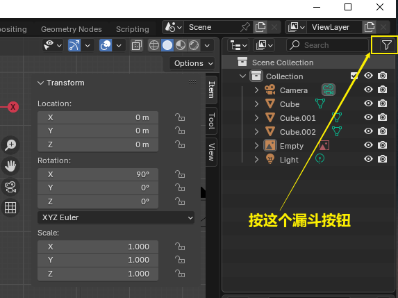

image:img/0267.png[,]

image:img/0268.png[,]

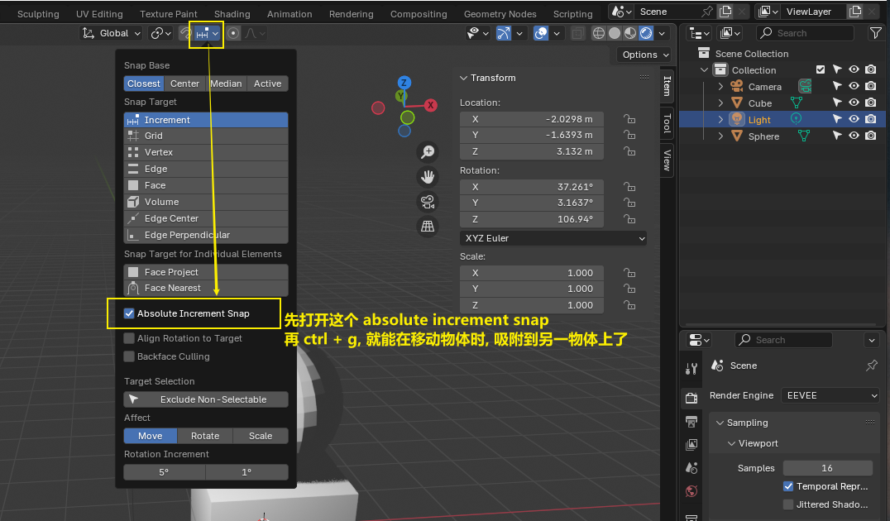

image:img/0270.png[,]

image:img/0271.png[,]

image:img/0272.png[,]

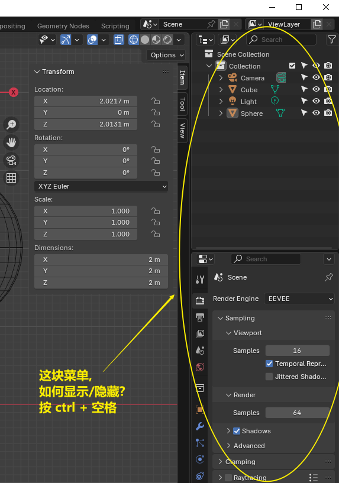

image:img/0274.png[,]

image:img/0275.png[,]

image:img/0276.png[,]

image:img/0277.png[,]

image:img/0278.png[,]

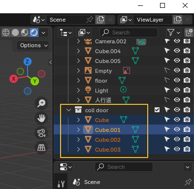

image:img/0280.png[,]

'''

== #游标# cursor

==== ★★ 将游标, 重新回到选中(激活)的某物体坐标处

image:img/0009.png[,]

==== 将游标, 回到整个世界轴的中心处  : shift + c

== 每个物体自身的 #原点(小黄点)#

注意: 小黄点才是代表物体的真正坐标位置. 计算机只认小黄点位置, 不认具体的模型物体位置.

==== 移动小黄点

image:img/0015.png[,]

image:img/0017.png[,]

'''

== 案例1 : 少女

==== ★ 加入参考背景图

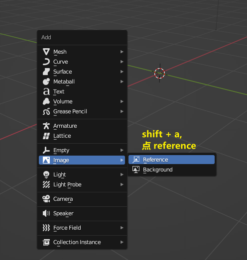
image:img/0027.png[,]
image:img/0028.png[,]

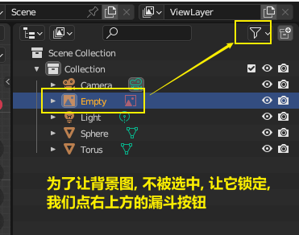
image:img/0033.png[,]

== #★ 吸附#

image:img/0240.png[,]

image:img/0241.png[,]

image:img/0242.png[,]

image:img/0243.png[,]

image:img/0244.png[,]

image:img/0245.png[,]

image:img/0246.png[,]

image:img/0247.png[,]
