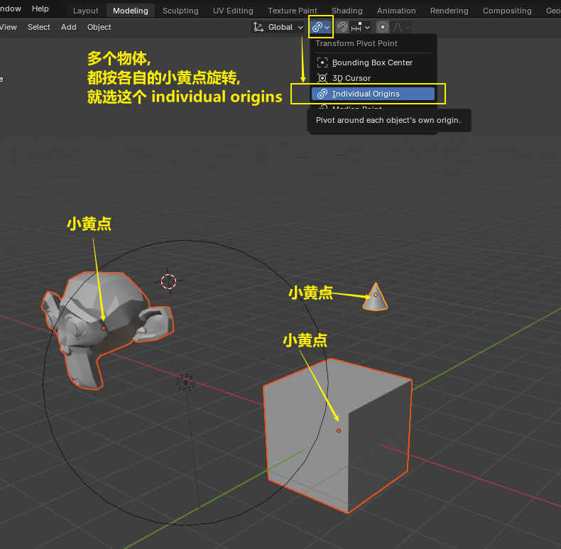
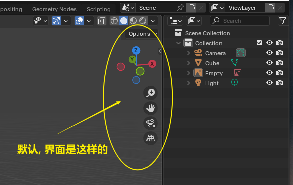
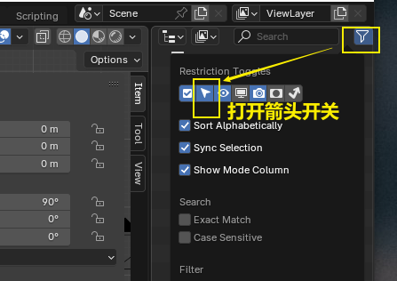
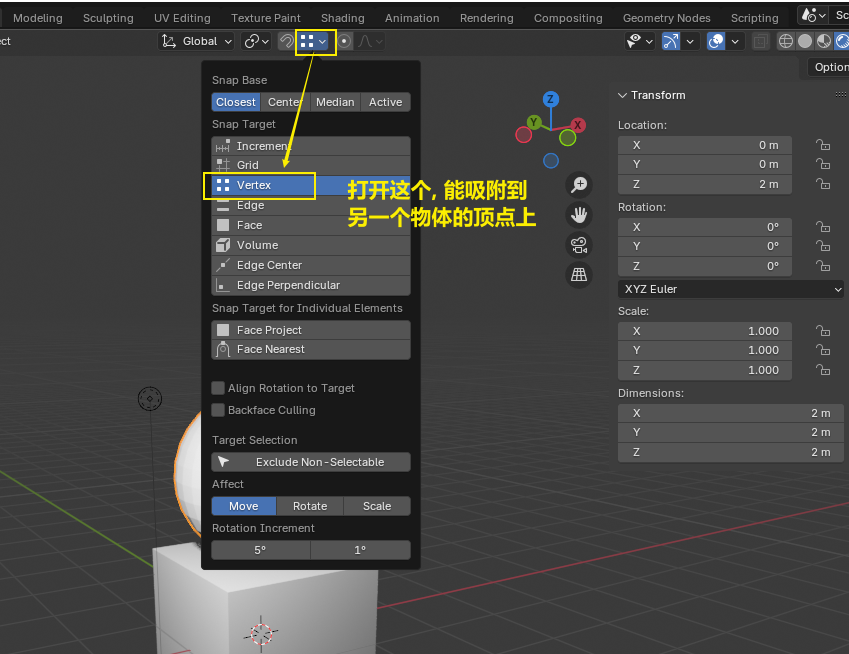
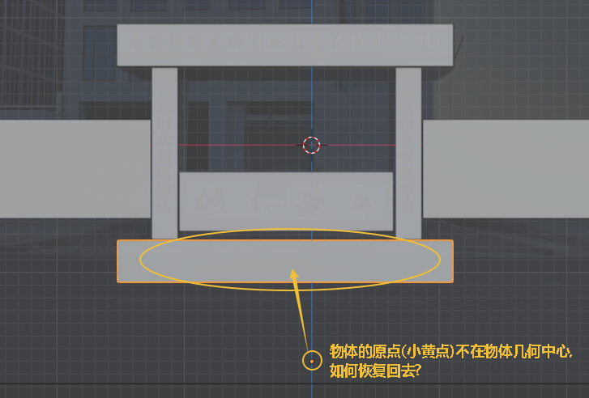
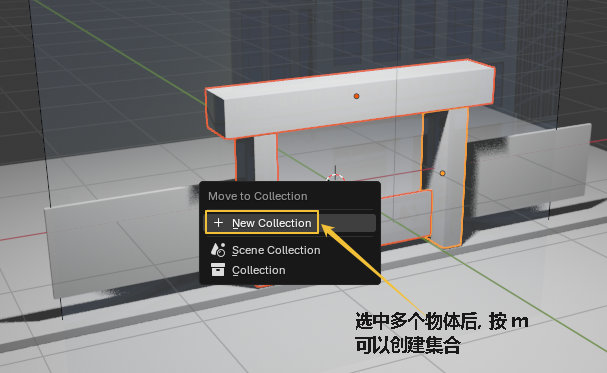

= blender 物体基本操作
:toc: left
:sectnums: 3

'''

== 窗口操作

==== 拉出新窗口

image:img/0007.png[,]

== #视图# 操作

[.small]
[options="autowidth" cols="1a,1a"]
|===
|Header 1 |Header 2

|旋转视图
|鼠标中键

为了以你选中的物体为中心, 来旋转视图, 你要先这样设置:

image:img/0018.png[,]

|平移视图
|shift + 鼠标中键

|缩放视图
|鼠标滚轮 +
为了以你鼠标的当前位置, 为缩放的中心, 能更方便你来操作视图. 你要这样设置:

image:img/0018.png[,]

image:img/0019.png[,]

|===

==== 正视图, 侧视图, 顶视图 的切换 : 按 数字键盘上的 1-9

image:img/0005.png[,]

- 也可以按你键盘右边的"数字小键盘"上的 1-9, 来切换视图. 1,3,7,9 是90度旋转视图. 2,4,6,8 是 每次按15度旋转视图.

- 也可以按alt + 鼠标中间, 来转

==== 切换到摄像机视图 : 按数字键 0

==== 切换到正交视图 (即无透视视图) : 按数字键5

==== 在一堆物体中, 将选中的物体快速定位, 单独放大到视图中间显示 : 按数字键上的小数点"."键

'''

== 物体

==== 选中物体

image:img/0004.png[,]

==== 新建物体 : shift + A

image:img/0001.png[,]

==== 让物体更光滑 : 右键, 平滑着色

image:img/0049.png[,]

image:img/0050.png[,]

image:img/0251.png[,]

image:img/0252.png[,]

image:img/0253.png[,]

image:img/0254.png[,]

image:img/0255.png[,]

image:img/0256.png[,]

image:img/0257.png[,]

image:img/0258.png[,]

image:img/0260.png[,]

image:img/0261.png[,]

image:img/0263.png[,]

image:img/0264.png[,]

image:img/0265.png[,]

image:img/0266.png[,]

image:img/0268.png[,]

image:img/0269.png[,]

image:img/0270.png[,]

image:img/0272.png[,]

image:img/0273.png[,]

image:img/0274.png[,]

image:img/0275.png[,]

image:img/0277.png[,]

image:img/0279.png[,]

image:img/0280.png[,]

'''

