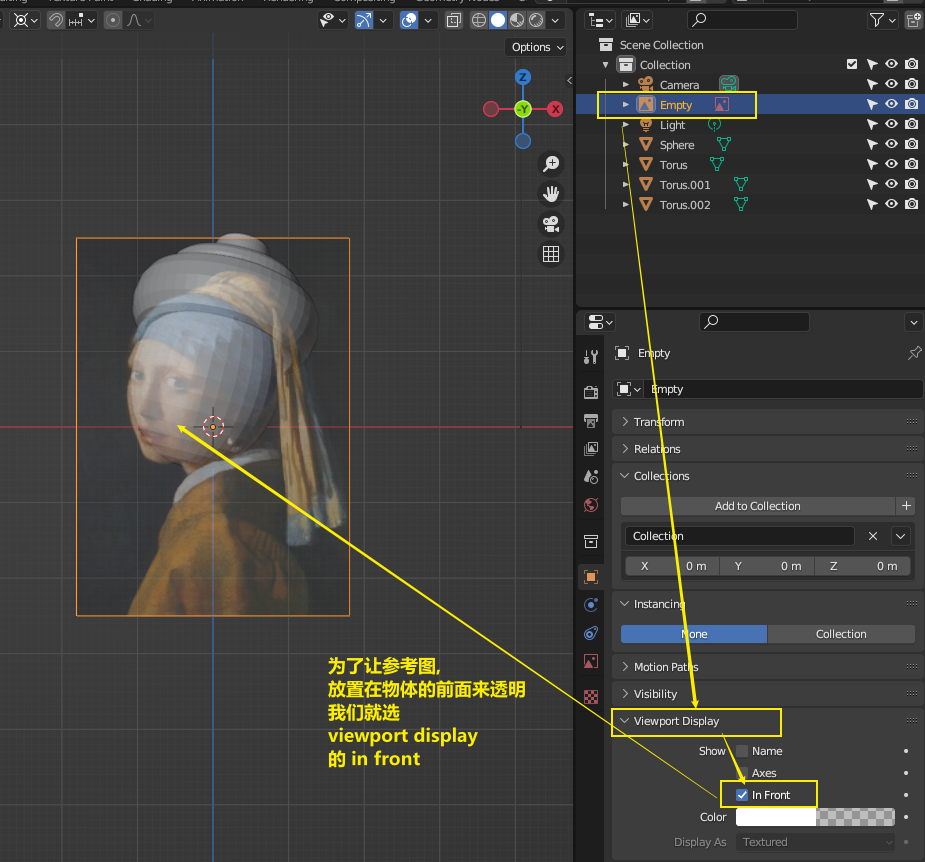
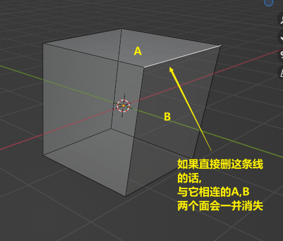
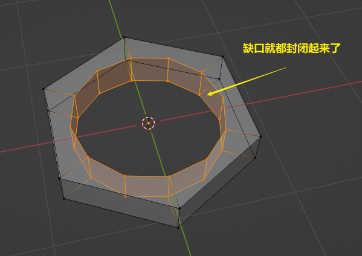

= blender 建模
:toc: left
:sectnums: 3

'''

但在锁定图片之前, 我们可以先来操作一下这个:

==== 创建物体(shift+a) 并修改参数

image:img/0031.png[,]

==== #★ 修改参数: f9#

物体新建后只要进行过移动、缩放、旋转等操作，是无法再查看左下角属性栏的，特别是在【编辑模式】下进行过点线面操作的，除了撤销动作可以返回几步，几乎是不可逆的，所以在添加如圆环、球体、柱体等需要修改顶点、半径、段数等的物体，请提前修改确认好，如果属性栏消失了，想修改物体属性可以尝试以下方法：

方法一：如果只是点击其他位置，导致属性栏消失，可以通过菜单栏【编辑】-【调整上一部操作】快捷键【F9】可以重新打开属性栏（请确认输入法为英文）

方法二：如果进行了如移动、缩放、旋转等操作，但是操作步骤不多，可以通过快捷键【Shift+A】重新创建一个

方法三：如果只是需要修改物体的位置、旋转、缩放、尺寸的具体属性，可以通过按快捷键【N】，在条目-变换中进行修改

image:img/0178.png[,]

方法四：如果进行过复杂操作，如进行了【挤压】和【添加了修改器】等，可以通过【新建物体】 继承属性来改变物体的属性，方法如下：

==== ★ 单独查看某个物体 : 英文输入法模式下,按 /

image:img/0036.png[,]

'''

== #选择点线面#

按tab, 可以进入物体的编辑模式, 再按tab, 则退回到物体模式

image:img/0056.png[,]

==== 快速切换模式

为了更快捷, 我们可以设置 :

image:img/0057.png[,]

image:img/0058.png[,]

image:img/0059.png[,]

image:img/0060.png[,]

==== 选择 点线面 : 快捷键分别是 1, 2, 3

image:img/0061.png[,]

image:img/0062.png[,]

上面图标英文中, 下划线划出来的英文字母, 就是快捷键. 你选用快捷键后, 如果想切换成其它快捷键, 必须线按 ecs 或 鼠标点击一下空白处, 才能继续按其它的快捷键来切换工具.

==== ★ 连物体背面的点线面一并选中 : 进入透视模式的快捷键是 alt + z (必须在英文输入法下, 快捷键才能生效)

==== 反选 : ctrl + i

==== 选出两个点之间的最短路径 : ctrl + 终点

image:img/0065.png[,]

image:img/0066.png[,]

==== 选中与某点线"相连接"的所有点线 : L

image:img/0067.png[,]

==== ★ 循环选择一圈 : alt + 双击(其实单击就行)你选中的某条边

下面的效果, 是按 ctrl+ alt + 左键 +
image:img/0071.png[,]

==== ★ 随机选择

==== ★ 扩展/减小 选区 : 按小键盘上的加号"+"和减号"-"

可以连续按小键盘上的 加号键和减号键

image:img/0073.png[,]

image:img/0074.png[,]

==== ★ 删除 点线面 : 快捷键 X

== #法线# : 决定正反面

image:img/0082.png[,]

image:img/0083.png[,]

==== 翻转正反面 : shift + n

image:img/0084.png[,]

== 法线

image:img/0085.png[,]

== #建模#

==== 改变物体的长宽高 : 快捷键就是 G

==== 旋转物体的面 : R

image:img/0088.png[,]

==== 缩放 S

image:img/0089.png[,]

==== 标注

image:img/0091.png[,]

==== 测量距离

image:img/0092.png[,]

==== 以另一个物体为底座, 创建出新物体

image:img/0093.png[,]

要删除这些物体, 必须先退出编辑模式, 再 del 删除

==== 挤出 E

image:img/0094.png[,]

image:img/0096.png[,]

image:img/0097.png[,]

image:img/0098.png[,]

注意 : 挤出后, 你不要用右键来撤销, 挤出效果依然会存在, 只不过它挤出的高度是0 (挤出的点线面会和原来的物体重叠). 你要用 esc来撤销, 这才安全.

==== 更好的挤压

==== 沿法线的方向挤出

==== 各自独立挤出

image:img/0109.png[,]

image:img/0110.png[,]

==== 向内挤出 I

==== 倒角 ctrl + B

image:img/0102.png[,]

==== 循环切割线

image:img/0103.png[,]

== 修改器

==== 方变圆

==== #阵列修改器#

image:img/0226.png[,]

image:img/0227.png[,]

相对偏移, 是以物体自身尺寸为1倍距离.

image:img/0229.png[,]

image:img/0230.png[,]

你修改了原型物体后, 其它的分身物体会跟着一起变化.

'''

==== 倒角修改器

image:img/0234.png[,]

每个修改器, 就相当于一个函数. 你放上面的修改器, 会优先执行这个函数. 所以多个修改器之间可以调整上下顺序, 来调整这多个函数的执行顺序.

image:img/0236.png[,]

image:img/0241.png[,]

image:img/0242.png[,]

image:img/0243.png[,]

image:img/0245.png[,]

image:img/0246.png[,]

image:img/0247.png[,]

image:img/0248.png[,]

image:img/0249.png[,]

image:img/0251.png[,]

image:img/0252.png[,]

image:img/0254.png[,]

image:img/0255.png[,]

image:img/0257.png[,]

image:img/0258.png[,]

image:img/0259.png[,]

image:img/0261.png[,]

image:img/0262.png[,]

image:img/0263.png[,]

image:img/0264.png[,]

image:img/0265.png[,]

image:img/0266.png[,]

image:img/0267.png[,]

image:img/0269.png[,]

image:img/0271.png[,]

image:img/0273.png[,]

image:img/0274.png[,]

image:img/0275.png[,]

image:img/0276.png[,]

image:img/0278.png[,]

image:img/0279.png[,]

image:img/0280.png[,]

