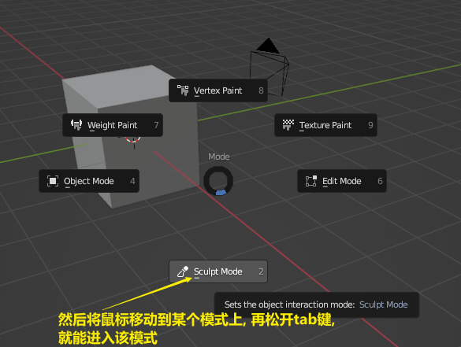
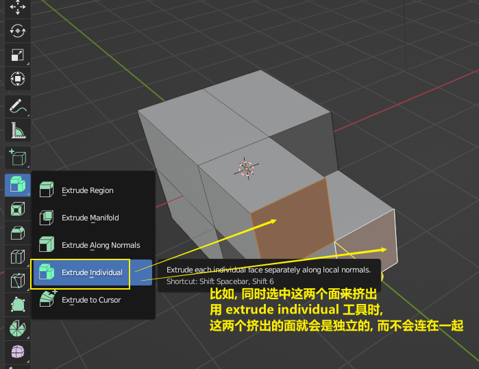

= blender 建模
:toc: left
:sectnums: 3

'''

image:img/0034.png[,]
image:img/0035.png[,]

但在锁定图片之前, 我们可以先来操作一下这个:

image:img/0037.png[,]

==== 创建物体(shift+a) 并修改参数

image:img/0029.png[,]
image:img/0030.png[,]

==== ★ 单独查看某个物体 : 英文输入法模式下,按 /

'''

== #选择点线面#

按tab, 可以进入物体的编辑模式, 再按tab, 则退回到物体模式

image:img/0056.png[,]

==== 快速切换模式

为了更快捷, 我们可以设置 :

image:img/0057.png[,]

image:img/0058.png[,]

==== 选择 点线面 : 快捷键分别是 1, 2, 3

image:img/0063.png[,]

上面图标英文中, 下划线划出来的英文字母, 就是快捷键. 你选用快捷键后, 如果想切换成其它快捷键, 必须线按 ecs 或 鼠标点击一下空白处, 才能继续按其它的快捷键来切换工具.

==== ★ 连物体背面的点线面一并选中 : 进入透视模式的快捷键是 alt + z (必须在英文输入法下, 快捷键才能生效)

image:img/0075.png[,]

==== 反选 : ctrl + i

image:img/0064.png[,]

==== 选出两个点之间的最短路径 : ctrl + 终点

image:img/0066.png[,]

==== 选中与某点线"相连接"的所有点线 : L

==== ★ 循环选择一圈 : alt + 双击(其实单击就行)你选中的某条边

image:img/0068.png[,]

image:img/0069.png[,]

image:img/0070.png[,]

下面的效果, 是按 ctrl+ alt + 左键 +

==== ★ 随机选择

image:img/0072.png[,]

==== ★ 扩展/减小 选区 : 按小键盘上的加号"+"和减号"-"

可以连续按小键盘上的 加号键和减号键

image:img/0073.png[,]

==== ★ 删除 点线面 : 快捷键 X

image:img/0076.png[,]

image:img/0077.png[,]

image:img/0078.png[,]

image:img/0079.png[,]

image:img/0080.png[,]

image:img/0081.png[,]

== #法线# : 决定正反面

image:img/0083.png[,]

==== 翻转正反面 : shift + n

image:img/0084.png[,]

== 法线

image:img/0085.png[,]

== #建模#

image:img/0086.png[,]

==== 改变物体的长宽高 : 快捷键就是 G

image:img/0087.png[,]

==== 旋转物体的面 : R

==== 缩放 S

==== 标注

image:img/0090.png[,]

==== 测量距离

==== 以另一个物体为底座, 创建出新物体

要删除这些物体, 必须先退出编辑模式, 再 del 删除

==== 挤出 E

image:img/0095.png[,]

image:img/0099.png[,]

注意 : 挤出后, 你不要用右键来撤销, 挤出效果依然会存在, 只不过它挤出的高度是0 (挤出的点线面会和原来的物体重叠). 你要用 esc来撤销, 这才安全.

==== 更好的挤压

image:img/0106.png[,]

image:img/0107.png[,]

==== 沿法线的方向挤出

image:img/0108.png[,]

==== 各自独立挤出

==== 向内挤出 I

image:img/0100.png[,]

image:img/0111.png[,]

==== 倒角 ctrl + B

image:img/0101.png[,]

==== 循环切割线

image:img/0104.png[,]

image:img/0105.png[,]

