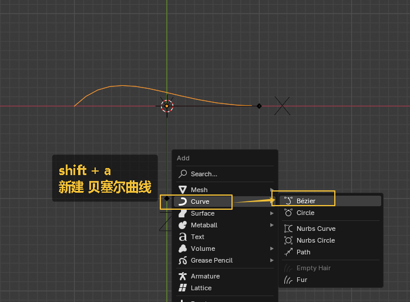
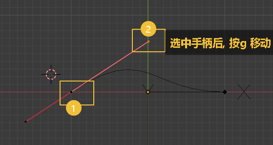
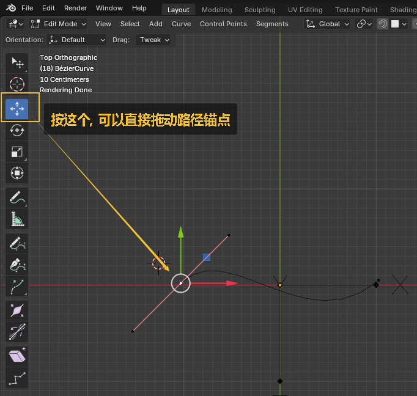
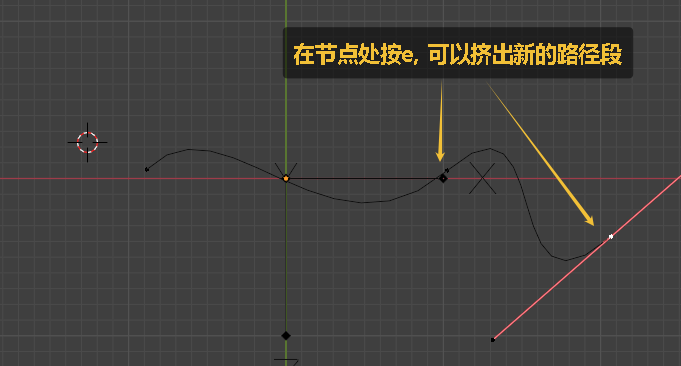

= 曲线路径
:toc: left
:toclevels: 3
:sectnums:
:stylesheet: myAdocCss.css

'''

== 01

image:img/0490.png[,]

image:img/0491.png[,]

'''

== 02

image:img/0490.png[,]

image:img/0491.png[,]

image:img/0492.png[,]

