= blender 修改器
:toc: left
:toclevels: 3
:sectnums:
:stylesheet: myAdocCss.css

'''

== 案例1 : 原始的 破坏性修改, 来做螺帽

image:img/0322.png[,]

image:img/0318.png[,]

image:img/0338.png[,]

image:img/0323.png[,]

image:img/0328.png[,]

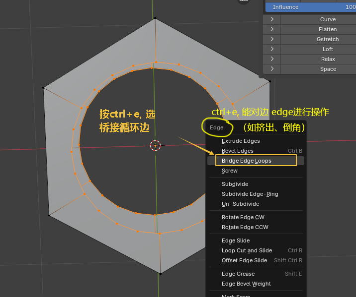

上图中,快捷键的功能是:

- Ctrl+E：边操作（如挤出、倒角）
- Ctrl+F：面操作（如填充、倒角）
- Ctrl+V：顶点操作（如合并、分离）

image:img/0333.png[,]

image:img/0335.png[,]

image:img/0340.png[,]

'''

== #修改器: 是"非破坏性修改"#, 相当于ps 将图层转成"智能对象"后, 来进行变形等操作, 不会破坏原始素材.

=== 修改器: #表面细分# -> 可以增加物体的细分面数, 让物体更加圆滑

表面细分修改器, 作用是: 将网格的面分割成更小的面, 使其看起来更平滑·

image:img/0343.png[,]

image:img/0347.png[,]

image:img/0348.png[,]

image:img/0349.png[,]

'''

=== 修改器: #实体化# -> 即升维打击, 将二维平面, 变成三维立方体

image:img/0354.png[,]

image:img/0355.png[,]

'''

=== 修改器: #倒角#

image:img/0356.png[,]

image:img/0357.png[,]

image:img/0358.png[,]

'''

=== 修改器: #布尔# -> 可以做镂空效果

布尔修改器: 可以对两个物体进行交集，差集，并集运算. 但偶尔会出现奇怪的问题，慎用. 因为布尔修改器, 会造成"多变面", 或不规则的面. 这会导致渲染时出现奇怪的阴影.

image:img/0360.png[,]

image:img/0362.png[,]

布尔修改器的缺点:  会造成"多变面", 或不规则的面. 这会导致渲染时出现奇怪的阴影.

image:img/0385.png[,]

'''

== 下面, 用修改器的方法, 来做螺帽

image:img/0371.png[,]

image:img/0373.png[,]

image:img/0374.png[,]

image:img/0375.png[,]

image:img/0376.png[,]

image:img/0377.png[,]

image:img/0378.png[,]

image:img/0380.png[,]

image:img/0381.png[,]

image:img/0384.png[,]

image:img/0386.png[,]

'''

== 案例

image:img/0486.png[,]

image:img/0487.png[,]

image:img/0488.png[,]

image:img/0489.png[,]

image:img/0392.png[,]

image:img/0393.png[,]

image:img/0394.png[,]

image:img/0401.png[,]

image:img/0403.png[,]

image:img/0404.png[,]

image:img/0406.png[,]

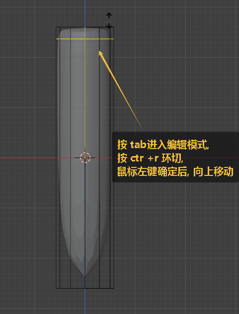

image:img/0410.png[,]

image:img/0411.png[,]

image:img/0412.png[,]

image:img/0413.png[,]

image:img/0415.png[,]

image:img/0416.png[,]

image:img/0417.png[,]

image:img/0419.png[,]

image:img/0424.png[,]

image:img/0425.png[,]

image:img/0426.png[,]

image:img/0427.png[,]

image:img/0429.png[,]

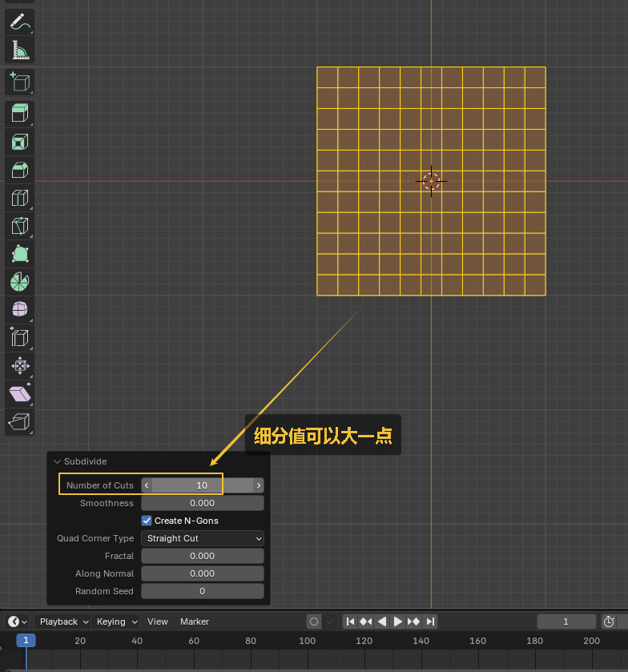

image:img/0437.png[,]

image:img/0439.png[,]

image:img/0440.png[,]

image:img/0441.png[,]

image:img/0442.png[,]

image:img/0443.png[,]

image:img/0444.png[,]

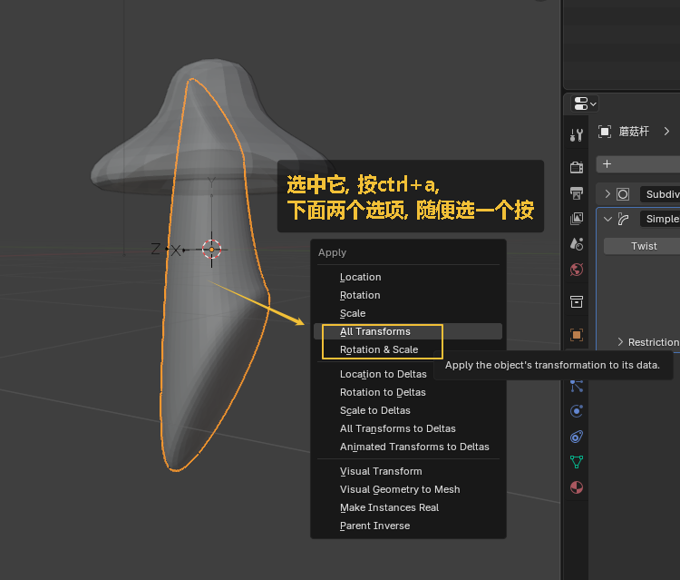

image:img/0446.png[,]

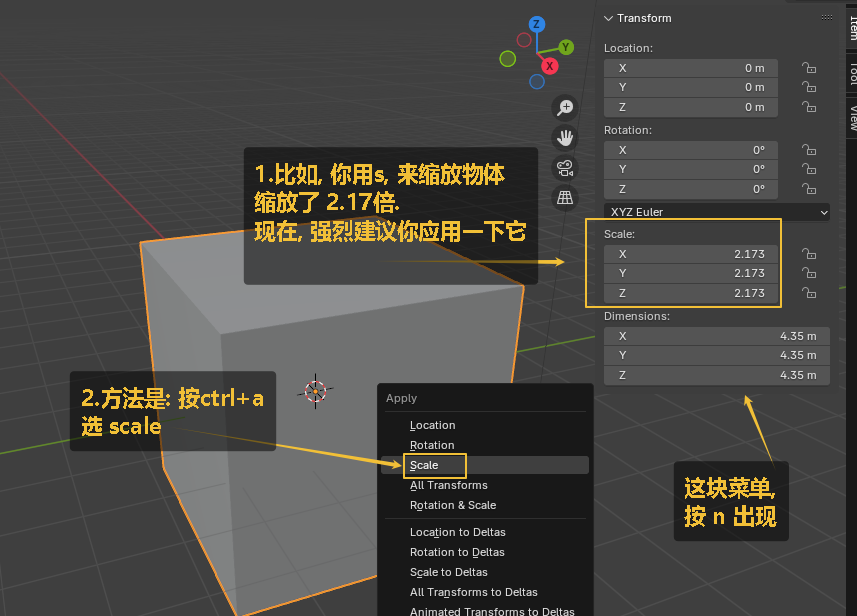

image:img/0449.png[,]

image:img/0452.png[,]

image:img/0453.png[,]

image:img/0454.png[,]

image:img/0457.png[,]

image:img/0459.png[,]

image:img/0460.png[,]

image:img/0461.png[,]

image:img/0465.png[,]

image:img/0467.png[,]

image:img/0470.png[,]

image:img/0472.png[,]

image:img/0478.png[,]

image:img/0479.png[,]

image:img/0481.png[,]

image:img/0482.png[,]

image:img/0483.png[,]

image:img/0484.png[,]

image:img/0486.png[,]

image:img/0487.png[,]

image:img/0488.png[,]

image:img/0489.png[,]

image:img/0493.png[,]

image:img/0494.png[,]

image:img/0495.png[,]

image:img/0496.png[,]

image:img/0498.png[,]

image:img/0499.png[,]

image:img/0500.png[,]

image:img/0501.png[,]

image:img/0503.png[,]

image:img/0504.png[,]

image:img/0507.png[,]

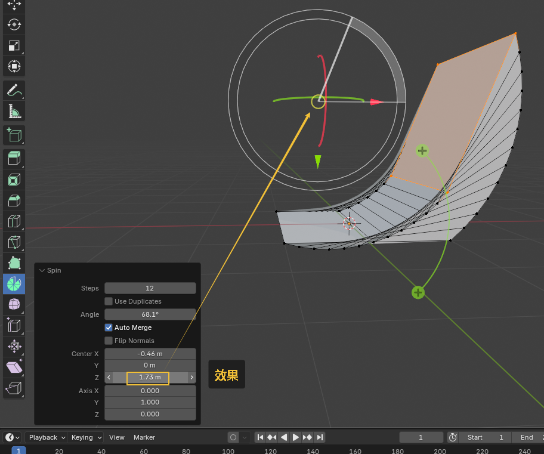

image:img/0513.png[,]

image:img/0514.png[,]

image:img/0516.png[,]

image:img/0518.png[,]

image:img/0520.png[,]

image:img/0522.png[,]

image:img/0523.png[,]

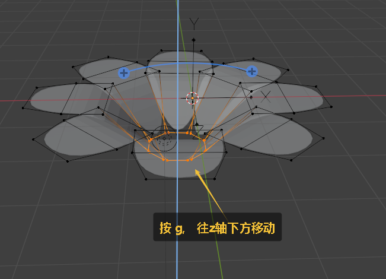

image:img/0525.png[,]

image:img/0527.png[,]

image:img/0528.png[,]

image:img/0529.png[,]

image:img/0535.png[,]

image:img/0536.png[,]

image:img/0539.png[,]

image:img/0540.png[,]

image:img/0541.png[,]

image:img/0542.png[,]

image:img/0543.png[,]

image:img/0544.png[,]

image:img/0545.png[,]

image:img/0546.png[,]

image:img/0549.png[,]

image:img/0550.png[,]

image:img/0551.png[,]

image:img/0552.png[,]

image:img/0553.png[,]

image:img/0554.png[,]

image:img/0555.png[,]

image:img/0556.png[,]

image:img/0557.png[,]

image:img/0558.png[,]

image:img/0559.png[,]

image:img/0560.png[,]

image:img/0561.png[,]

image:img/0562.png[,]

image:img/0563.png[,]

image:img/0564.png[,]

image:img/0565.png[,]

image:img/0566.png[,]

image:img/0567.png[,]

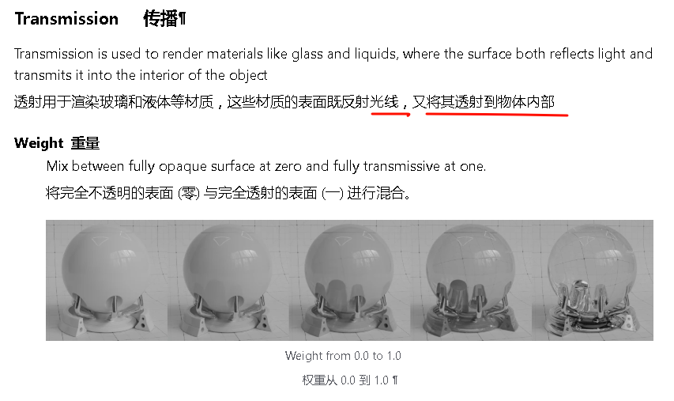

image:img/0569.png[,]

image:img/0570.png[,]

image:img/0572.png[,]

image:img/0574.png[,]

image:img/0575.png[,]

image:img/0576.png[,]

image:img/0577.png[,]

image:img/0580.png[,]

image:img/0582.png[,]

image:img/0583.png[,]

image:img/0584.png[,]

image:img/0585.png[,]

image:img/0587.png[,]

image:img/0588.png[,]

image:img/0589.png[,]

image:img/0590.png[,]

image:img/0592.png[,]

image:img/0593.png[,]

image:img/0594.png[,]

image:img/0595.png[,]

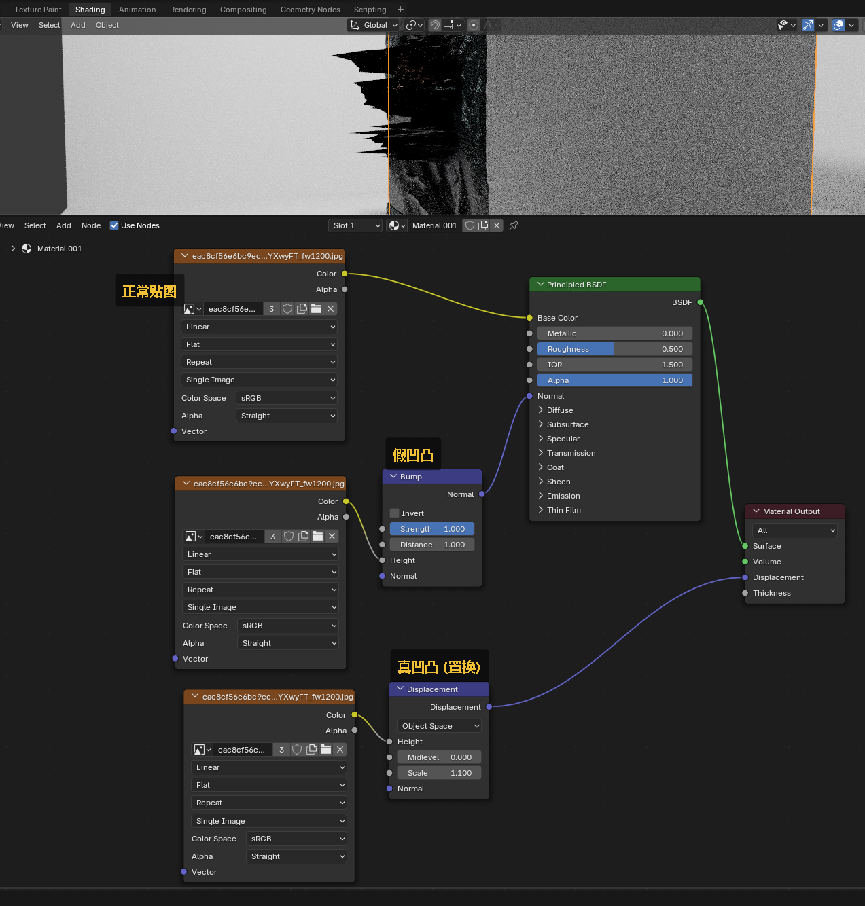

image:img/0599.png[,]

image:img/0600.png[,]

image:img/0601.png[,]

image:img/0602.png[,]

image:img/0603.png[,]

image:img/0606.png[,]

image:img/0609.png[,]

image:img/0610.png[,]

image:img/0612.png[,]

image:img/0613.png[,]

image:img/0616.png[,]

image:img/0617.png[,]

image:img/0618.png[,]

image:img/0619.png[,]

image:img/0620.png[,]

image:img/0621.png[,]

image:img/0622.png[,]

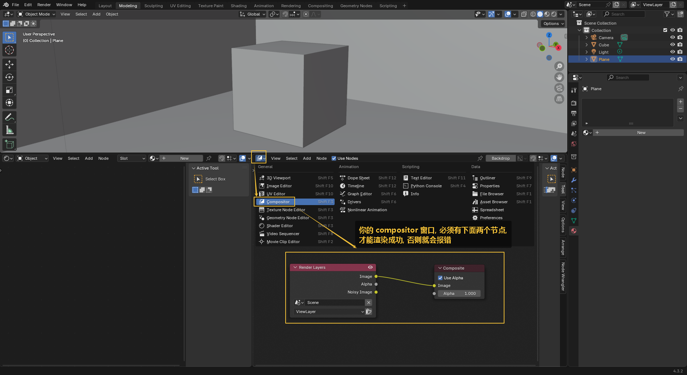

image:img/0625.png[,]

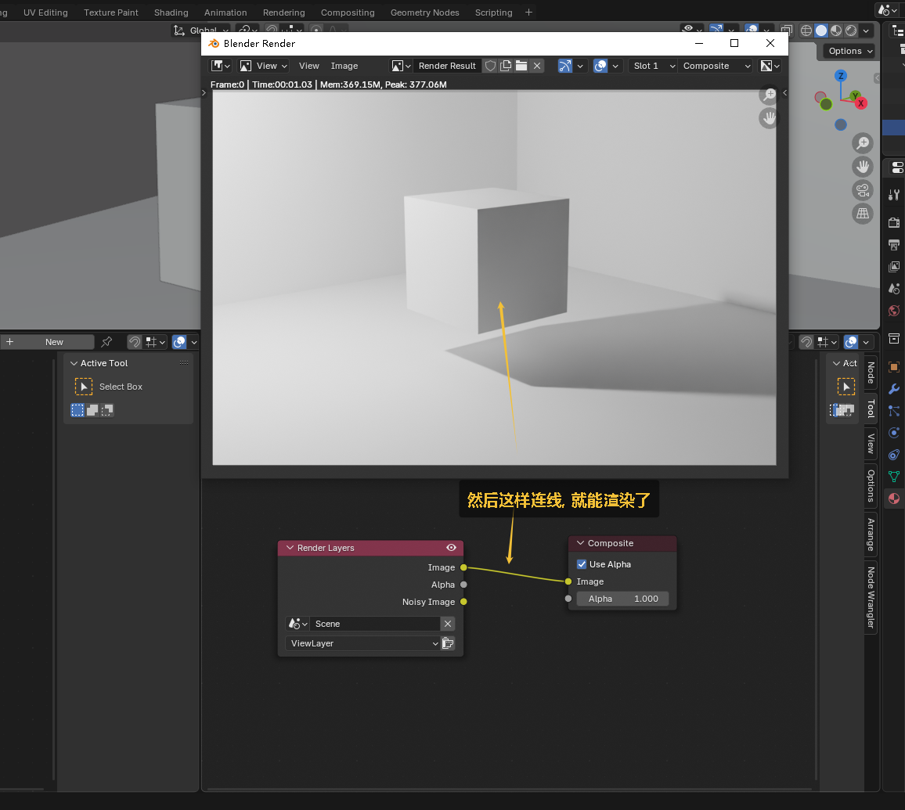

image:img/0627.png[,]

image:img/0628.png[,]

image:img/0629.png[,]

image:img/0630.png[,]

image:img/0631.png[,]

image:img/0632.png[,]

image:img/0635.png[,]

image:img/0637.png[,]

image:img/0638.png[,]

image:img/0639.png[,]

image:img/0640.png[,]

image:img/0641.png[,]

image:img/0642.png[,]

image:img/0644.png[,]

image:img/0648.png[,]

image:img/0649.png[,]

image:img/0650.png[,]

image:img/0651.png[,]

image:img/0655.png[,]

image:img/0656.png[,]

image:img/0657.png[,]

image:img/0661.png[,]

image:img/0662.png[,]

image:img/0663.png[,]

image:img/0664.png[,]

image:img/0665.png[,]

image:img/0666.png[,]

image:img/0667.png[,]

image:img/0668.png[,]

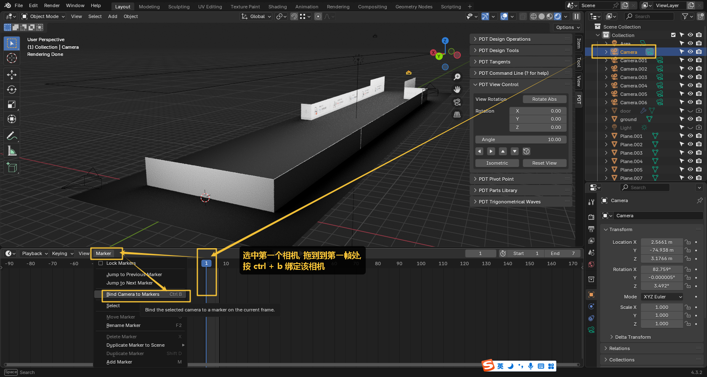

image:img/0670.png[,]

image:img/0671.png[,]

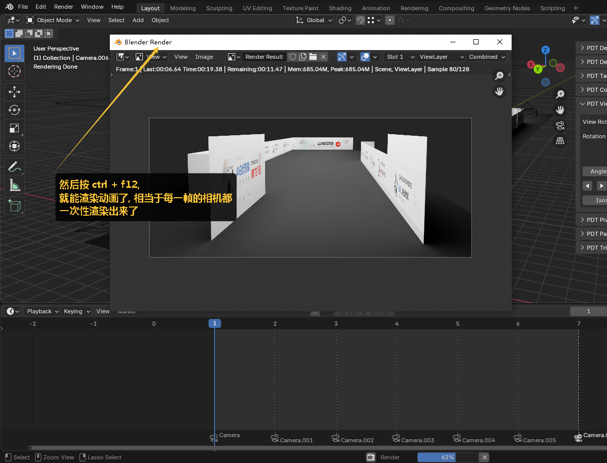

image:img/0673.png[,]

image:img/0675.png[,]

image:img/0676.png[,]

image:img/0677.png[,]

image:img/0678.png[,]

image:img/0679.png[,]

image:img/0680.png[,]

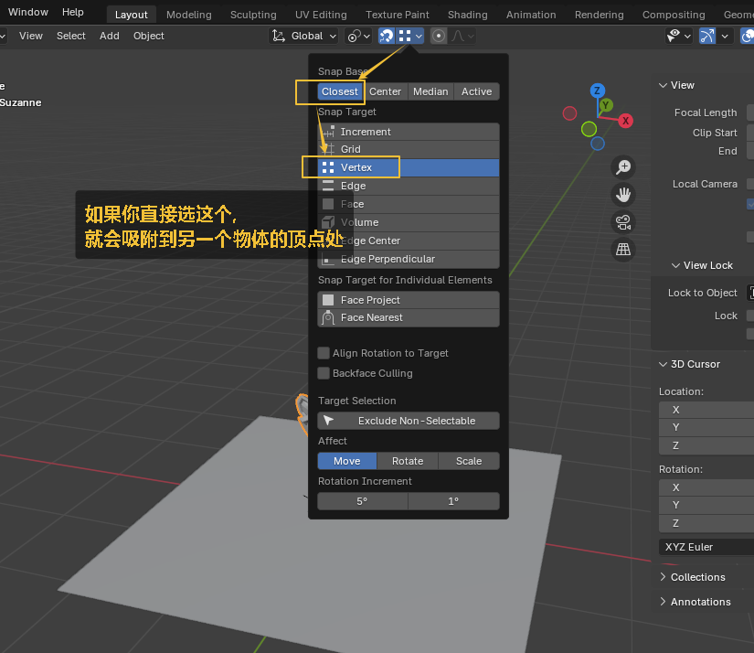

image:img/0683.png[,]

image:img/0685.png[,]

image:img/0686.png[,]

image:img/0689.png[,]

image:img/0690.png[,]

image:img/0691.png[,]

image:img/0692.png[,]

image:img/0693.png[,]

image:img/0694.png[,]

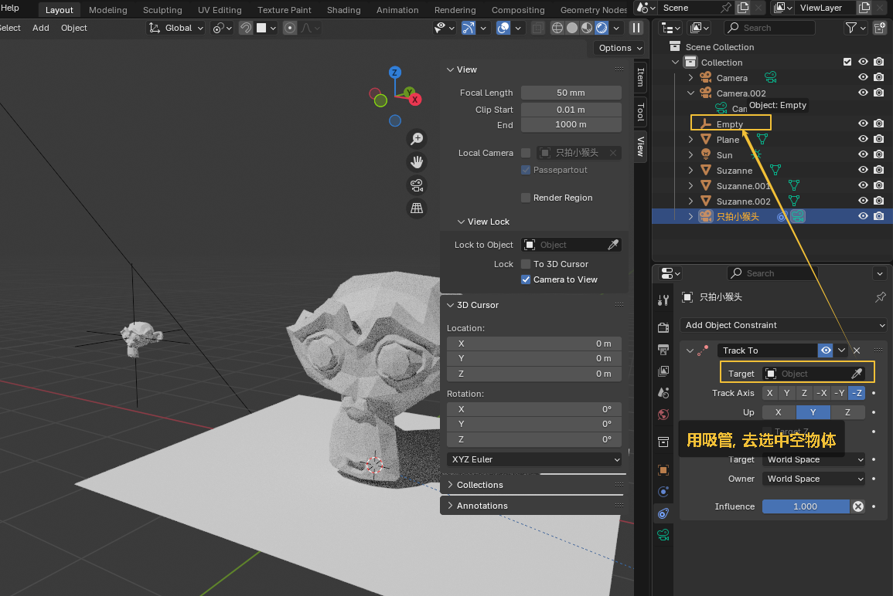

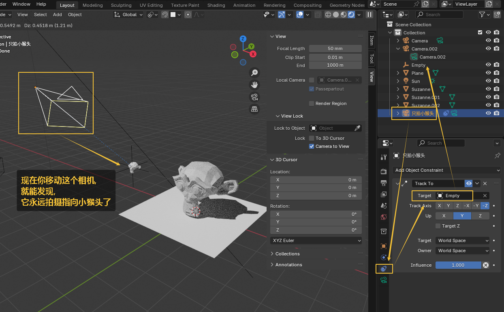

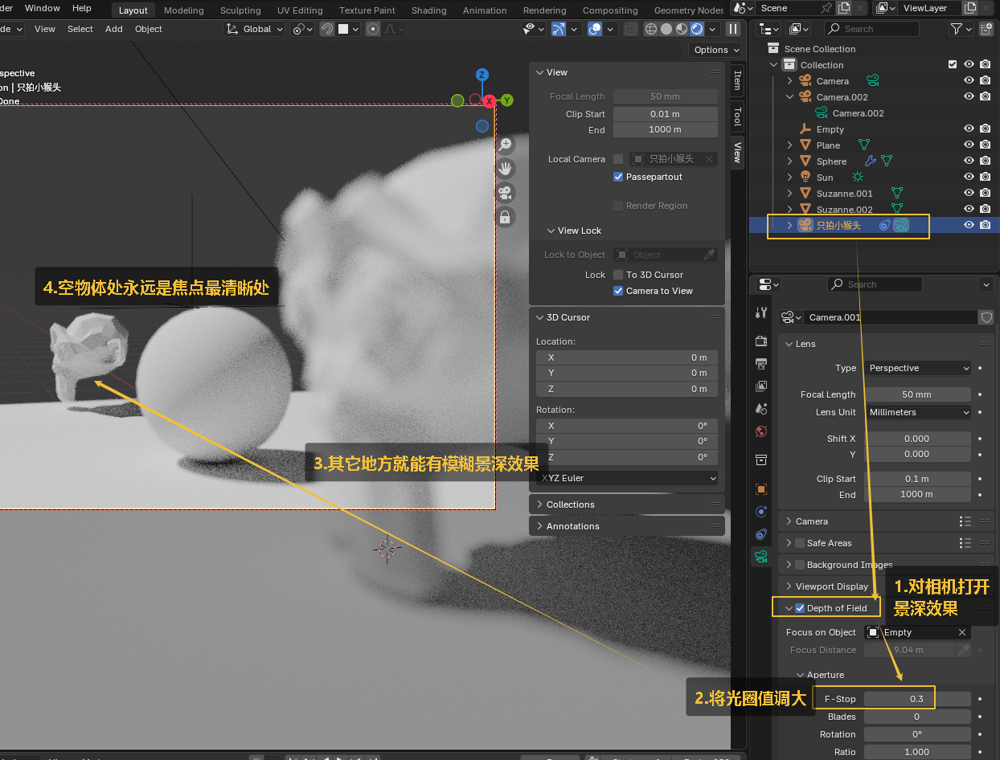

image:img/0698.png[,]

image:img/0699.png[,]

image:img/0700.png[,]

image:img/0701.png[,]

image:img/0702.png[,]

image:img/0703.png[,]

image:img/0704.png[,]

image:img/0705.png[,]

image:img/0706.png[,]

image:img/0707.png[,]

image:img/0708.png[,]

image:img/0709.png[,]

image:img/0710.png[,]

image:img/0712.png[,]

image:img/0713.png[,]

image:img/0714.png[,]

image:img/0392.png[,]

image:img/0393.png[,]

image:img/0394.png[,]

image:img/0401.png[,]

image:img/0403.png[,]

image:img/0404.png[,]

image:img/0406.png[,]

image:img/0410.png[,]

image:img/0411.png[,]

image:img/0412.png[,]

image:img/0413.png[,]

image:img/0415.png[,]

image:img/0416.png[,]

image:img/0417.png[,]

image:img/0419.png[,]

image:img/0424.png[,]

image:img/0425.png[,]

image:img/0426.png[,]

image:img/0427.png[,]

image:img/0429.png[,]

image:img/0437.png[,]

image:img/0439.png[,]

image:img/0440.png[,]

image:img/0441.png[,]

image:img/0442.png[,]

image:img/0443.png[,]

image:img/0444.png[,]

image:img/0446.png[,]

image:img/0449.png[,]

image:img/0452.png[,]

image:img/0453.png[,]

image:img/0454.png[,]

image:img/0457.png[,]

image:img/0459.png[,]

image:img/0460.png[,]

image:img/0461.png[,]

image:img/0465.png[,]

image:img/0467.png[,]

image:img/0470.png[,]

image:img/0472.png[,]

image:img/0478.png[,]

image:img/0479.png[,]

image:img/0481.png[,]

image:img/0482.png[,]

image:img/0483.png[,]

image:img/0484.png[,]

image:img/0486.png[,]

image:img/0487.png[,]

image:img/0488.png[,]

image:img/0489.png[,]

image:img/0493.png[,]

image:img/0494.png[,]

image:img/0495.png[,]

image:img/0496.png[,]

image:img/0498.png[,]

image:img/0499.png[,]

image:img/0500.png[,]

image:img/0501.png[,]

image:img/0503.png[,]

image:img/0504.png[,]

image:img/0507.png[,]

image:img/0513.png[,]

image:img/0514.png[,]

image:img/0516.png[,]

image:img/0518.png[,]

image:img/0520.png[,]

image:img/0522.png[,]

image:img/0523.png[,]

image:img/0525.png[,]

image:img/0527.png[,]

image:img/0528.png[,]

image:img/0529.png[,]

image:img/0535.png[,]

image:img/0536.png[,]

image:img/0539.png[,]

image:img/0540.png[,]

image:img/0541.png[,]

image:img/0542.png[,]

image:img/0543.png[,]

image:img/0544.png[,]

image:img/0545.png[,]

image:img/0546.png[,]

image:img/0549.png[,]

image:img/0550.png[,]

image:img/0551.png[,]

image:img/0552.png[,]

image:img/0553.png[,]

image:img/0554.png[,]

image:img/0555.png[,]

image:img/0556.png[,]

image:img/0557.png[,]

image:img/0558.png[,]

image:img/0559.png[,]

image:img/0560.png[,]

image:img/0561.png[,]

image:img/0562.png[,]

image:img/0563.png[,]

image:img/0564.png[,]

image:img/0565.png[,]

image:img/0566.png[,]

image:img/0567.png[,]

image:img/0569.png[,]

image:img/0570.png[,]

image:img/0572.png[,]

image:img/0574.png[,]

image:img/0575.png[,]

image:img/0576.png[,]

image:img/0577.png[,]

image:img/0580.png[,]

image:img/0582.png[,]

image:img/0583.png[,]

image:img/0584.png[,]

image:img/0585.png[,]

image:img/0587.png[,]

image:img/0588.png[,]

image:img/0589.png[,]

image:img/0590.png[,]

image:img/0592.png[,]

image:img/0593.png[,]

image:img/0594.png[,]

image:img/0595.png[,]

image:img/0599.png[,]

image:img/0600.png[,]

image:img/0601.png[,]

image:img/0602.png[,]

image:img/0603.png[,]

image:img/0606.png[,]

image:img/0609.png[,]

image:img/0610.png[,]

image:img/0612.png[,]

image:img/0613.png[,]

image:img/0616.png[,]

image:img/0617.png[,]

image:img/0618.png[,]

image:img/0619.png[,]

image:img/0620.png[,]

image:img/0621.png[,]

image:img/0622.png[,]

image:img/0625.png[,]

image:img/0627.png[,]

image:img/0628.png[,]

image:img/0629.png[,]

image:img/0630.png[,]

image:img/0631.png[,]

image:img/0632.png[,]

image:img/0635.png[,]

image:img/0637.png[,]

image:img/0638.png[,]

image:img/0639.png[,]

image:img/0640.png[,]

image:img/0641.png[,]

image:img/0642.png[,]

image:img/0644.png[,]

image:img/0648.png[,]

image:img/0649.png[,]

image:img/0650.png[,]

image:img/0651.png[,]

image:img/0655.png[,]

image:img/0656.png[,]

image:img/0657.png[,]

image:img/0661.png[,]

image:img/0662.png[,]

image:img/0663.png[,]

image:img/0664.png[,]

image:img/0665.png[,]

image:img/0666.png[,]

image:img/0667.png[,]

image:img/0668.png[,]

image:img/0670.png[,]

image:img/0671.png[,]

image:img/0673.png[,]

image:img/0675.png[,]

image:img/0676.png[,]

image:img/0677.png[,]

image:img/0678.png[,]

image:img/0679.png[,]

image:img/0680.png[,]

image:img/0683.png[,]

image:img/0685.png[,]

image:img/0686.png[,]

image:img/0689.png[,]

image:img/0690.png[,]

image:img/0691.png[,]

image:img/0692.png[,]

image:img/0693.png[,]

image:img/0694.png[,]

image:img/0698.png[,]

image:img/0699.png[,]

image:img/0700.png[,]

image:img/0701.png[,]

image:img/0702.png[,]

image:img/0703.png[,]

image:img/0704.png[,]

image:img/0705.png[,]

image:img/0706.png[,]

image:img/0707.png[,]

image:img/0708.png[,]

image:img/0709.png[,]

image:img/0710.png[,]

image:img/0712.png[,]

image:img/0713.png[,]

image:img/0714.png[,]

image:img/0716.png[,]

image:img/0717.png[,]

image:img/0718.png[,]

image:img/0719.png[,]

image:img/0721.png[,]

image:img/0723.png[,]

image:img/0724.png[,]

image:img/0728.png[,]

image:img/0716.png[,]

image:img/0717.png[,]

image:img/0718.png[,]

image:img/0719.png[,]

image:img/0721.png[,]

image:img/0723.png[,]

image:img/0724.png[,]

image:img/0728.png[,]

