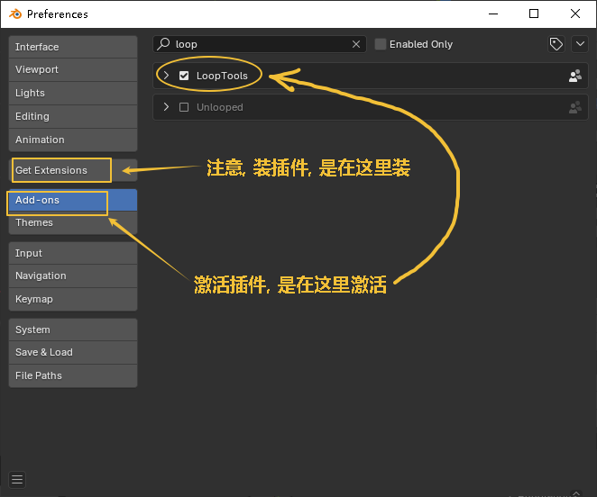
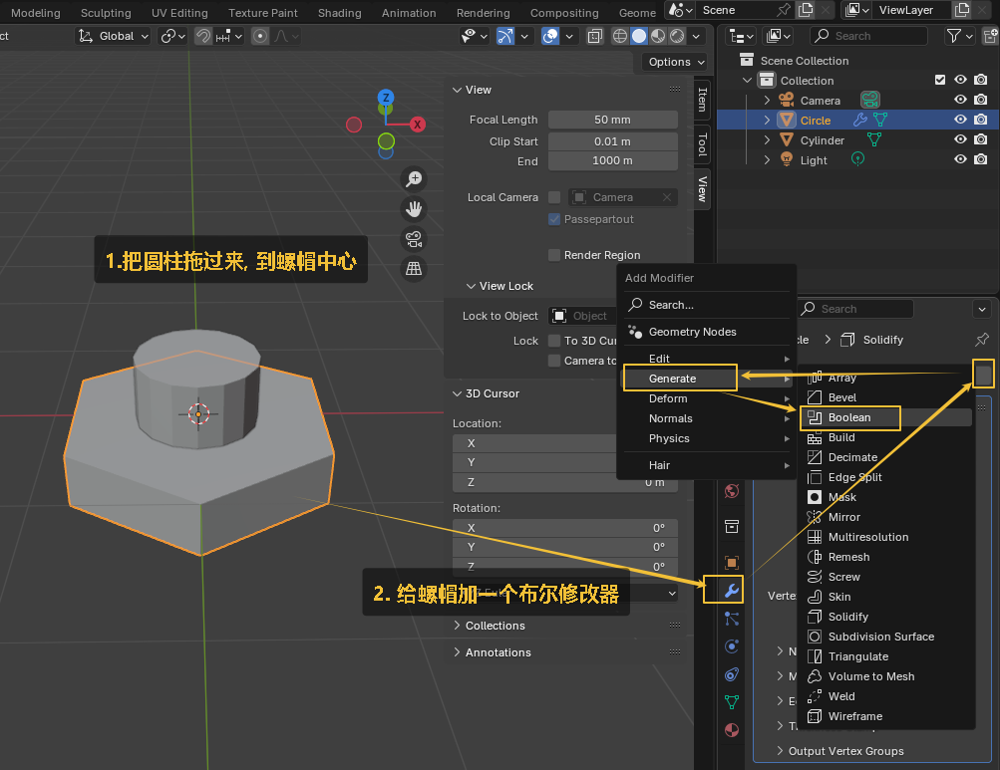

= blender 修改器
:toc: left
:toclevels: 3
:sectnums:
:stylesheet: myAdocCss.css

'''

== 案例1 : 原始的 破坏性修改, 来做螺帽

image:img/0316.png[,]

image:img/0317.png[,]

image:img/0320.png[,]

image:img/0321.png[,]

image:img/0324.png[,]

image:img/0325.png[,]

image:img/0326.png[,]

image:img/0327.png[,]

image:img/0329.png[,]

上图中,快捷键的功能是:

- Ctrl+E：边操作（如挤出、倒角）
- Ctrl+F：面操作（如填充、倒角）
- Ctrl+V：顶点操作（如合并、分离）

image:img/0334.png[,]

image:img/0339.png[,]

image:img/0341.png[,]

'''

== #修改器: 是"非破坏性修改"#, 相当于ps 将图层转成"智能对象"后, 来进行变形等操作, 不会破坏原始素材.

=== 修改器: #表面细分# -> 可以增加物体的细分面数, 让物体更加圆滑

表面细分修改器, 作用是: 将网格的面分割成更小的面, 使其看起来更平滑·

image:img/0342.png[,]

image:img/0344.png[,]

image:img/0345.png[,]

image:img/0346.png[,]

image:img/0350.png[,]

image:img/0351.png[,]

image:img/0352.png[,]

image:img/0353.png[,]

'''

=== 修改器: #实体化# -> 即升维打击, 将二维平面, 变成三维立方体

'''

=== 修改器: #倒角#

'''

=== 修改器: #布尔# -> 可以做镂空效果

布尔修改器: 可以对两个物体进行交集，差集，并集运算. 但偶尔会出现奇怪的问题，慎用. 因为布尔修改器, 会造成"多变面", 或不规则的面. 这会导致渲染时出现奇怪的阴影.

image:img/0361.png[,]

image:img/0362.png[,]

image:img/0363.png[,]

image:img/0364.png[,]

image:img/0365.png[,]

image:img/0366.png[,]

布尔修改器的缺点:  会造成"多变面", 或不规则的面. 这会导致渲染时出现奇怪的阴影.

'''

== 下面, 用修改器的方法, 来做螺帽

image:img/0367.png[,]

image:img/0368.png[,]

image:img/0369.png[,]

image:img/0370.png[,]

image:img/0372.png[,]

image:img/0374.png[,]

image:img/0378.png[,]

image:img/0379.png[,]

image:img/0382.png[,]

image:img/0383.png[,]

'''

