= blender 实景合成
:toc: left
:sectnums: 3

'''

实景合成, 需要用到一个辅助软件: fspy. 已存在你的百度网盘里了.

官网安装为 https://fspy.io/

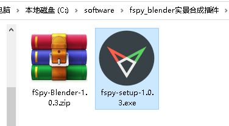

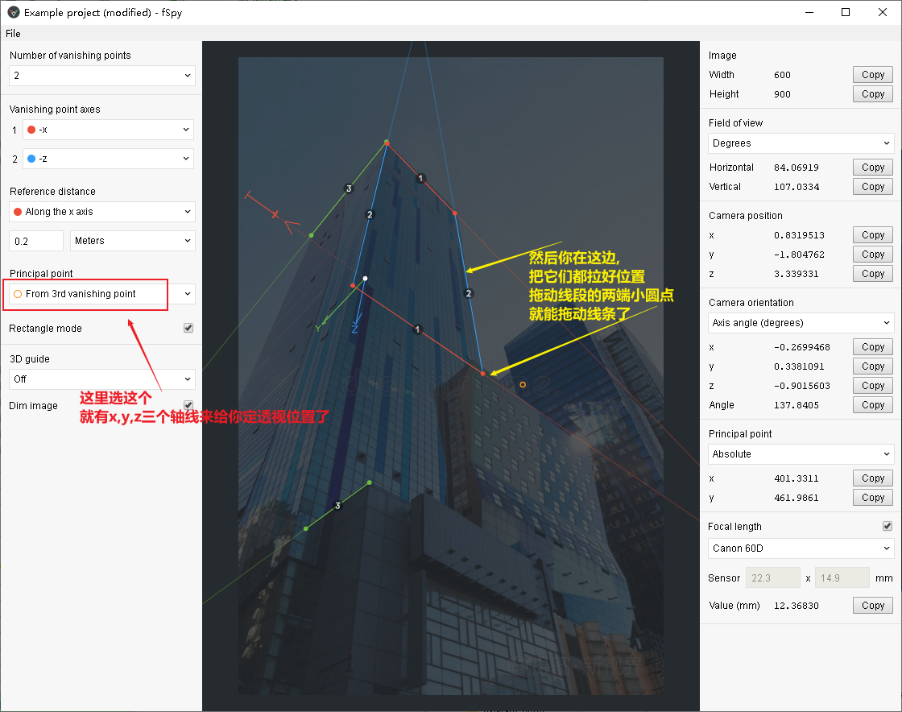

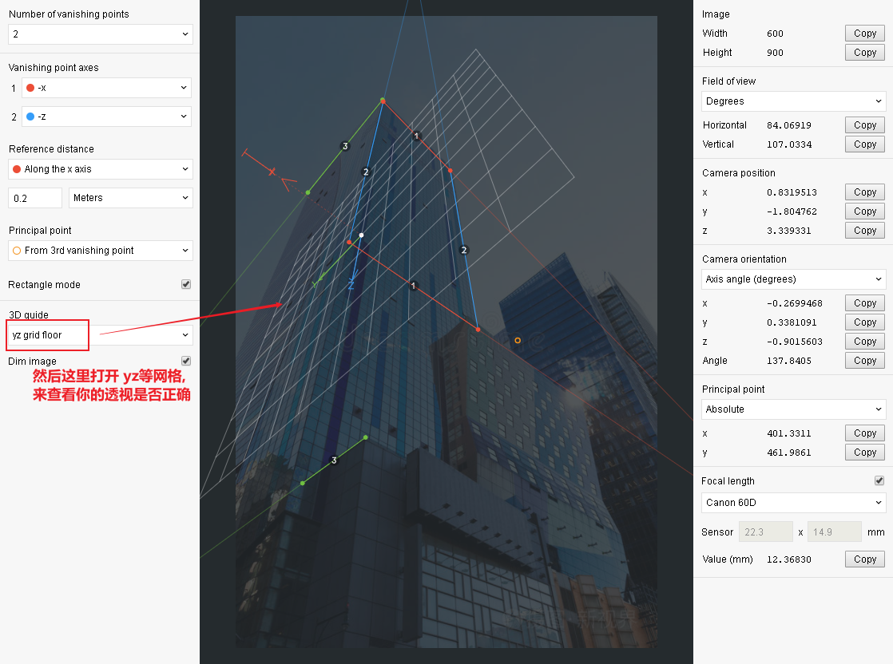

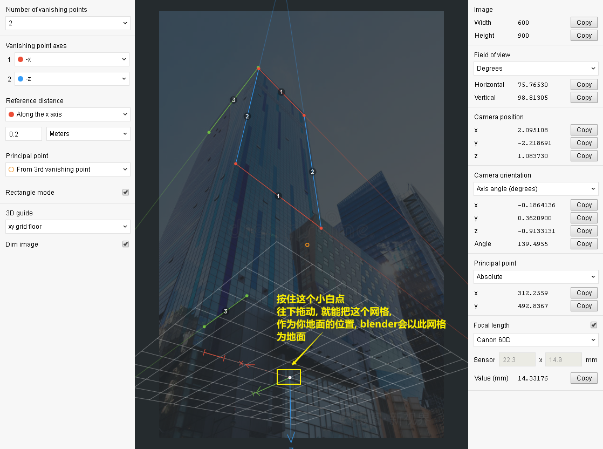

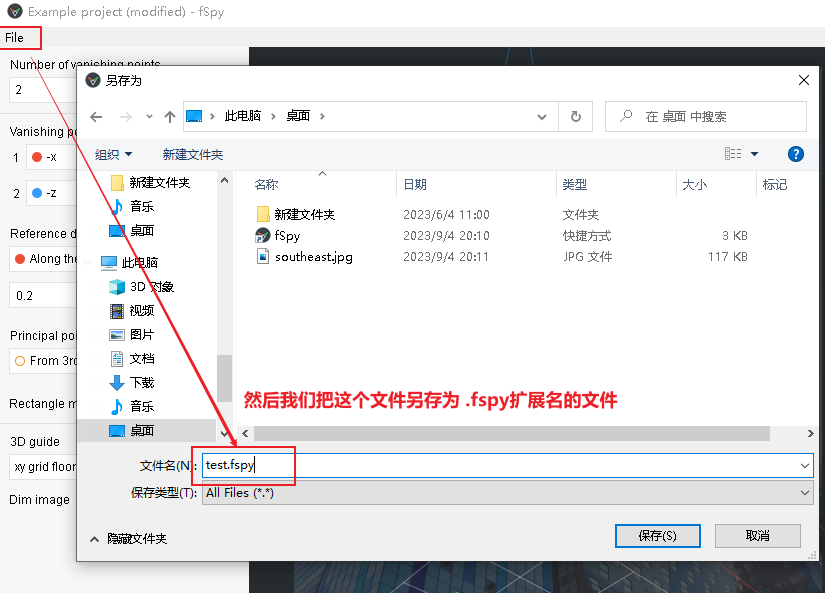

在blender导入 fspy格式文件之前, 我们还需要给 blender安装一个插件来支持这种格式.

https://github.com/stuffmatic/fSpy-Blender

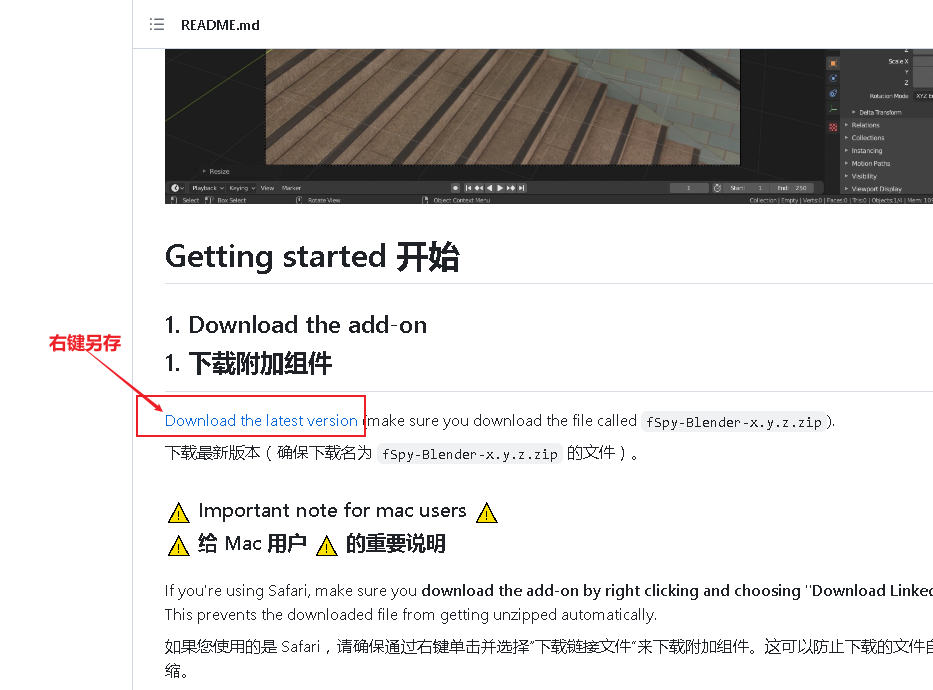

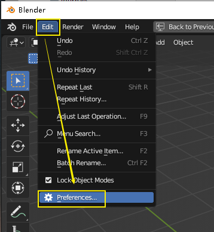

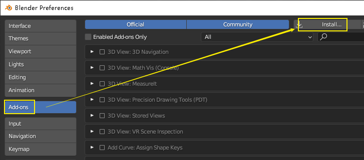

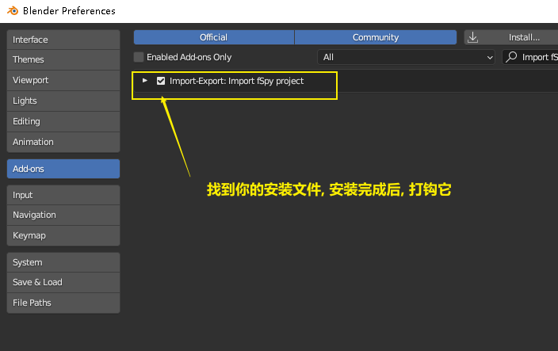

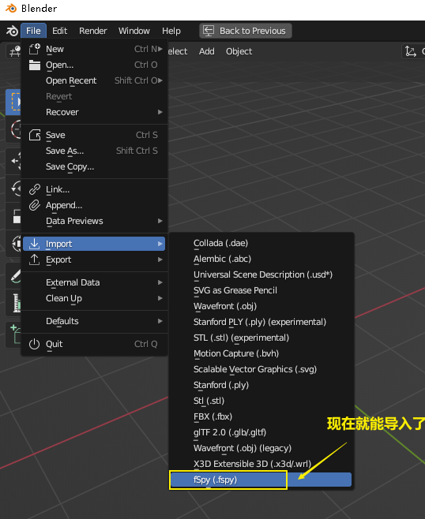

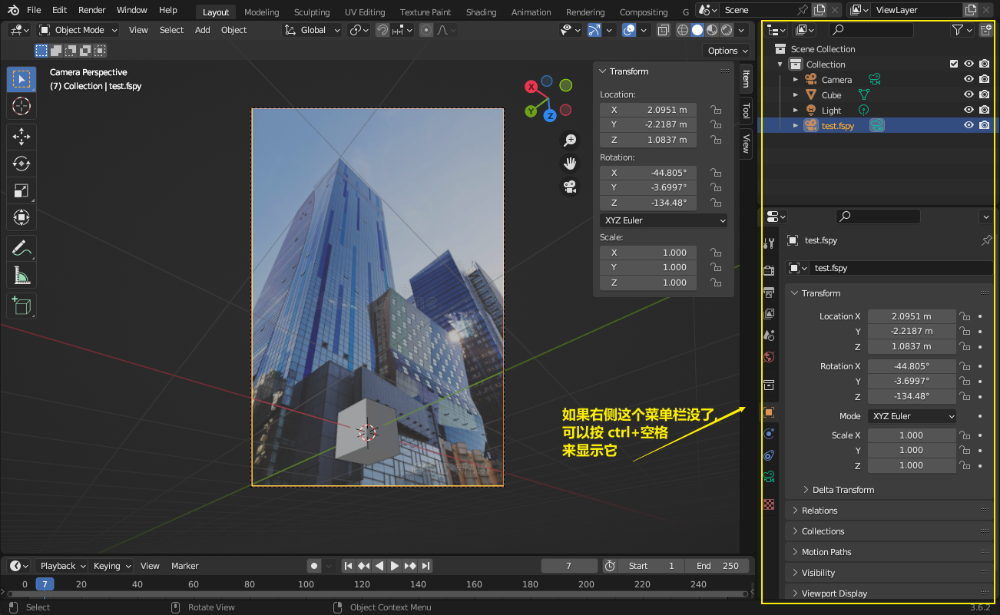

用小数字键0, 来查看相机的取景视图.

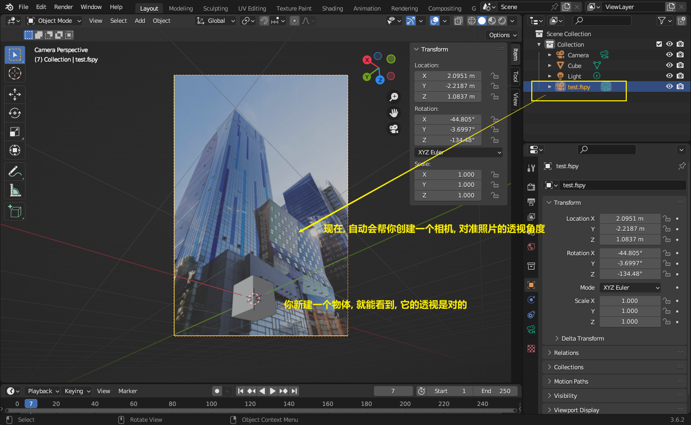

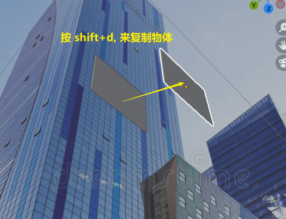

