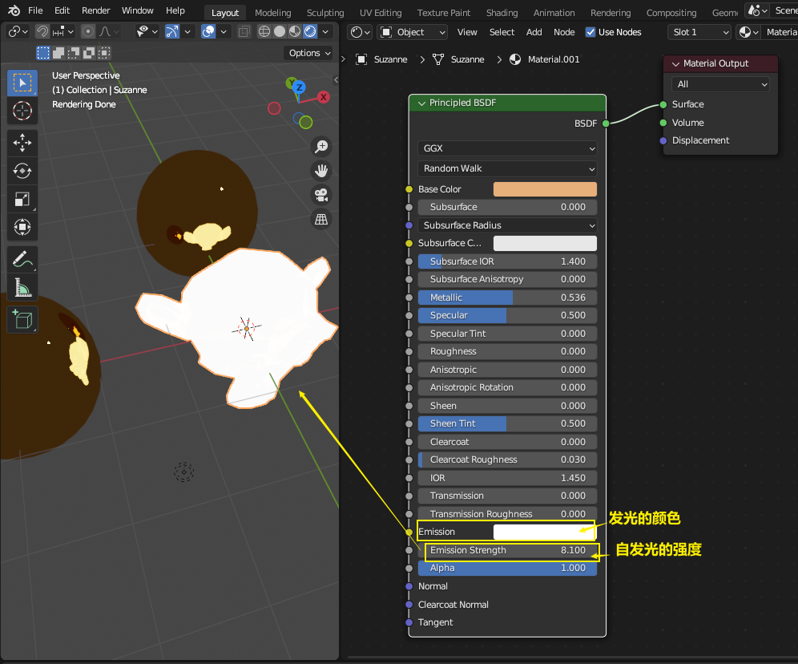
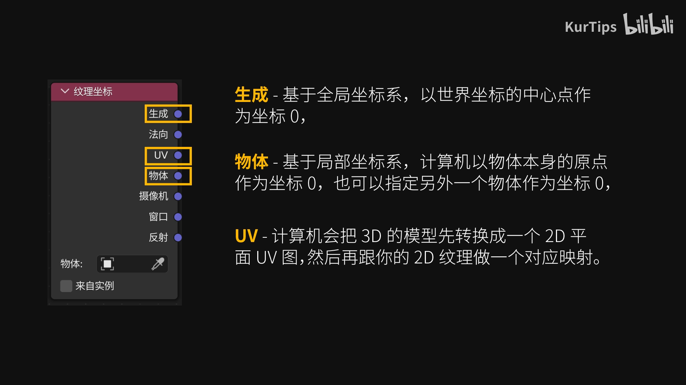
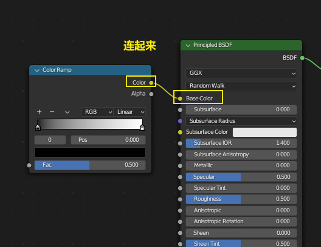

= blender 材质
:toc: left
:sectnums: 3

'''

== #贴图#

注意: 贴图, 先要对选中物体, 按tab 进入点线面"编辑模式"才能贴图.

变成黑色, 就说明物体已经用我们的贴图来贴了, 而遮盖掉了物体的材质颜色.

如果你载入贴图后, 物体上还是没有效果, 就按 assign 按钮

==== #★ 进行单面贴图#

==== #★ 复制"贴图"给其他物体#

'''

== #材质#

==== 金属质感

== #着色器编辑器#

==== ★ 金属质感

==== 塑料感觉

==== 玻璃透光质感

==== ★ 自发光

==== 透明度

==== 次表面颜色 (类似皮肤在背光时, 能看到透出血液的颜色)

次表面颜色（Subsurface Color）：用于模拟类似于人类皮肤这样在光线透过表面之后, 会有第二种表面颜色反射的情况。也可以做类似陶瓷，玉，冰之类的从物体内部往外透出颜色的材质，会给人一种很通透的感觉。

==== 各向异性过滤 (让高光变成圆环)

== ★ 一个物体, 在不同的部位, 分别赋予两种材质

== 添加有纹理的材质

==== #★★ 图像纹理, 贴图#

为了能调整贴图的位置, 我们还需要一个映射节点

下面, 第一种, 会在物体的正反两面有贴图

总结:

==== ★★ 把一张图片, 映射到3d物体上 (像包装纸一样)

== 渐变纹理

