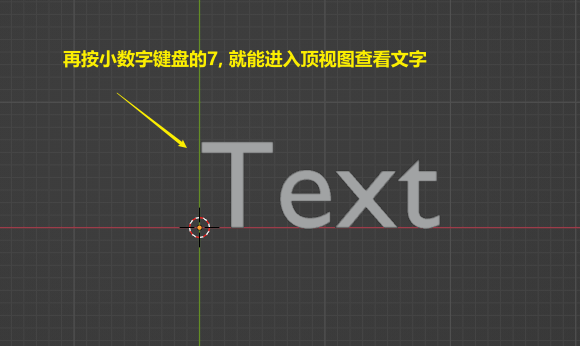
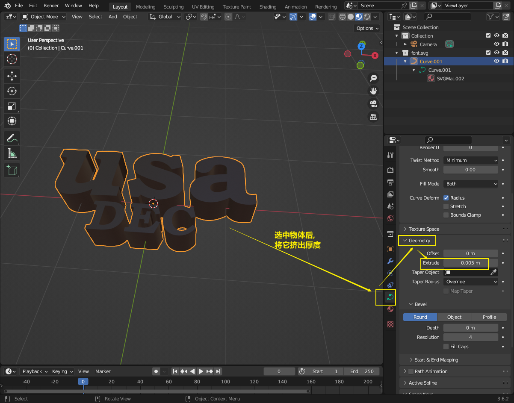
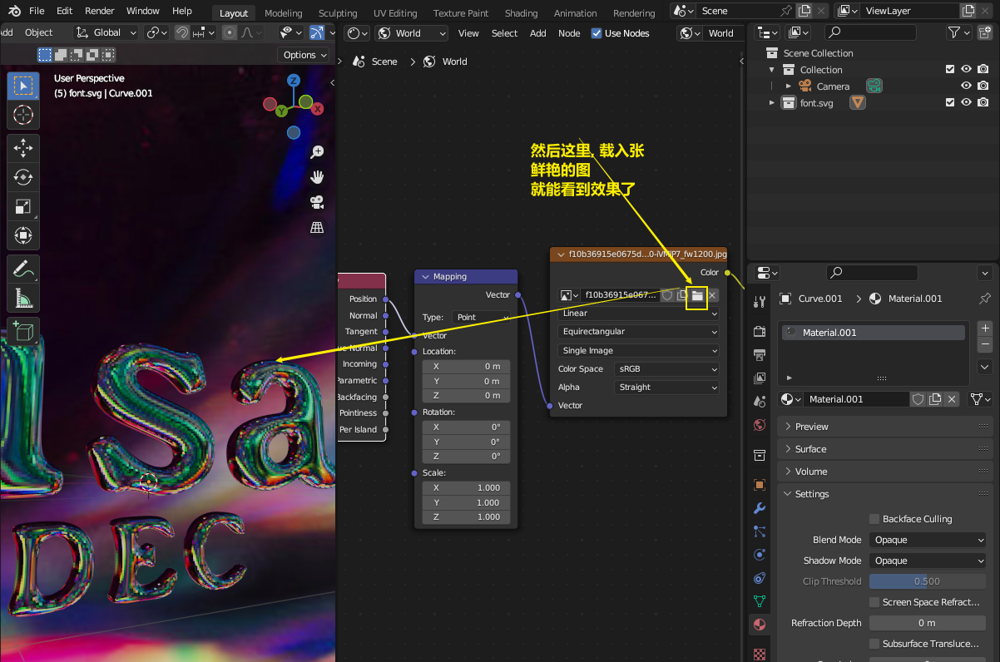
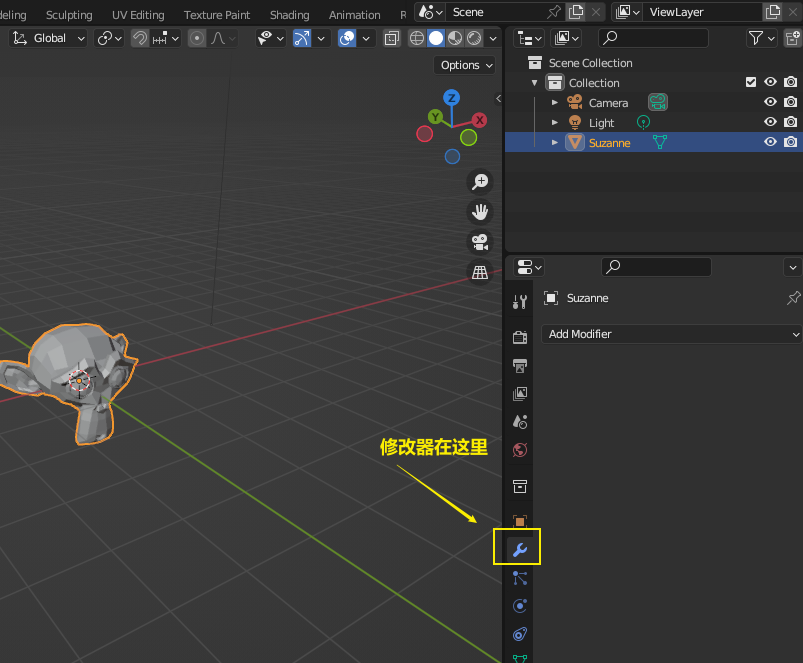
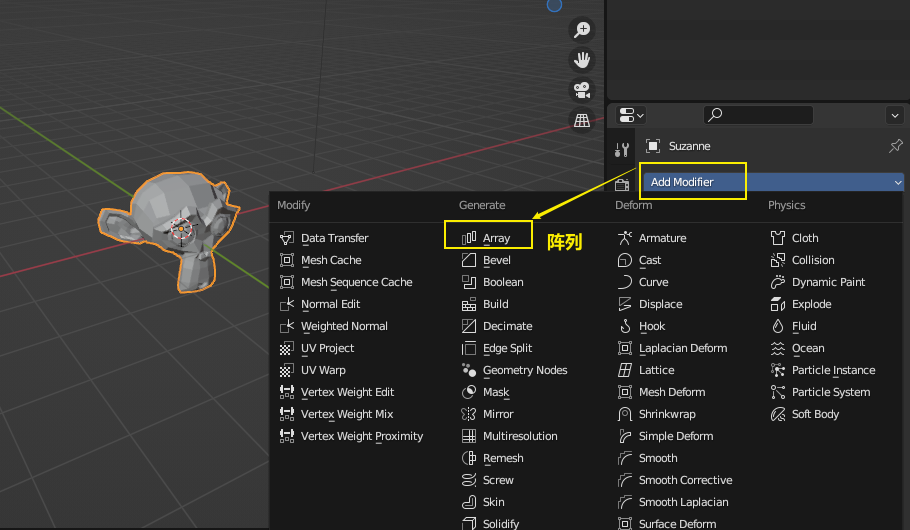
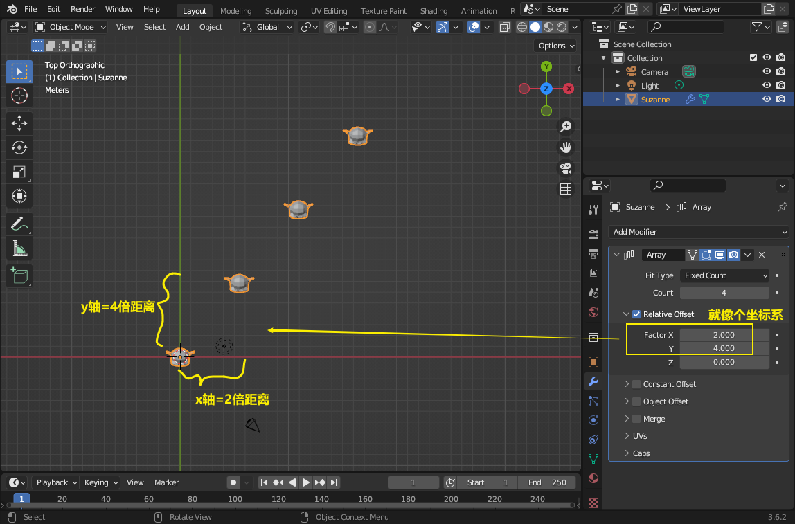
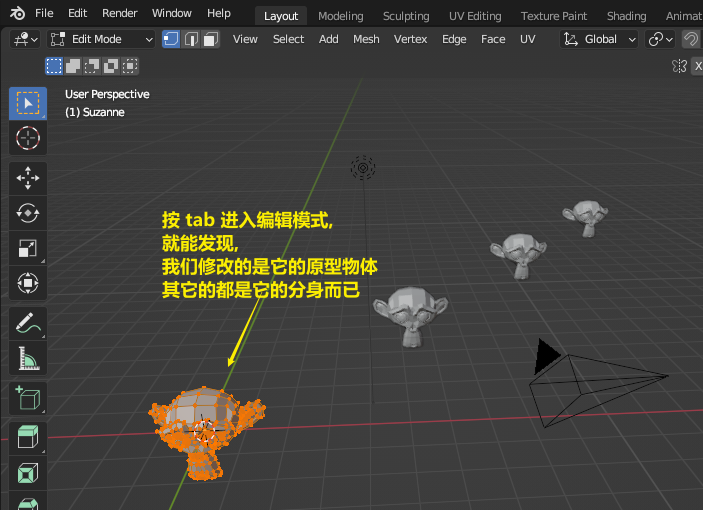
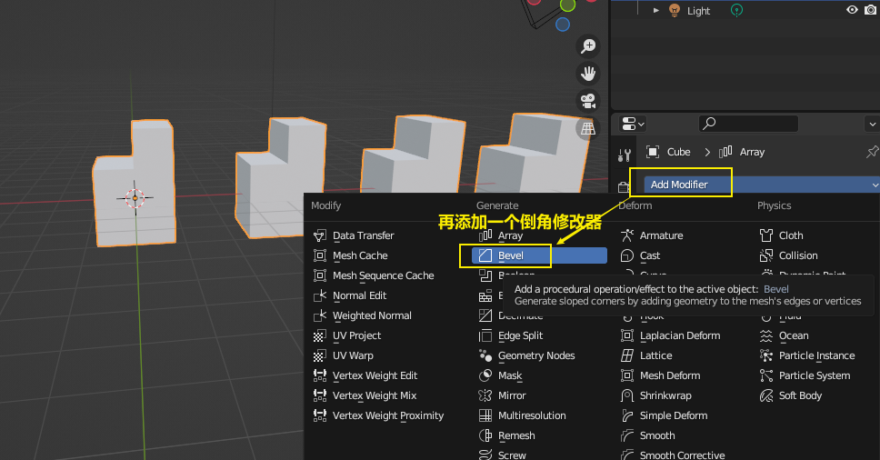
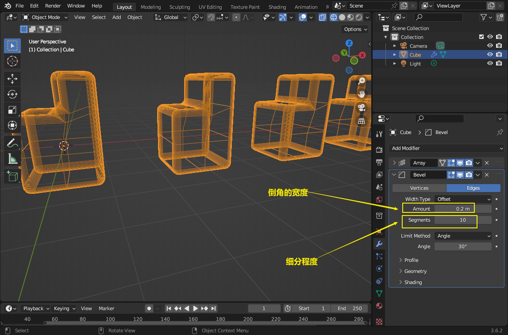

= blender 3d 字体
:toc: left
:sectnums: 3

'''

== 3d字

== 鎏金字效果

image:img/0206.png[,]

image:img/0215.png[,]

注意: 查看相机的取景时, 视图上会有一圈橘色的虚线, 来表示你现在看到的时相机的取景.

image:img/0228.png[,]

image:img/0231.png[,]

image:img/0232.png[,]

image:img/0233.png[,]

image:img/0235.png[,]

image:img/0237.png[,]

image:img/0238.png[,]

image:img/0239.png[,]

