= 建模 蘑菇
:toc: left
:toclevels: 3
:sectnums:
:stylesheet: myAdocCss.css

'''

== 案例 : 蘑菇

image:img/0387.png[,]

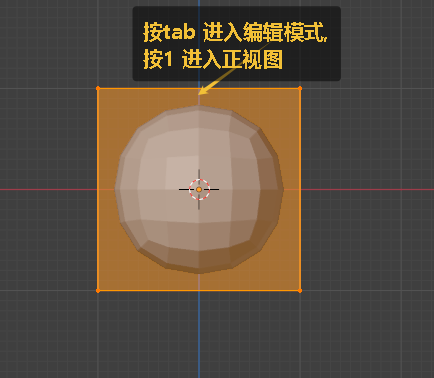

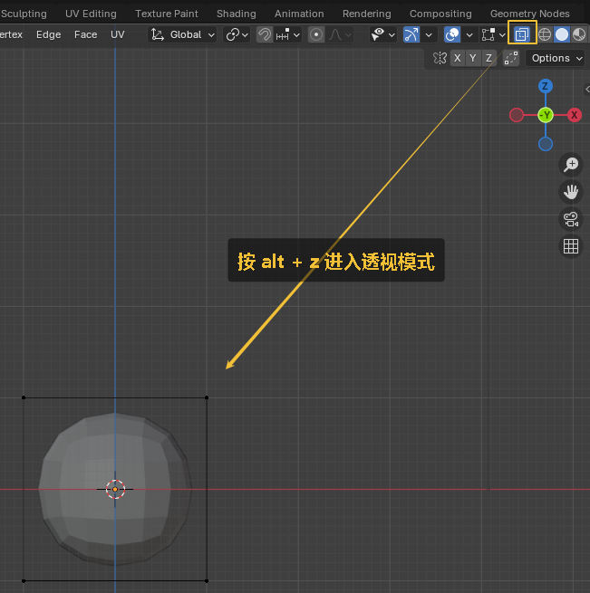

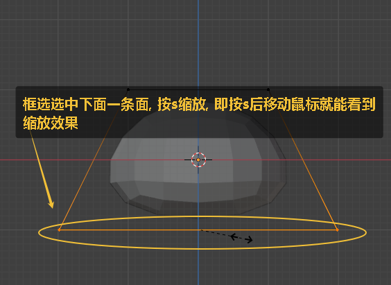

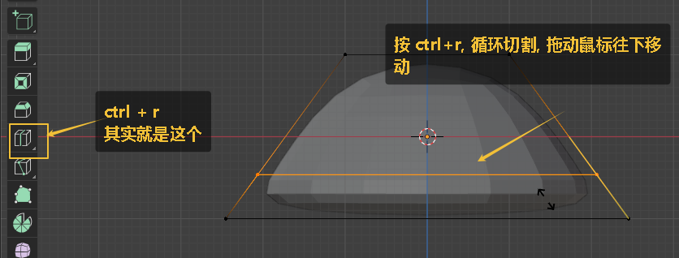

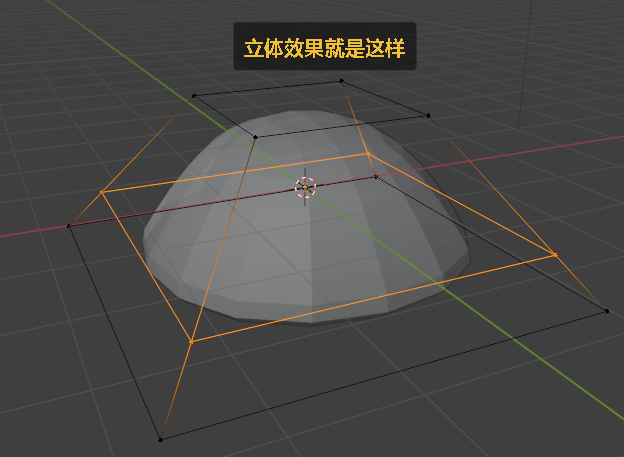

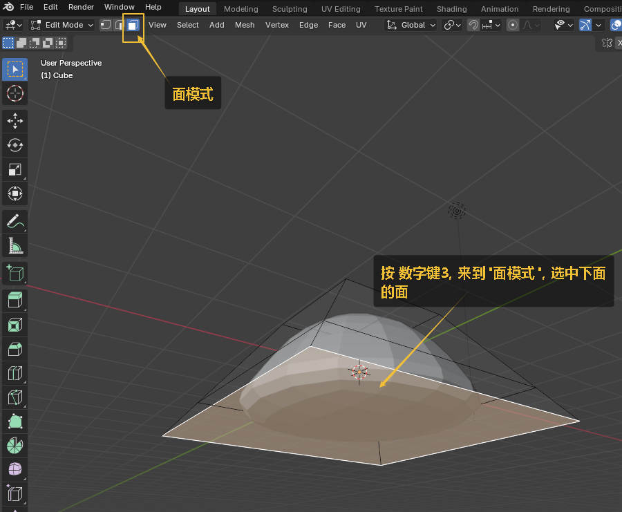

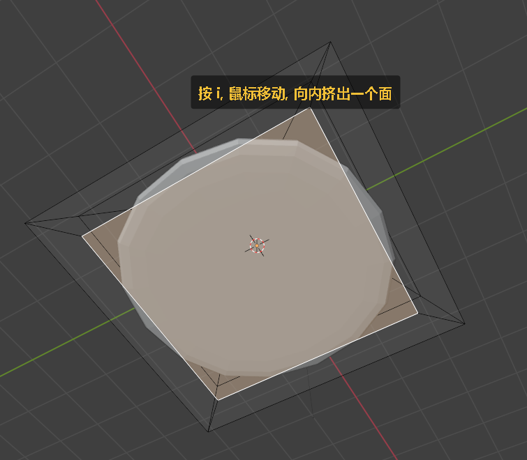

image:img/0395.png[,]

image:img/0396.png[,]

image:img/0397.png[,]

image:img/0398.png[,]

image:img/0399.png[,]

image:img/0400.png[,]

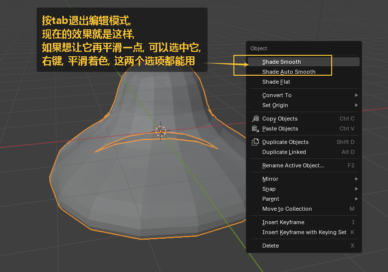

image:img/0402.png[,]

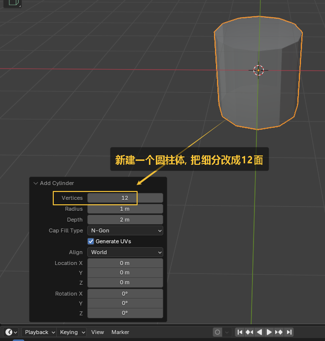

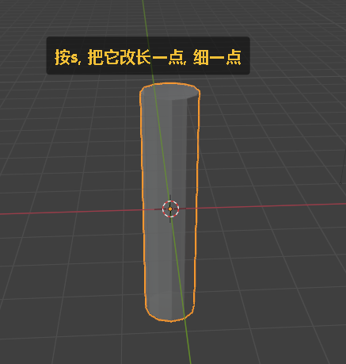

image:img/0405.png[,]

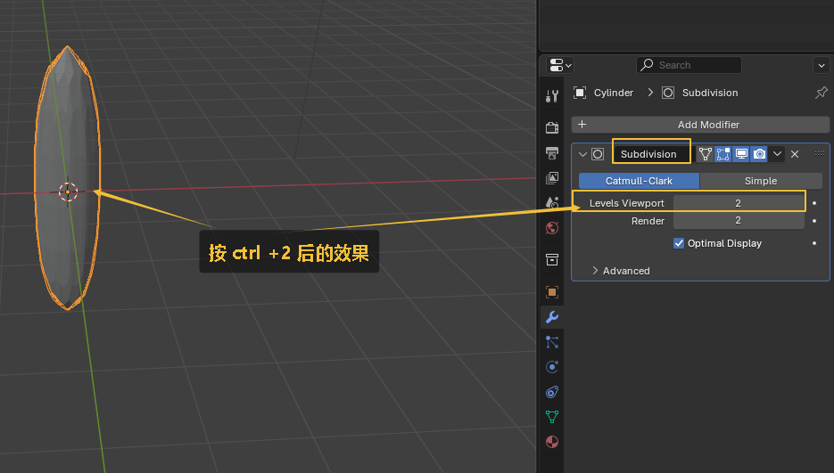

image:img/0407.png[,]

image:img/0408.png[,]

image:img/0409.png[,]

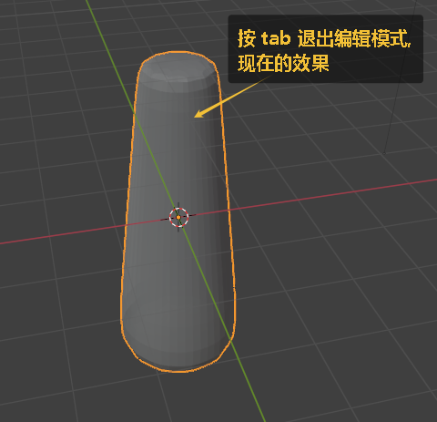

image:img/0412.png[,]

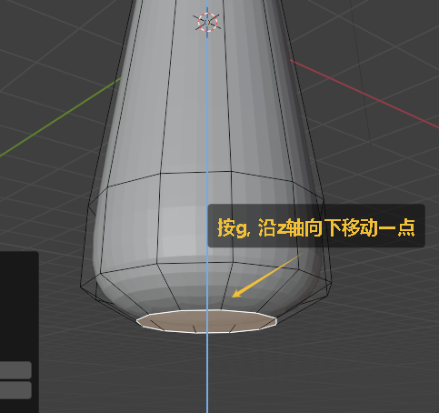

image:img/0414.png[,]

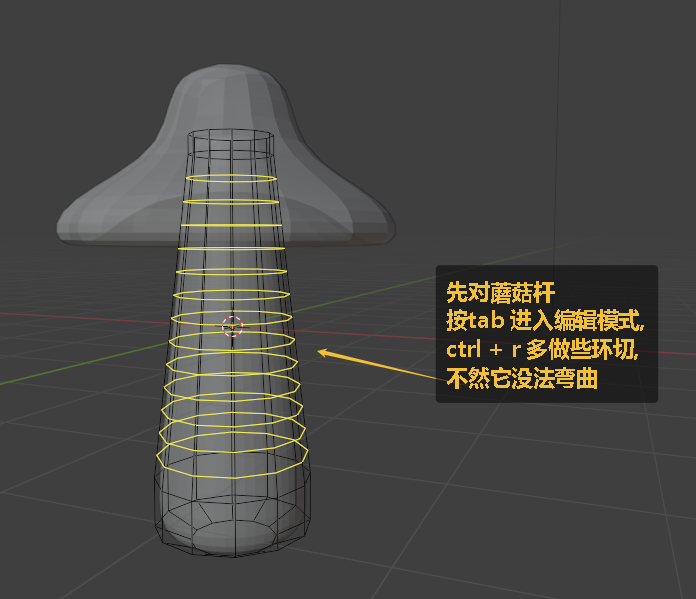

image:img/0415.png[,]

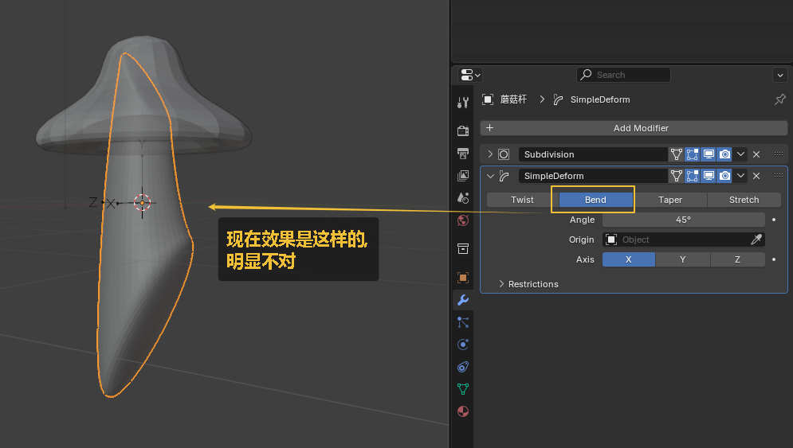

image:img/0445.png[,]

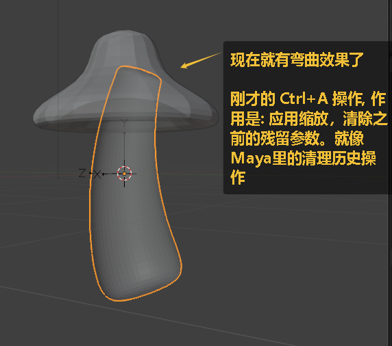

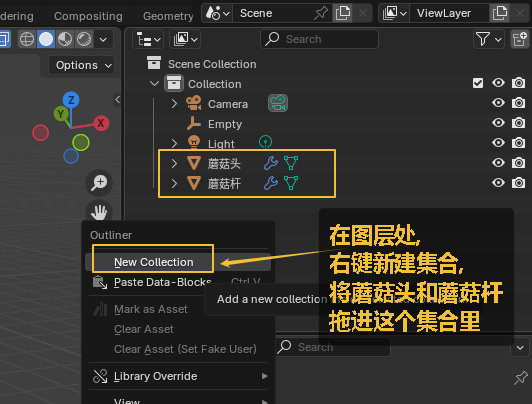

image:img/0450.png[,]

Ctrl+P (parent)：设置父对象

你选中的最后一个物体, 将为活动物体 (以亮橙色表示)，并且还将作为是"父物体"。如果你在选择父物体之前, 还选定多个物体，则它们将全部是父物体的子物体，并且将处于层次结构的同一级别(它们是“同辈”)。

要为物体设置"父级"，请至少选择两个物体(首先选择子物体，最后选择"父物体")，然后按 Ctrl-P 。将弹出 设置父级目标 菜单，允许你从几种可选的不同的"父子类型"中选择一种。选择 设置父级目标 中的一个条目进行确认，并创建父/子关系。

image:img/0451.png[,]

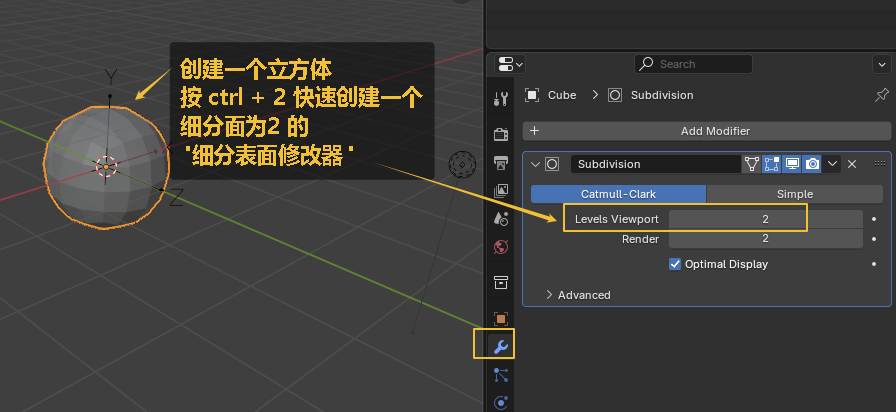

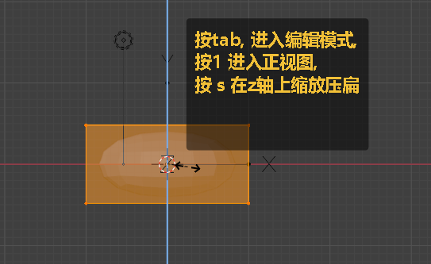

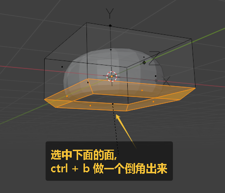

image:img/0455.png[,]

image:img/0456.png[,]

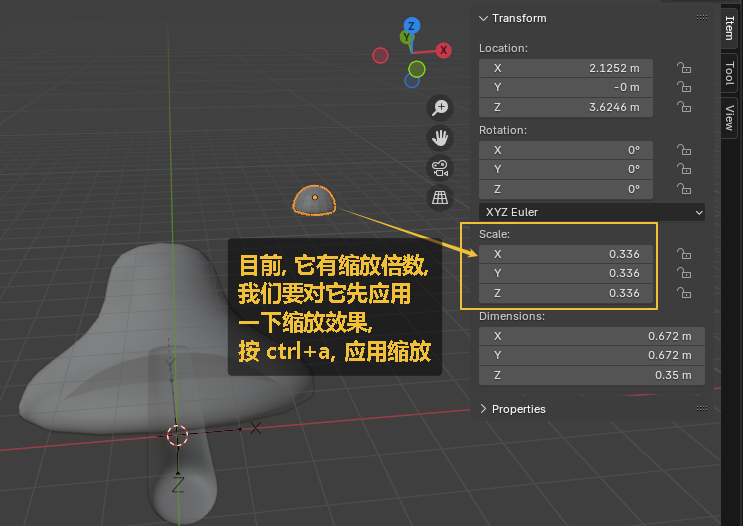

image:img/0458.png[,]

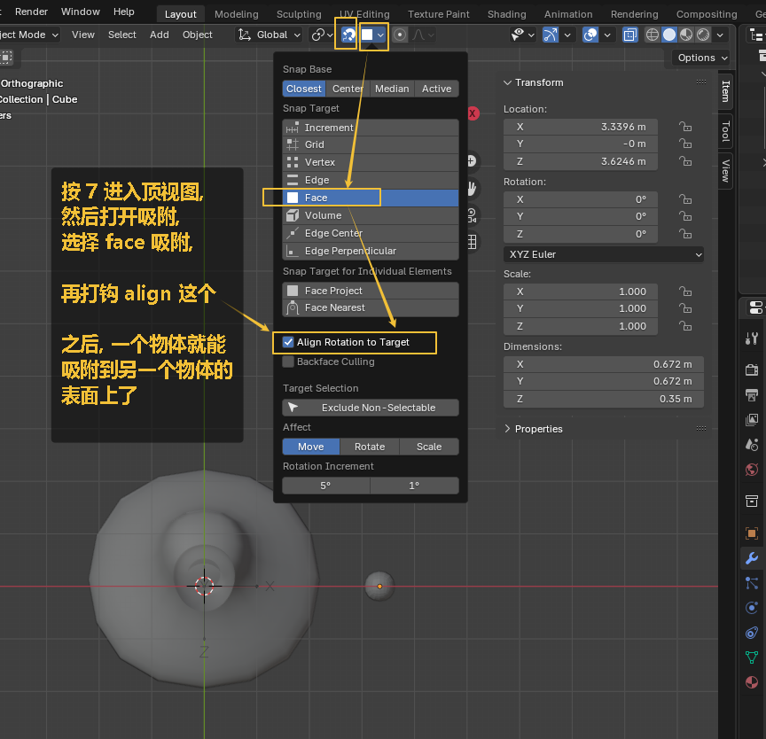

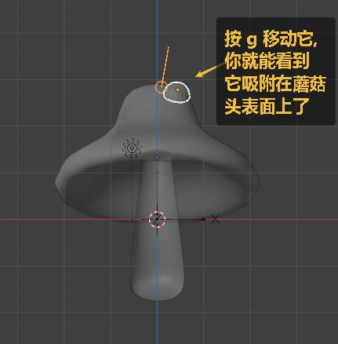

注意: 如果吸附不上，是因为蘑菇伞的原点不在几何中心.

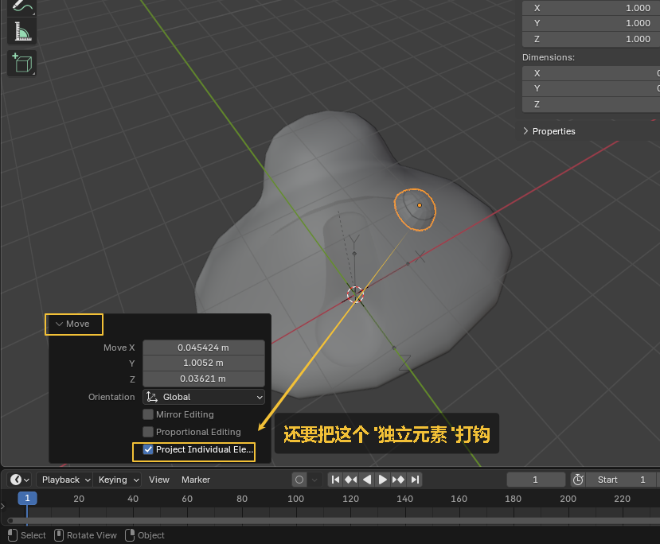

image:img/0463.png[,]

image:img/0464.png[,]

image:img/0465.png[,]

image:img/0466.png[,]

'''
