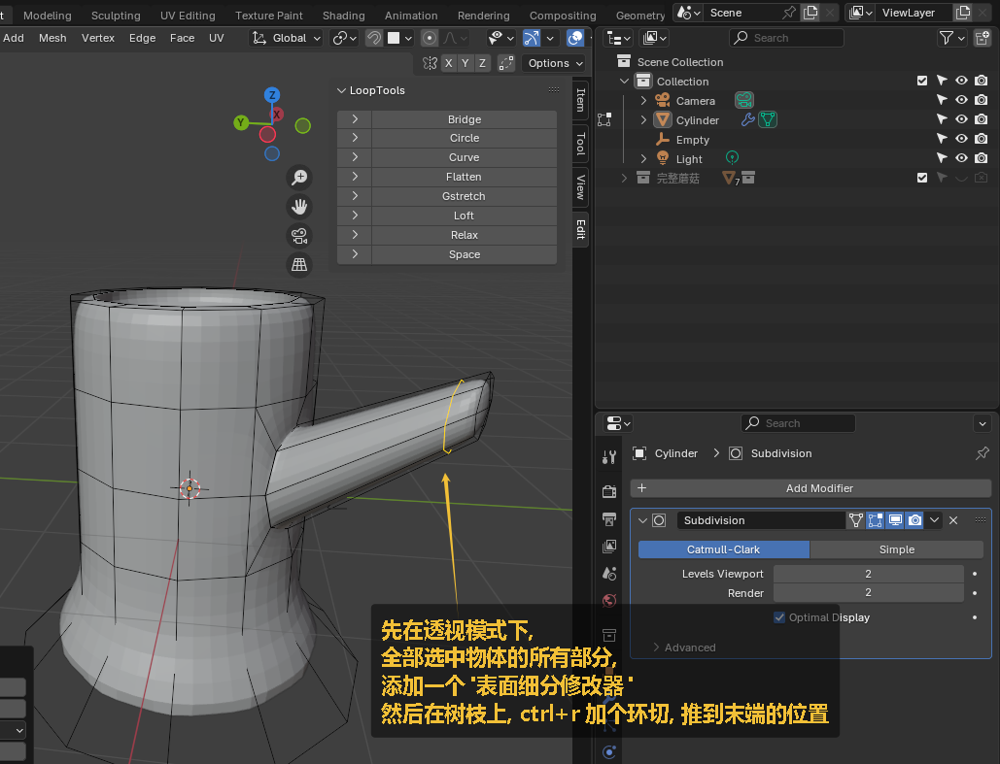
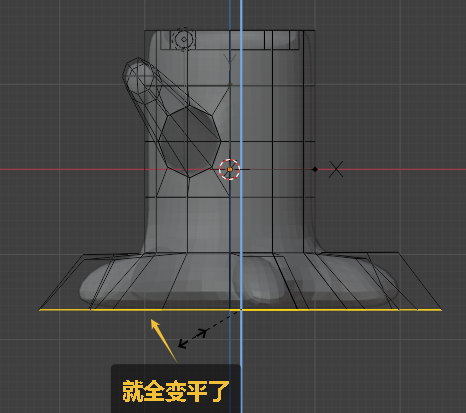
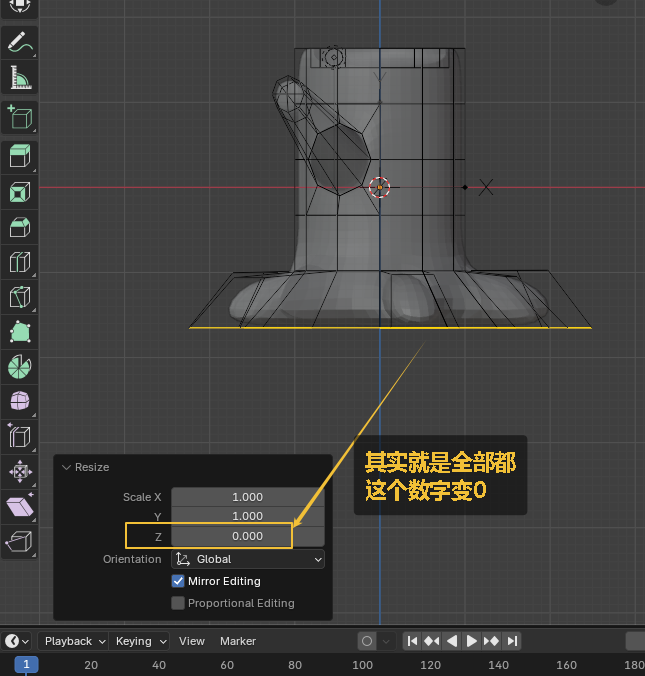

= 建模 - 树干, 树根
:toc: left
:toclevels: 3
:sectnums:
:stylesheet: myAdocCss.css

'''

image:img/0467.png[,]

image:img/0473.png[,]

image:img/0474.png[,]

image:img/0475.png[,]

image:img/0476.png[,]

image:img/0477.png[,]

image:img/0479.png[,]

image:img/0480.png[,]

image:img/0481.png[,]

image:img/0485.png[,]

image:img/0484.png[,]

