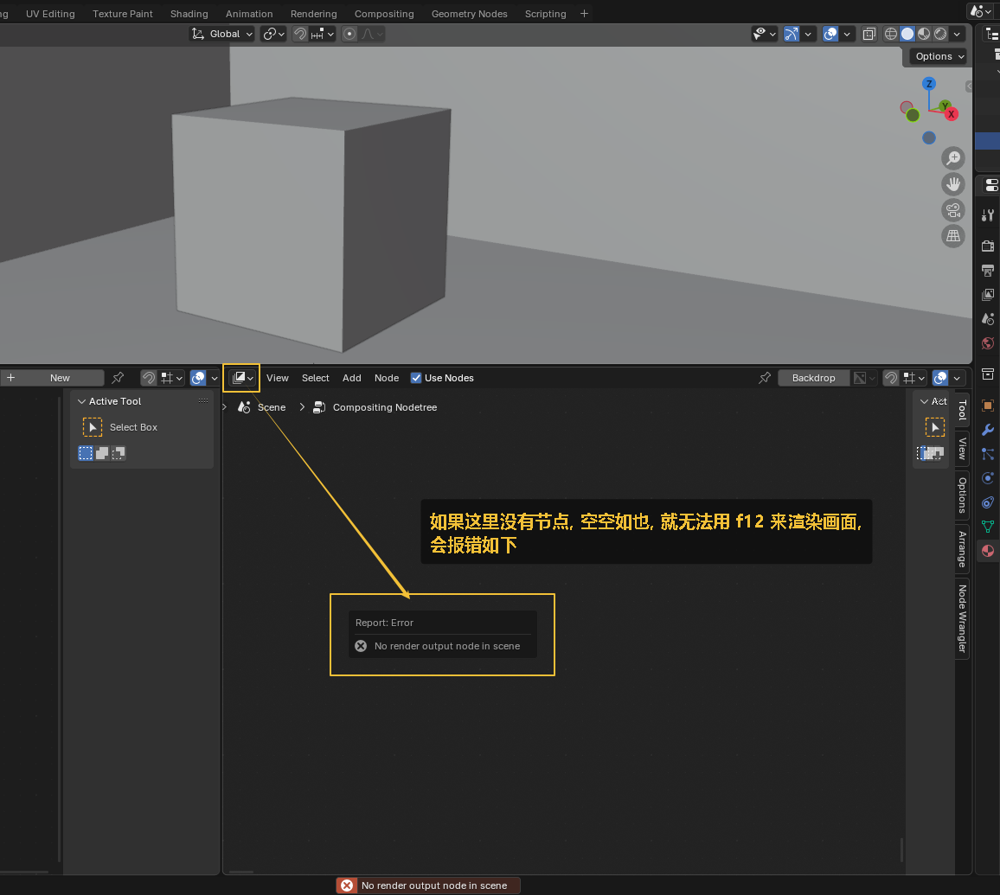
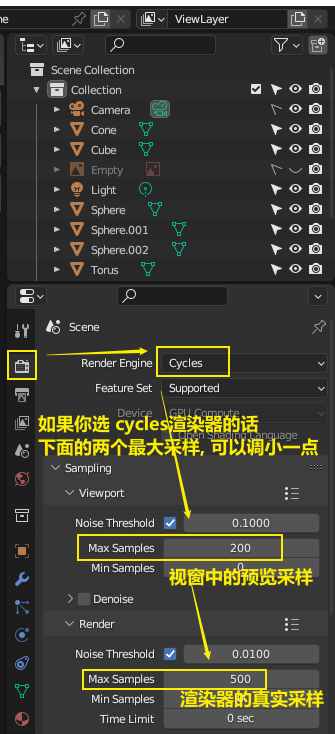

= #渲染# -> 按 F12
:toc: left
:toclevels: 3
:sectnums:
:stylesheet: myAdocCss.css

'''

== 渲染尺寸设置

image:img/0042.png[,]

'''

== ★ #只渲染选中的方框区域 -> ctrl + b#  , 要恢复原样时, 按 ctrl + alt + b

'''

== 渲染后画面发灰的问题

'''

== #无法渲染时, 报错# :  No render output node in scene

image:img/0623.png[,]

image:img/0624.png[,]

image:img/0625.png[,]

image:img/0626.png[,]

'''

== 改成 用显卡 gpu 渲染

image:img/0133.png[,]

==== 自带渲染器

[.small]
[options="autowidth" cols="1a,1a"]
|===
|两个渲染器 |Header 2

|eevee
|- 没有光线追踪. 所以快.

|cycles
|- 基于物理渲染, 所以逼真, 但渲染速度很慢.
|===

image:img/0044.png[,]

image:img/0045.png[,]

image:img/0046.png[,]

== 进行渲染 : 按 f12

'''