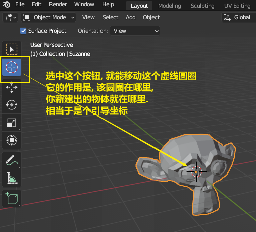

= 游标 cursor
:toc: left
:toclevels: 3
:sectnums:
:stylesheet: myAdocCss.css

'''

==== 在特定坐标位置, 新建物体

也可以用 "shift + 鼠标右键", 来快速更改该"虚线圆圈curse"的位置.

==== 将选中的物体, 移动到"游标"的坐标处

image:img/0011.png[,]

'''

== ★★ 将游标, 重新回到选中(激活)的某物体坐标处

image:img/0009.png[,]

image:img/0010.png[,]

== 将游标, 回到整个世界轴的中心处  : shift + c

image:img/0012.png[,]

'''