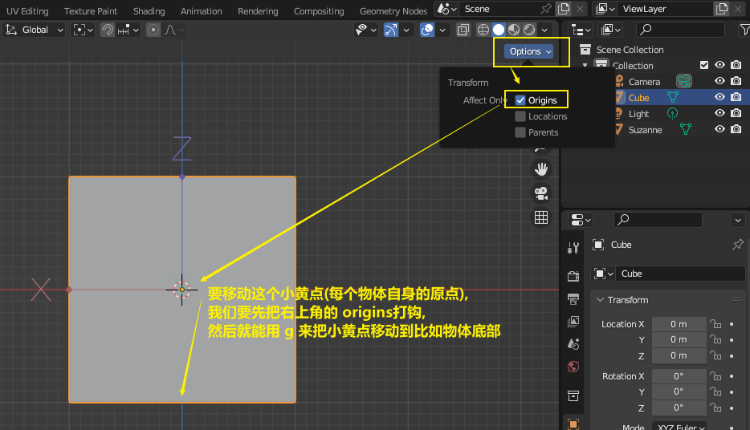
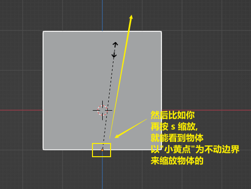

= 物体的原点(小黄点)
:toc: left
:toclevels: 3
:sectnums:
:stylesheet: myAdocCss.css

'''

== 每个物体自身的 #原点(小黄点)#

注意: 小黄点才是代表物体的真正坐标位置. 计算机只认小黄点位置, 不认具体的模型物体位置.

== #★ 移动小黄点#

image:img/0016.png[,]

image:img/0261.png[,]

== #★ 将小黄点(原点)回到物体中心#

image:img/0276.png[,]

image:img/0277.png[,]

'''
