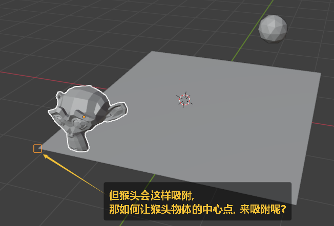
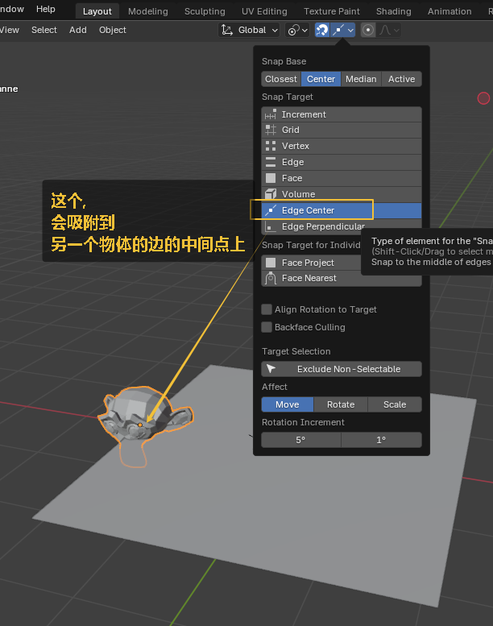

= 吸附
:toc: left
:toclevels: 3
:sectnums:
:stylesheet: myAdocCss.css

'''

https://www.bilibili.com/video/BV1Tk4y177jR?spm_id_from=333.788.videopod.sections&vd_source=52c6cb2c1143f8e222795afbab2ab1b5

== #★ 吸附#

image:img/0240.png[,]

image:img/0241.png[,]

image:img/0242.png[,]

image:img/0243.png[,]

image:img/0244.png[,]

image:img/0245.png[,]

image:img/0246.png[,]

image:img/0247.png[,]

'''

== 吸附到"另一个物体的顶点"处

image:img/0682.png[,]

image:img/0684.png[,]

image:img/0685.png[,]

'''

== 吸附到"另一个物体的边的中间点"处

'''

== a物体的中心点(注意不是轮廓面), 吸附到b物体的面上

image:img/0687.png[,]

image:img/0688.png[,]

'''

