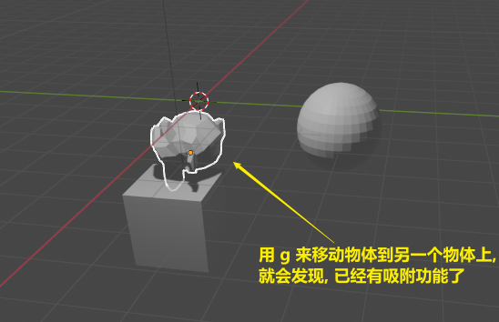
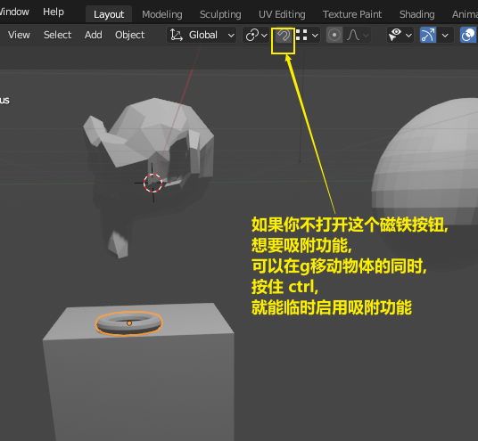
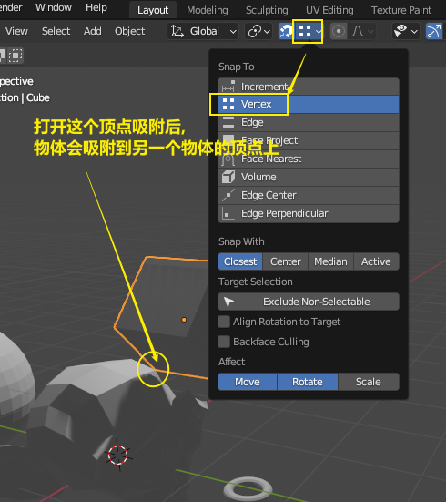

= 吸附
:toc: left
:toclevels: 3
:sectnums:
:stylesheet: myAdocCss.css

'''

== #★ 吸附#

image:img/0240.png[,]

image:img/0243.png[,]

image:img/0244.png[,]

image:img/0245.png[,]

image:img/0247.png[,]

'''
