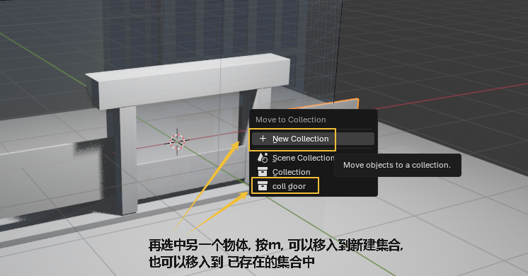

= 图层
:toc: left
:toclevels: 3
:sectnums:
:stylesheet: myAdocCss.css

'''

== #集合#

==== 将多个物体, 移入到一个集合中 -> 按 m

选中多个物体, 按m, 可以把它们放到一个新建的集合里

image:img/0278.png[,]

image:img/0279.png[,]

==== #选中一个集合中的所有物体#

或者还可以这样做:

image:img/0284.png[,]

'''
