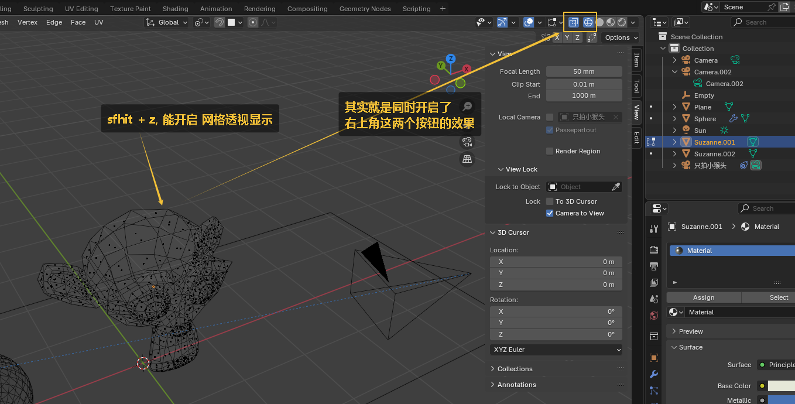
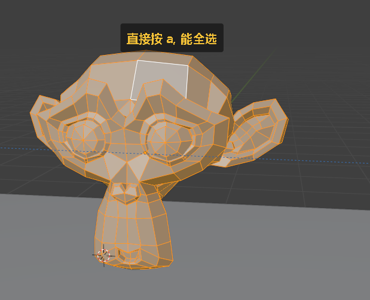
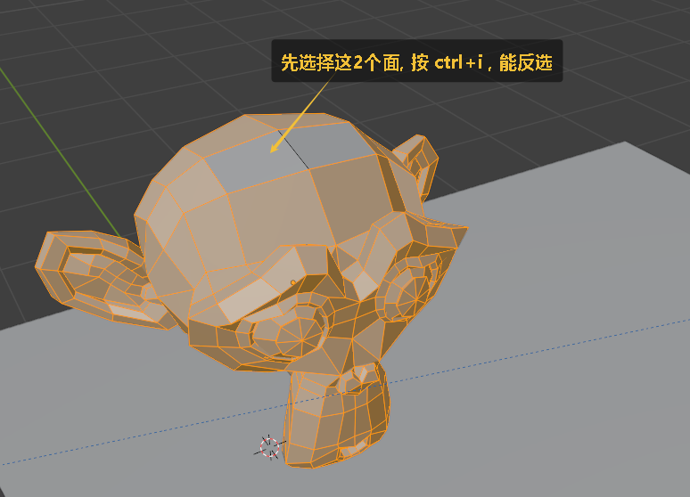
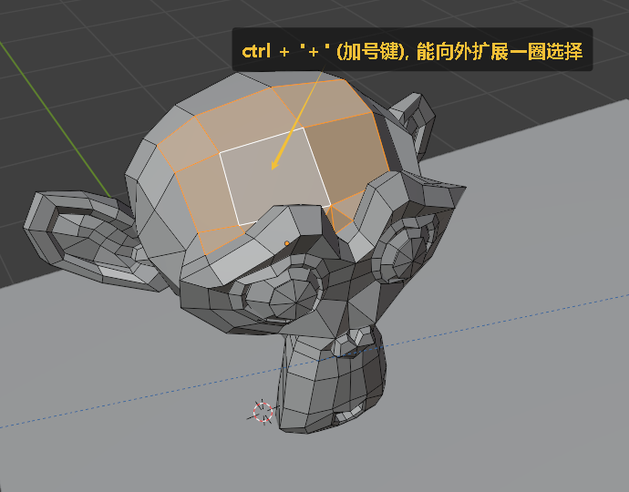

= 编辑模式下, 选择点线面
:toc: left
:toclevels: 3
:sectnums:
:stylesheet: myAdocCss.css

'''

== 开启透视显示网格 -> sfhit + z

== 全选 -> 按 a

要"全部不选", 就按两下a, 或 alt+a

'''

== 反选 -> ctrl + i

'''

== 框选 ->  ctrl + 右键

image:img/0704.png[,]

'''

== 选中循环边 -> alt + 左键

image:img/0706.png[,]

'''

== 向外扩展一圈选择 -> ctrl + 加号键

同理, 如果要向内减去一圈选择, 就是 : ctrl + 减号键

'''

== 关联选择  -> ctrl + L, /或选中某个面, 再按 L

'''

== 选中两个面的最短路径 -> 点击一个网格，按住CTRL，点击另一个网格进行最短路径选择

image:img/0710.png[,]

'''

==  进行相同类型元素选择 -> shift + G

image:img/0711.png[,]

'''

== ★ 将选中的面, 存储下来, 方便下次调用

image:img/0712.png[,]

image:img/0713.png[,]
