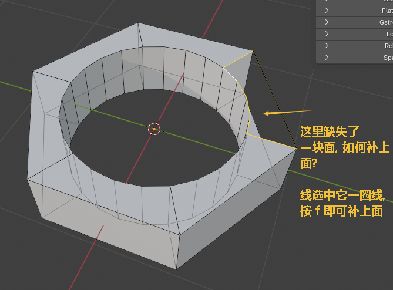
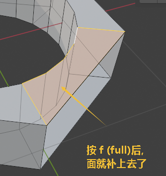

= 面操作 - 补上面
:toc: left
:toclevels: 3
:sectnums:
:stylesheet: myAdocCss.css

'''

== ★ 补上缺失的面

'''

== 方法2

image:img/0533.png[,]

image:img/0534.png[,]

image:img/0535.png[,]

image:img/0536.png[,]

