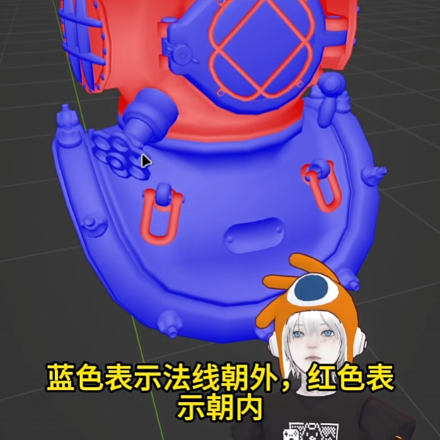
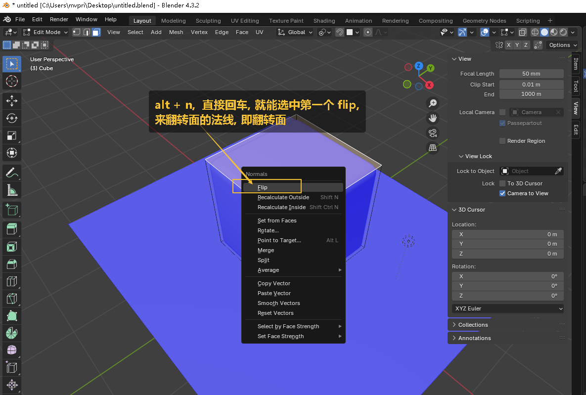
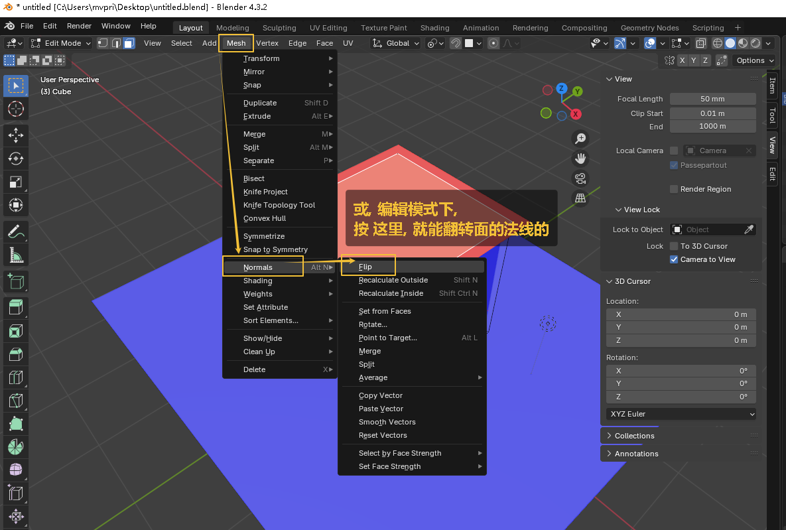
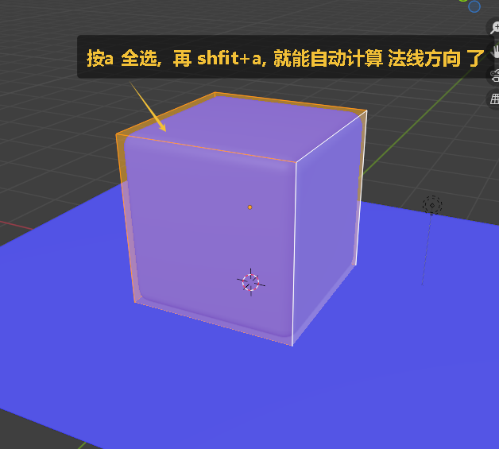
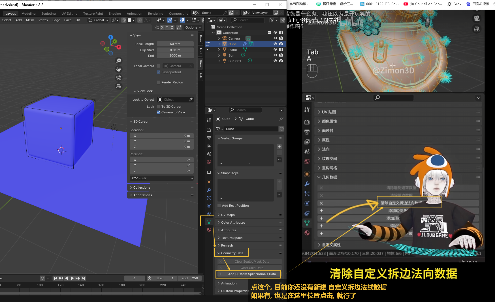
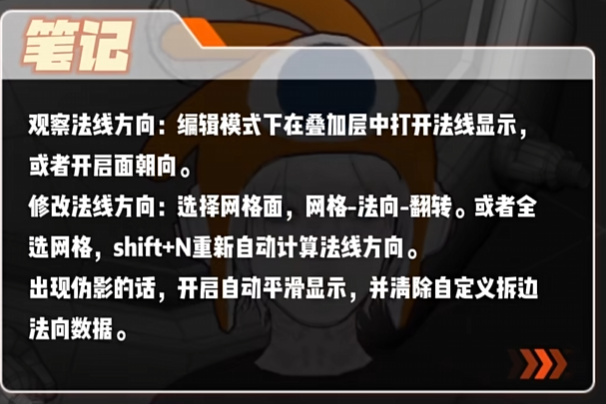

= 面 - 法线
:toc: left
:toclevels: 3
:sectnums:
:stylesheet: myAdocCss.css

'''
== 查看法线

一般如果你发现, 阴影很奇怪的话, 一种可能就是法线出错了, 即面的正反颠倒了.

image:img/0085.png[,]

'''

== #法线# : 决定正反面

image:img/0082.png[,]

image:img/0083.png[,]

'''

== 翻转正反面 : alt + n + 回车 (即选 flip)

image:img/0084.png[,]

== 翻转法线, 方法2:

按a, 全选网格后, 再按 shift+n, 重新自动计算法线方向

'''

== 调整面的法线到正确后, 阴影还是有问题, 可以试试这个方法

