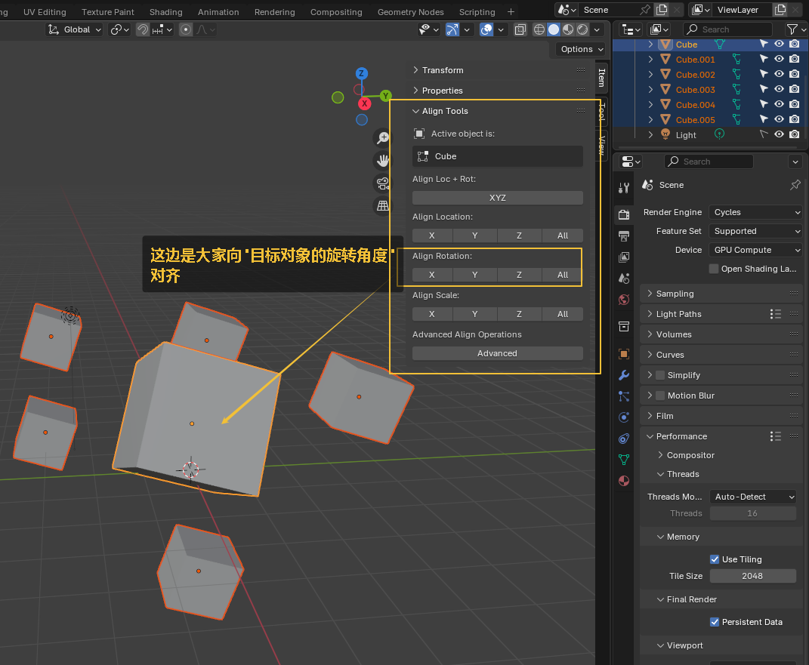

= 物体 对齐
:toc: left
:toclevels: 3
:sectnums:
:stylesheet: myAdocCss.css

'''

需要安装插件 align

image:img/0636.png[,]

image:img/0637.png[,]

image:img/0638.png[,]

image:img/0639.png[,]

image:img/0640.png[,]

image:img/0641.png[,]

'''

