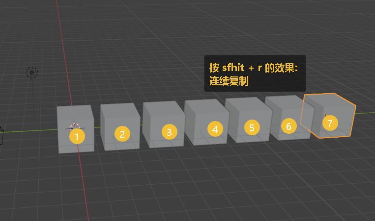
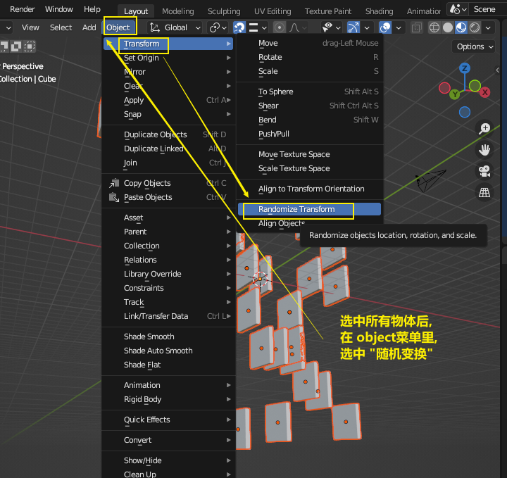

= 物体 复制
:toc: left
:toclevels: 3
:sectnums:
:stylesheet: myAdocCss.css

'''

== 复制物体 : shift + D (Duplicate)

注意: 如果你在选中物体后, 按了 shift+D 后, 再点右键, 它就会在该物体的当前位置上, 复制出一个新物体,  新旧两个物体是重叠在一起的. 所以不要将右键误认为是你取消了复制. 复制并没有取消!

'''

== 连续复制 : shift + r (repeat)

image:img/0643.png[,]

'''

== #★ 复制后, 随机变换位置, 旋转角度, 与缩放大小#

image:img/0248.png[,]

image:img/0250.png[,]

'''

== ★ #复制出"指针对象"  alt + d# (Linked Duplicates ) <- (修改其中一个, 所有对象都会自动一起被修改)

image:img/0645.png[,]

'''

